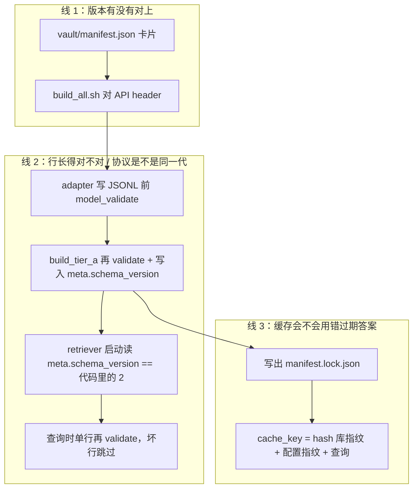

# 全项目 hash / manifest / schema_version 对照

> 读完应能分清：项目里好几处「算 hash」「对一下版本」「写一份 manifest」，**不是同一种校验**。  
> 协议本身仍以各目录 README 为准；本文只做对照和讲解，不改字段定义。

权威出处：

- A 层建库与 `meta` 表：[`rag/build/README.md`](../rag/build/README.md)
- 检索校验与缓存 key：[`rag/retriever/docs/router-runtime.md`](../rag/retriever/docs/router-runtime.md)、[`config.md`](../rag/retriever/docs/config.md)
- 目录职责：[`rag/README.md`](../rag/README.md)
- B 层切块/向量策略菜谱：[`rag/vault/tier_b_prose/CHUNKING.md`](../rag/vault/tier_b_prose/CHUNKING.md)

实现现状（写本文时）：`vault/manifest.json`、`build_all.sh` 版本对齐、`build_tier_a.py` 写 `manifest.lock.json` 和 `rules.db` 的 `meta` **已经落地**。`retriever` 启动时读 `schema_version`、`cache.py` / `retrieve_cached` **还是协议**（函数体为 `NotImplementedError` stub）。

---

## 1. 先给结论

[`rag/retriever/docs/router-runtime.md`](../rag/retriever/docs/router-runtime.md) 的 `cache_key` **不是在「校验数据对不对」**，而是在给检索结果起一个可复用的门牌号：

> 同一条业务查询 + 同一份已发布的库 + 同一份召回配置 → 同一个 key。

你在仓库里会反复看到 `manifest`、`hash`、`schema_version`、`校验`。它们至少是 **四套看起来像、职责完全不同的东西**。混在一起，就会觉得「整个项目都在做同一种校验」。

| 名字 | 文件 / 位置 | 回答的问题 | 变了会怎样 |
| --- | --- | --- | --- |
| **版本锁卡片** | `rag/vault/manifest.json` | 这批原材料声称对齐哪个 Godot / 哪份 docs / 哪两份 API？ | `build_all.sh` 拒绝开工 |
| **出厂回执** | `rag/artifacts/manifest.lock.json` | 这份 `rules.db` 是用哪些文件、在什么时候编出来的？ | 缓存 key 整体换号 |
| **协议代数** | `schema_version`（A 层当前是 `"2"`） | 表结构 / 字段名还是不是这一代？ | retriever **拒绝启动**（协议） |
| **检索缓存 key** | `sha256(库指纹 + 配置指纹 + 查询 JSON)` | 同一问 + 同一份已发布库 + 同一套 YAML 召回参数，能不能直接复用上次答案？ | 旧缓存自然打不中，不必手动清 |

另外两套**不要和上面混**：

- Godot `extension_api.json` 里方法自带的 `hash`：ABI 兼容哈希。A 层 diff **故意忽略**（参数列表和返回类型没变就当没变）。见 [`rag/build/README.md`](../rag/build/README.md) 与 `diff_extension_api.py`。
- B 层 IR 的 `schema_version: 1`，以及 `rag/artifacts/chunks/<id>/manifest.json`、`rag/artifacts/corpora/<id>/manifest.json`：切块参数和 embedding 模型菜谱，**没有**接到 `cache_key` 上。

C 层 `workspace_index/cache.py` 也无关：它按 `workspace_path` 缓「这个仓库的现场索引」，一家仓库一把钥匙，不跨仓库，也不吃 `manifest.lock.json`。

面试材料里还有另一句「LLM 响应缓存 key = hash(error_signature + file_slice)」。那是 **Agent 循环另一层**的事，不要和检索侧的 `cache_key` 合成一个。

---

## 2. `cache_key` 在算什么

检索本身不便宜：A 层 SQL + B 层 embedding + 混合检索。但跨仓库时问句高度重复，例如：

> `Nonexistent function 'instance' in base 'PackedScene'.` + 目标 `4.7.1`

知识库是「建一次、所有仓库共用」。仓库 A 查过一次，仓库 B、C 再问同一句，答案应完全一样。所以协议在 `router.retrieve()` 外面加一层 `retrieve_cached()`：

```text
Agent 工具
  → retrieve_cached(query)
       算 cache_key
       Redis / 内存里有？ → 取出，只把 cache_hit 改成 True，原样返回
       没有？             → 真查库 → 写入缓存 → cache_hit=False 返回
```

`cache_hit` 只是观测字段。命中时**不准改** hits / coverage / recommended_action。否则「省了一次检索」会变成「悄悄改写了答案」。

协议里的函数：

```python
def cache_key(query, manifest_hash: str, config_hash: str) -> str:
    # 同一条业务查询 + 同一份已发布的库 + 同一份召回配置 → 同一个 key。
    payload = query.model_dump_json(exclude={"request_id"})
    return hashlib.sha256(f"{manifest_hash}:{config_hash}:{payload}".encode()).hexdigest()
```

可以读成一句话：

> **门牌 = 哪一版已发布的库 + 哪一套 YAML 召回参数 + 这条业务查询本身**

改 `retriever.yaml` 里的 k / 权重 / 通道 / 阈值 / reranker 名，必须让 `config_hash` 变，否则 Redis 会把旧权重的答案当成新配置的答案。`log_dir` / `sample_rate` / `request_id` 不进指纹。键清单见 [`config.md`](../rag/retriever/docs/config.md)。

### 2.1 左边：`manifest_hash`（库的身份证）

设计意图：对 `artifacts/manifest.lock.json`（或它的规范化内容）做一次哈希，得到一个短字符串。lock 变了，左边就变，所有旧 key 全部打不中——这就是「不用手动清缓存」。

lock 文件里**目前没有**现成的 `manifest_hash` 字段。实现时要约定：hash 整份 JSON，还是只 hash `files` + `schema_version` + `row_count`。若带上 `built_at`，**同内容重跑一次 build 也会让缓存全失效**（偏保守，通常可接受）。

### 2.2 右边：`payload`（问句的身份证）

`RetrievalQuery` 整份 JSON，但抠掉 `request_id`。会进 payload、因而会拆开缓存槽位的包括：

- `error_text` / `symbols` / `query_text`
- `target_version`（`4.7.1` 和 `4.0` 必须是两个 key，过滤门不同）
- `kinds` / `file_hint`
- `retrieval_mode`（`hybrid` 和 `exact_only` 必须是两个 key，消融实验要比的就是这个差）
- `top_k` / `top_k_a` / `top_k_b`

### 2.3 为什么必须排除 `request_id`

它只是日志追踪号（`job-仓库A-第3步` vs `job-仓库B-第1步`）。算进去的话，每个仓库每次调用都是新 key，跨仓库命中率变成 0，这层缓存就废了。

### 2.4 为什么两段拼起来再 hash 一次

Redis 的 key 要短、要定长。`manifest_hash` 本身已是哈希，query JSON 可能很长，再包一层 SHA-256 得到 64 位 hex。

生活类比：左边是「第几版百科全书」，中间是「馆员用哪套检索规章」（YAML），右边是「查哪个词条」。版次或规章变了，旧便利贴全部作废；三者相同，直接抄上次答案。

---

## 3. 两份叫 manifest 的文件（最容易混）

### 3.1 `rag/vault/manifest.json`：开工前的版本锁卡片

人手写、进 git。当前内容形如：

```json
{
  "godot_version": "4.7.1",
  "docs_checkout": "vault-snapshot-4.7",
  "api_from": "4.0.4",
  "api_to": "4.7.1",
  "schema_version": "2"
}
```

意思是：**我们声称** 目标引擎 4.7.1、文档快照是这一档、API diff 是 4.0.4→4.7.1、A 层表协议是第 2 代。

它**不**含每个文件的 sha256。它只管「三个版本号有没有对上」，不管「文件内容有没有被偷偷改」。

谁读它：

- `build_all.sh`：和两份 `extension_api_*.json` 的 `header` 对拍
- `parse_upgrading_docs.py` / `build_tier_a.py`：`load_manifest()`，用来填 `since_version`、写入 `rules.db` 的 `meta` 表、拷进 lock

### 3.2 `rag/artifacts/manifest.lock.json`：编完库后的出厂回执

由 `build_tier_a.py` 写出来，不手改。结构是：

```json
{
  "built_at": "2026-08-26T17:12:06.666574+00:00",
  "schema_version": "2",
  "manifest": { "godot_version": "4.7.1", "...": "..." },
  "files": {
    "vault/tier_a_manual/semantic_rewrites.yaml": {
      "sha256": "b0ff67f9...",
      "bytes": 16026
    }
  },
  "row_count": 8260
}
```

`files` 来自 `_hash_vault()`：把 `vault/` 下每个文件读一遍算 SHA-256。

```python
def _sha256(path: Path) -> str:
    h = hashlib.sha256()
    with path.open("rb") as fh:
        for chunk in iter(lambda: fh.read(1 << 20), b""):
            h.update(chunk)
    return h.hexdigest()

def _hash_vault() -> dict[str, Any]:
    files: dict[str, Any] = {}
    for path in sorted(VAULT.rglob("*")):
        if not path.is_file() or path.name == ".gitkeep":
            continue
        rel = path.relative_to(RAG_ROOT).as_posix()
        files[rel] = {"sha256": _sha256(path), "bytes": path.stat().st_size}
    return files
```

回执回答的是另一件事：**这份成品库，是用哪些字节编出来的。**  
改一行 YAML、换一份 `extension_api_target.json`，对应条目的 sha256 就会变，整份 lock 就变。

协议里写「`manifest_hash` 来自 lock 文件」，意思是：把这份回执压成**一个**字符串，塞进 cache key 左边。

注意：lock 现在只由 **A 层** `build_tier_a.py` 写，指纹的是 **vault 源文件**，不是 `rules.db` / `corpus.lance` 本身。只重跑 B 层 embedding、vault 一个字节都没动，当前 lock **不会**变。这是设计和实现之间的缝，见第 8 节。

### 3.3 B 层那两份 `manifest.json`

`rag/artifacts/chunks/default/manifest.json` 和 `rag/artifacts/corpora/default/manifest.json` 记的是切块参数（`max_tokens`、`code_attach`）和 embedding 模型名（`BAAI/bge-small-en-v1.5`）。给「用哪套策略编的向量」用，**没有**接到 `cache_key` 上。

---

## 4. 「校验」是三条并行的线，不是一个 hash 走完全程

[router-runtime.md](../rag/retriever/docs/router-runtime.md) 的校验防线和缓存，经常被看成同一种校验。它们管的是三件不同的事。



### 线 1：版本对齐（build 开工前）

`build_all.sh` 打开两份 `extension_api_*.json` 的 `header`，算出真实版本，和卡片上的 `api_from` / `api_to` / `godot_version` 比：

- 卡片写 4.7.1，但 `extension_api_target.json` 其实是 4.4 → **直接退出**，不编库。
- 卡片上 `godot_version` 必须等于 `api_to`，防止「引擎号」和「API 快照」各写各的。

这保证评测和线上说的是同一套冻结语料。它**不算文件内容哈希**。这也就是 [`docs/rag.md`](rag.md) 第 7 章说的「三个版本号必须对齐」。

`parse_upgrading_docs.py` / `build_tier_a.py` 也会 `load_manifest()`：rst 用卡片上的目标版本填 `since_version`，写库时把卡片拷进 `rules.db` 的 `meta` 表和 lock。

### 线 2：形状 + 协议代（build 中 → worker 启动 → 每次查表）

这和缓存无关，管的是「会不会读到一种根本对不上的表」。

| 阶段 | 做什么 | 失败怎么处理 | 落地了吗 |
| --- | --- | --- | --- |
| adapter 写 `intermediate/*.jsonl` | 每行先 `MigrationRule.model_validate()` | **整次 build 炸**，脏数据不准进入下一步 | 是（`write_jsonl`） |
| `build_tier_a.py` 合并 | YAML 没走 adapter，再 validate 一次；写入 `meta.schema_version="2"` | 同样炸 | 是 |
| worker **启动** | 读 `meta.schema_version`，和代码里写死的 `"2"` 比 | **拒绝提供服务**。旧库列名还是 `kind` 不是 `symbol_kind` 时，不要等逐行失败刷屏 | 协议未实现 |
| `query_rules()` 读每一行 | 再 `model_validate` | **单行跳过 + 计数**，其余行照常 | 协议未实现 |
| 构造 `RetrievalQuery` | 版本格式、`top_k` 范围、至少有一个查询字段 | Pydantic 拒收，工具把错误抛回框架 | 协议未实现（权威在 [contracts.md](../rag/retriever/docs/contracts.md)） |

`schema_version` 和文件 sha256 **正交**：

- 只加一条陷阱 YAML：协议仍是 `"2"`，worker **照常启动**；但 lock 里那个 YAML 的 sha256 变了 → 缓存全失效。
- 把列 `kind` 改成 `symbol_kind` 却忘了升代：内容哈希可能也对得上某次 build，但启动时 `"1" != "2"`，服务直接不起来。

「启动对代数、查询对单行」是故意拆开的：代数错是系统性事故；单行脏是局部瑕疵。

A 层 `schema_version` 当前是字符串 `"2"`，写在 `vault/manifest.json`、`rules.db` 的 `meta` 表、`manifest.lock.json` 三处，必须一致。B 层 IR 的 `schema_version` 是整数 `1`，是另一份协议，数字碰巧不同，不要互相覆盖。

### 线 3：缓存失效（运行时，每次工具调用）

**不算**「这份库能不能用」，只算「这份答案能不能复用」。

典型流程（协议）：

1. worker 启动时读一遍 lock，算出 `manifest_hash`，进程内记住。
2. 每次 `retrieve_cached`：`key = sha256(manifest_hash + ":" + config_hash + ":" + query_json_without_request_id)`。
3. Redis 命中 → 返回，只改 `cache_hit=True`。
4. 未命中 → 真查 `rules.db` + `corpus.lance` → 写入 Redis。

改 vault、重跑 `build_tier_a.py` 之后：

- lock 的 `files.*` / `built_at` / `row_count` 变了
- 新镜像里的 `manifest_hash` 变了
- 新 key 和旧 key 对不上
- 旧 Redis 条目变成永远打不中的垃圾，**不必** `FLUSHALL`

这就是「不用手动清」。

校验**不会**自动清缓存。启动失败是「这台 worker 不服务」；缓存失效是「key 换号」。两件事不要互相替代。

---

## 5. 用一条真实查询把三根线串起来

仓库 A、B 都报了同一句，目标都是 4.7.1。

**Build 时（本机，一次）：**

1. `build_all.sh`：卡片说 4.0.4→4.7.1，两份 API header 也对 → 过。
2. adapter 每行 validate → JSONL。
3. `build_tier_a.py` 再 validate，写出 `rules.db`（`meta.schema_version=2`，当前约 8260 行），再写出 lock（每个 vault 文件一份 sha256）。

**Worker 启动时（每个进程一次）：**

4. 打开 `rules.db`，断言 `schema_version == "2"`（协议；代码还没写）。
5. 打开 `corpus.lance` **一次**，后面复用句柄（见第 6 节）。
6. 读 lock，算出 `manifest_hash = "abc123..."`，记住。

**仓库 A 第一次检索：**

7. `request_id="job-A-3"`，`error_text` 含 `instance`，`target_version="4.7.1"`。
8. payload **不含** `request_id`。key = `sha256("abc123:{config_hash}:{error_text, symbols, 4.7.1, hybrid, top_k=8, ...}")`。
9. Redis 没有 → 真查 → 得到 `instance→instantiate` → 写入。`cache_hit=False`。

**仓库 B 问同一句：**

10. `request_id="job-B-1"`，其余字段相同。
11. payload 相同 → **同一个 key** → 命中。只把 `cache_hit` 改成 `True`。这就是能报数字的跨仓库降本。

**你加了一条 YAML 陷阱并重建：**

12. lock 里那条 YAML 的 sha256 变了 → `manifest_hash` 变成 `"def456..."`。
13. 同样的 `instance` 查询，key 整体换号。旧答案不会被新库误用。
14. `schema_version` 仍是 `"2"`，worker 仍能启动——协议没变，变的是内容。

---

## 6. 「进程内怎么连库」和缓存不是一回事

[`rag/retriever/docs/router-runtime.md`](../rag/retriever/docs/router-runtime.md) 缓存一节、以及 [`rag/README.md`](../rag/README.md)「Worker 启动时加载一次、复用多次」：

> worker 启动时打开一次 `rules.db` 和 `corpus.lance`，后续每次工具调用复用连接。不要每次检索都重新打开 Lance 表。

这是 **I/O / 索引加载**，不是 Redis。

- SQLite、LanceDB 都是本地文件。打开 Lance 表要映射索引，按次付费不便宜。
- Day 5 每个 worker 自己 `import rag.retriever`，只读同一份 `artifacts/`。多进程只读是安全的。
- 正确形态：进程级单例（`load()` 一次）。错误形态：每次 `retrieve_migration_rule` 都 `lancedb.open`。

| | 连接复用 | 结果缓存 |
| --- | --- | --- |
| 省的是 | 打开文件 / 加载索引 | SQL + embedding + 混合检索 |
| 作用域 | **一个进程内部** | **跨仓库、跨 worker**（Redis） |
| key | 没有，就是两个句柄 | `manifest_hash + config_hash + query` |

即使 Redis 永远不命中，连接也必须复用；即使连接已经复用，跨仓库重复查询仍值得缓存结果。

---

## 7. 为什么这些词会让人晕

同一套词在四个层上各用一次，协议文档又没有先画对照表：

1. **卡片**（`vault/manifest.json`）——「我们打算对齐哪个版本」
2. **回执**（`manifest.lock.json` 里每个文件的 sha256）——「成品到底用了哪些字节」
3. **代数**（`schema_version`）——「代码和库还讲同一种列名吗」
4. **门牌**（`cache_key`）——「这次答案能不能抄作业」

再叠加 Godot API 自己的 `hash`、B 层 IR 的 `schema_version: 1`、切块策略 manifest，视觉上全是「hash / manifest / version」，职责却完全不同。

---

## 8. 文档和现状的缝（实现 `cache.py` 时别按字面踩坑）

这些不是否定设计，是读协议时要知道「哪句还没落地、哪句略超前」：

1. **`cache.py` / `retrieve_cached` / 启动时读 `schema_version` 都还没写函数体。** 协议在 `retriever/docs/`。`RetrievalQuery` 目前写在 [contracts.md](../rag/retriever/docs/contracts.md)，`schemas.py` 里还没有完整入参模型。
2. **lock 里没有现成的 `manifest_hash` 字段。** 实现时要约定吃哪些字段。带 `built_at` = 每次 rebuild 都失效；不带 = 同内容重跑 build 仍可命中旧缓存。
3. **「数据库或向量库重新 build 过，hash 就变」——对当前 lock 不完全成立。** 现在只指纹 vault 源文件。只重 embed、不改 vault，lock 不变，缓存可能仍返回旧 B 层 hits。更严的做法是把 `rules.db`、`corpus.lance`（或 B 层 corpora manifest）也折进指纹。
4. **校验不会自动清缓存。** 启动失败是「这台 worker 不服务」；缓存失效是「key 换号」。改 YAML 召回参数走的是 `config_hash`，不是 lock。

实现 `cache.py` 时，`manifest_hash` 建议至少稳定包含：`schema_version`、`files`（各 vault 文件 sha256）、`row_count`。若希望「只重编 B 层也失效」，再并入 corpora / chunks 的 `manifest.json`（或成品库自身的哈希）。不要只 hash 整份 lock 却忘了 B 层根本没写进这份 lock。

---

## 9. 出现位置速查

| 东西 | 路径 | 角色 |
| --- | --- | --- |
| 版本锁卡片 | `rag/vault/manifest.json` | 人手写；三个版本号 + A 层协议代 |
| 读卡片 | `rag/build/_util.py` 的 `load_manifest()` | adapter / 写库共用 |
| 开工前对拍 | `rag/build/build_all.sh` | API header vs 卡片 |
| 出厂回执 | `rag/artifacts/manifest.lock.json` | `build_tier_a.py` 写；vault 逐文件 sha256 |
| 算文件哈希 | `rag/build/build_tier_a.py` 的 `_sha256` / `_hash_vault` | 只扫 `vault/` |
| 库内协议代 | `rules.db` 的 `meta.schema_version` | 写库时从卡片拷入 |
| 缓存门牌（协议） | `rag/retriever/docs/router-runtime.md` | `sha256(manifest_hash + config_hash + query)` |
| 缓存实现 | `rag/retriever/cache.py` | docstring stub，待写函数体 |
| B 层策略菜谱 | `rag/artifacts/chunks/*/manifest.json`、`corpora/*/manifest.json` | 切块/embed 参数，未进 cache key |
| B 层 IR 代数 | 各 `*.ir.json` 的 `schema_version: 1` | 散文中间表示，与 A 层 `"2"` 无关 |
| Godot ABI hash | `extension_api_*.json` 方法字段 `hash` | diff **忽略** |
| C 层 job 缓存 | `workspace_index/cache.py` | key = `workspace_path`，不跨仓库 |
