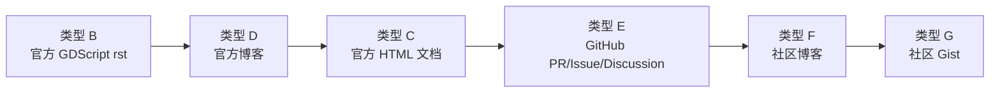

# B 层 Prose 语料预处理指南（学习材料）

> 本文档是独立于项目规范的学习材料，讲解工业标准下 prose 文本库在 chunking 和 embedding 之前需要经过哪些预处理，并直接映射到当前 `rag/vault/tier_b_prose/_raw/` 中 21 个未处理文件的操作路径。

---

## 一、为什么预处理必不可少

在把原始网页或文档直接送进向量数据库之前，必须先做预处理。原因有三点。

### 1.1 原始文件里含有大量对检索无益的噪音

以当前已经下载的 `_raw/` 文件为例：

- `official_html_doc/class_fileaccess.html` 大小约 1.4 MB，其中绝大部分是 Sphinx 渲染生成的导航栏、侧边栏、类签名表格、版权信息、搜索框模板。
- `github_pr/godot_pull_41794.html` 大小约 860 KB，里面包含 GitHub 的完整 UI：头像、 reaction 表情、时间线、评论框、状态标签、大量 CSS/JS 引用。
- `community_blog/await-coroutine-basics.html` 是 WordPress 风格的博客页面，包含菜单、广告位、作者简介、相关文章推荐、评论系统。

如果直接把这些 HTML 切块 embedding，向量库里的绝大多数条目会是“导航链接”“版权信息”“+1 评论”，真正关于 `yield → await` 迁移语义的内容被淹没。检索时会出现一种典型现象：query 明明很准，但召回的前几条全是页面 footer 或无关评论。

### 1.2 不同来源的信息密度差异极大

| 来源类型 | 信息密度 | 原因 |
|---|---|---|
| 官方 rst 升级指南 | 高 | 每句话都围绕“什么变了、怎么改” |
| 官方 GDScript 语言参考 | 中高 | 有定义性内容，也有大量示例代码 |
| 官方博客 | 中 | 有设计动机，也有项目进展、未来计划 |
| GitHub PR/Issue/Discussion | 中低 | 首帖可能很有价值，但评论里充斥讨论、试错、+1 |
| 社区博客 | 低 | 大量 SEO 引言、通用教程步骤、作者个人经验 |
| 社区 Gist | 中 | 笔记体，多个主题混在一起 |

预处理的核心目标不是“把所有文字都塞进去”，而是**让 chunking 后的每个单元都有高信噪比**。对于信息密度低的来源，要舍得丢弃大部分内容。

### 1.3 Chunking 是预处理的结果，不是起点

很多初学者把 chunking 理解为“把长文本切成 512 token 的块”。这只是在处理长度问题，没有解决质量问题。工业流程里，chunking 之前必须完成：

1. 格式归一化（把 HTML/Markdown/RST 变成干净的文本或 AST）
2. 结构解析（识别标题、段落、代码块、表格）
3. 内容过滤（去掉噪音、模板、无关段落）
4. 语义筛选（对非结构化来源保留有价值的部分）

完成这四步之后，才进入真正的 chunking 策略选择。

---

## 二、工业标准的通用预处理流程

下面按照执行顺序讲解每个阶段。

### 2.1 格式归一化（Normalization）

目标：把不同格式的原始文件转换成统一的、可进一步处理的中间表示。

#### HTML 文件

HTML 不是给人直接 chunking 的，需要先提取正文。常用方法：

- **基于规则**：用 BeautifulSoup 选择 `<article>`、`<div role="main">`、`<div class="article-body">` 等已知容器。
- **基于可读性算法**：使用 `readability-lxml`、`trafilatura`、`newspaper3k` 等库自动识别正文区域。
- **基于视觉/密度启发式**：计算每个 DOM 节点的文本密度，过滤导航、footer、侧边栏。

需要注意：

- 保留标题层级 `<h1>` `<h2>` `<h3>`，用于后续按章节切分。
- 保留代码块 `<pre><code>`，代码示例对迁移知识很重要。
- 丢弃 `<script>`、`<style>`、`<nav>`、`<footer>`、广告容器。
- 处理相对链接：如果正文里有相对链接，可以保留文本，也可以替换成绝对 URL，取决于是否需要 source_url 追溯。

#### RST 文件

RST 是标记语言，直接用正则切容易出错。标准做法是：

- 用 `docutils` 解析成 AST（`docutils.nodes.document`）。
- 遍历 AST 节点，按 `section` 节点划分层级。
- 对 `paragraph`、`literal_block`、`admonition` 等节点分别处理。

当前项目里的 `parse_upgrading_docs.py` 就是这种做法，它已经能正确处理标题层级、表格、代码块、admonition。

#### Markdown 文件

GitHub API 返回的是 Markdown，可以用：

- `markdown-it-py` 或 `mistune` 解析成 token 流。
- 或者直接按标题 `# ## ###` 和代码块 ` ``` ` 做粗分。

GitHub 评论里的 Markdown 通常比较干净，主要是文本 + 代码块 + 列表，不需要像 HTML 那样大量去噪。

### 2.2 结构解析（Structural Parsing）

目标：把归一化后的文本还原成“带层级路径的语义单元”。

#### 识别标题层级

对 HTML 提取 `<h1>` `<h2>` `<h3>`，对 RST/Markdown 按 `section` 或 `#` 层级解析。最终产出类似这样的路径：

```text
["GDScript reference", "History"]
["GDScript reference", "Example of GDScript"]
["Core refactoring progress report #2", "OS / DisplayServer split"]
```

#### 识别代码块

代码块应该和 surrounding prose 保持关联，但不一定合并成同一个 chunk。两种策略：

- **合并策略**：把代码块和紧接它的说明段落合并，保留“为什么这样写 + 示例”的上下文。
- **独立策略**：代码块单独成一个 chunk，但 metadata 里记录它所属的 `heading_path`，方便检索时一起召回。

对于迁移知识，推荐合并策略，因为 Agent 需要同时看到“说明”和“示例”。

#### 识别列表和表格

列表项如果很短（如“- 支持 X11、Wayland、EGL”），可以合并到父段落。如果列表项本身包含完整语义（如 GitHub issue 里的复现步骤），可以单独成 chunk。

表格通常来自官方文档的兼容性表，这些已经在 A 层被结构化提取，B 层不需要重复处理。

### 2.3 内容过滤（Content Filtering）

目标：去掉模板化、重复、过短、无关的内容。

#### 去除模板文本

常见模板文本包括：

- "Last updated on ..."
- "See also"
- "Table of contents"
- "On this page"
- "Was this page helpful?"
- "Edit this page on GitHub"
- GitHub 的 "Sign up for free to join this conversation on GitHub"

这些可以通过关键词列表 + 正则快速过滤。

#### 去除过短片段

当前项目里已经用了 `PROSE_MIN_CHARS = 40` 的阈值。这个阈值不是绝对的：

- 官方 rst 可以用 40-80 字符。
- 社区博客由于噪音多，建议提高到 100-150 字符，或者干脆只保留人工挑选的段落。
- GitHub 评论如果只有 "+1"、"Thanks"、"Any update?"，应该直接丢弃。

#### 去除主题无关段落

对于迁移知识库，可以通过关键词白名单/黑名单做初筛：

- 白名单："migration"、"breaking change"、"deprecated"、"renamed"、"replaced"、"Godot 4"、"GDScript"、具体 API 名。
- 黑名单："donate"、"patreon"、"subscribe"、"newsletter"、"privacy policy"。

这种规则只能做粗筛，不能替代语义筛选。

### 2.4 语义筛选（Semantic Selection）

这是预处理中最难的环节，因为“是否有迁移价值”是一个语义判断，无法靠简单规则完全解决。

#### 抽样分析

对于社区博客、GitHub 讨论这类低密度来源，标准做法是：

1. 从每个来源中抽取 10%-20% 的段落（或按主题抽样）。
2. 人工 + LLM 共同阅读这些样本，标注每个段落属于：
   - 行为差异 / 静默失败
   - 设计动机 / 架构变更
   - 操作步骤 / 代码示例
   - 噪音 / 无关
3. 根据标注结果，总结该类来源的“价值模式”。

例如，对 bugnet 社区博客的抽样分析可能得出：

- 文章开头 30% 是 SEO 引言和背景说明。
- 中间 40% 是“报错现象 + 根因 + 修复代码”。
- 结尾 30% 是相关文章推荐和作者简介。

基于这个模式，可以写一个启发式规则：只保留包含 "Godot 4"、"error"、"fix"、代码块、反引号 API 名的中间段落。

#### 人工 + AI 联合标注

LLM 适合做第一遍粗筛。可以设计一个二分类 prompt：

```text
判断以下段落是否包含 Godot 3 到 Godot 4 迁移过程中的行为差异、静默失败风险或设计动机。
只回答 YES 或 NO，并给出一句理由。

段落：{text}
```

人工做第二遍校验， especially 对 LLM 标为 YES 但实际质量不高的样本。校验后的结果可以用来：

- 直接决定是否保留该段落。
- 作为未来训练小模型的标注数据（如果规模足够大）。

#### 是否需要训练小模型

对于你当前的情况，**不建议专门训练分类小模型**。原因：

- 语料规模太小（21 个文件），训练一个 DistilBERT 级别的模型需要至少数百到数千条标注样本。
- 规则 + 启发式 + 人工筛选的 ROI 更高。
- 小模型会带来额外的依赖和维护成本。

如果未来扩展到成百上千篇文章，可以考虑：

- 用 DistilBERT / BERT-tiny / MobileBERT 训练一个二分类器，判断“是否属于迁移知识”。
- 或者用聚类 + 关键词模型自动发现主题。
- 但即便如此，高价值内容仍然需要人工 final review。

### 2.5 分块策略（Chunking Strategy）

完成过滤和筛选后，才进入 chunking。常见策略有四种。

#### 策略 1：按章节切分（推荐用于官方文档）

以标题层级为边界，把同一小节的段落、列表、代码块合并成一个 chunk。优点：

- 保留完整上下文。
- 不会把因果论述切成两半。
- chunk 边界符合人的阅读习惯。

当前项目里的 `parse_upgrading_docs.py` 就是按 `heading_path` 分桶，同一桶内段落合并。

#### 策略 2：按语义边界切分（段落/列表项/代码块）

对每个章节内部，如果内容过长，再按段落、列表项、代码块切分。适用于：

- 官方 GDScript 语言参考中的长章节。
- 官方博客中跨越多个 h3 的长文章。

#### 策略 3：固定长度滑动窗口（最后手段）

按 token 数（如 256 / 512 / 1024）硬切，必要时保留 10%-20% 重叠。缺点：

- 容易切断因果链。
- 一个 chunk 可能只有半句话，检索时语义不完整。

只在前两种策略无法应用时使用，例如某些完全没有章节结构的纯文本。

#### 策略 4：混合策略

实际工业系统通常组合使用：

- 先按章节切分。
- 如果某个章节超过模型最大输入长度，再按段落/语义边界二次切分。
- 代码块尽量保持完整，不跨 chunk。

### 2.6 元数据标注（Metadata Annotation）

每个 chunk 必须携带元数据，否则检索结果无法被 Agent 正确使用。当前项目已经定义的字段包括：

```json
{
  "heading_path": ["...", "..."],
  "text": "...",
  "since_version": "4.0",
  "source_file": "gdscript_basics.rst",
  "source": "official_doc"
}
```

建议补充的元数据：

- `chunk_type`: "prose" / "code_example" / "admonition" / "list"
- `semantic_tag`: "behavior_change" / "silent_failure" / "design_rationale" / "how_to"
- `match_tokens`: ["yield", "await", "_process"]
- `confidence`: "verified" / "extracted" / "community"
- `source_url`: 原始 URL，用于 Agent 引用

### 2.7 质量验证（Quality Assurance）

预处理不是一次性的，需要验证。

#### 人工抽查

随机抽取 10%-20% 的 chunk，人工阅读，检查：

- 是否有 HTML 标签残留。
- 是否有模板文本未过滤。
- chunk 是否在语义边界处被切断。
- 代码块是否完整。

#### 检索测试集验证

用一组已知 query 测试 Recall@K：

- "yield 改 await 有什么坑？" 应该召回包含 `_process` 里每帧 await 的 chunk。
- "Tween 节点引用失效怎么办？" 应该召回 bugnet Tween 那篇的关键段落。
- "@export 和 @onready 一起用会怎样？" 应该召回 `ONREADY_WITH_EXPORT` 相关 chunk。

如果召回结果不对，反向定位是预处理哪一步出了问题。

#### 监控指标

- 噪音率：被人工判定为无价值的 chunk 比例。
- 重复率：内容高度相似的 chunk 比例。
- 平均 chunk 长度：太短说明切分过细，太长说明信息密度低。
- 版本覆盖率：每个 `since_version` 区间是否有足够 chunk。

---

## 三、针对当前 21 个未处理文件的分类工作流

当前 `rag/vault/tier_b_prose/_raw/` 中除了已经处理好的 8 篇官方升级指南外，还有 21 个文件需要预处理。下面按 README.md 中定义的 7 种类型分别说明。

### 3.1 类型 A：官方逐版本升级指南（已处理）

- 文件数：8
- 位置：`_raw/official_upgrading_guide/`
- 状态：已完成 parse + 章节切分 + 清洗
- 产出：`rag/vault/tier_b_prose/*.prose.jsonl`

这批是官方 rst，结构清晰，已经用 `parse_upgrading_docs.py` 处理完毕。后续只需要在新增版本时复用同一套逻辑。

### 3.2 类型 B：官方 GDScript 语言参考 rst（3 个文件）

- 文件：
  - `_raw/official_gdscript_doc/gdscript_basics.rst`
  - `_raw/official_gdscript_doc/gdscript_styleguide.rst`
  - `_raw/official_gdscript_doc/signals_step_by_step.rst`
- 预处理工作流：
  1. 复用 `parse_upgrading_docs.py` 中的 `inject_substitution_defs` + `parse_doctree`。
  2. 遍历 `section` 节点，记录 `heading_path`。
  3. 收集 `paragraph`、`literal_block`、`admonition` 节点文本。
  4. 过滤长度 < 40 字符的片段。
  5. 人工复核以下关键段落是否完整保留：
     - `await` 关键字语义（对应 yield → await 迁移）
     - 注解（Annotations）机制定义
     - `ONREADY_WITH_EXPORT` 警告
     - 信号连接的 `.connect()` 回调命名约定
- 自动化程度：高
- 人工介入点：关键段落复核、确认 `ONREADY_WITH_EXPORT` 实际位置

### 3.3 类型 C：官方 HTML 渲染页（3 个文件）

- 文件：
  - `_raw/official_html_doc/using_character_body_2d.html`
  - `_raw/official_html_doc/class_fileaccess.html`
  - `_raw/official_html_doc/class_editorplugin.html`
- 预处理工作流：
  1. 用 BeautifulSoup / `trafilatura` 提取 `<article class="[bd-]article">` 或 `<div role="main">` 内的正文。
  2. 保留 `<h1>` `<h2>` `<h3>`，重建 `heading_path`。
  3. 保留描述性段落和代码示例，丢弃 API 签名表、参数表、继承关系表。
  4. 过滤长度 < 80 字符的片段。
  5. 人工检查是否有 A 层已覆盖的重复内容，避免 B 层重复收录。
- 自动化程度：中高
- 人工介入点：判断哪些 API 签名已在 `rules.db` 中覆盖

### 3.4 类型 D：官方博客（2 个文件）

- 文件：
  - `_raw/official_blog/core-refactoring-progress-report-2.html`
  - `_raw/official_blog/multiplayer-changes-godot-4-0-report-2.html`
- 预处理工作流：
  1. 提取 `<div class="article-body">`。
  2. 按 `<h3>` / `<h4>` 切分。
  3. 丢弃图片 caption、footer、导航、捐赠呼吁。
  4. 保留设计动机段落（如 OS 拆分原因、RPC 语法演进原因）。
  5. 每个 chunk 标注 `source=official_blog`。
- 自动化程度：高
- 人工介入点：核验设计动机段落完整性，确认没有切断关键论述

### 3.5 类型 E：GitHub PR / Issue / Discussion（5 个文件）

- 文件：
  - `_raw/github_pr/godot_pull_41794.html`
  - `_raw/github_pr/godot_pull_65271.html`
  - `_raw/github_issue/godot-docs_issue_5577.html`
  - `_raw/github_issue/godot-docs_issue_6265.html`
  - `_raw/github_discussion/godot-proposals_discussion_6192.html`
- 预处理工作流：
  1. **建议改用 GitHub API**，而非直接解析抓下来的 HTML。
     - PR: `GET /repos/godotengine/godot/pulls/41794`
     - Issue: `GET /repos/godotengine/godot-docs/issues/5577`
     - Discussion: `GET /repos/godotengine/godot-proposals/discussions/6192`
  2. 获取首帖的 Markdown 正文。
  3. 对评论，只保留：
     - 官方维护者（如 `akien-mga`、`reduz`、`Calinou`）的回复。
     - 高赞回复（reactions 数高的）。
     - 包含代码块或明确结论的回复。
  4. 丢弃 "+1"、"Thanks"、"Any update?"、纯表情等低信息评论。
  5. 把 Markdown 解析成文本 + 代码块，按主题段落切分。
- 自动化程度：中
- 人工介入点：选择哪些评论有价值，确认官方账号列表

### 3.6 类型 F：社区博客（7 个文件）

- 文件：
  - `_raw/community_blog/await-coroutine-basics.html`
  - `_raw/community_blog/fix-godot-tween-not-working-godot-4.html`
  - `_raw/community_blog/fix-godot-characterbody2d-move-and-slide-not-moving.html`
  - `_raw/community_blog/fix-nonexistent-function-connecting-signals-godot.html`
  - `_raw/community_blog/godot-4-setter-getter.html`
  - `_raw/community_blog/godot4-export-annotations.html`
  - `_raw/community_blog/fix-godot-rpc-call-not-working-enet-multiplayer.html`
- 预处理工作流：
  1. 先用 `trafilatura` 或 BeautifulSoup 提取正文。
  2. 抽样 1-2 篇人工分析结构（开头/中间/结尾分别是什么内容）。
  3. 用启发式规则粗筛：保留包含以下元素的段落：
     - 反引号包裹的 API 名
     - 代码块
     - "Godot 4"、"migration"、"error"、"silent"、"not working"
     - 具体报错信息原文
  4. 对粗筛结果人工 review，只保留 README.md 表格中明确标注的关键段落。
  5. 每个 chunk 标注 `source=community_prose` 和 `confidence=needs_review`。
- 自动化程度：低
- 人工介入点：**必须人工摘录**，不能整篇 chunking

### 3.7 类型 G：社区 Gist（1 个文件）

- 文件：
  - `_raw/community_gist/wolfgangsenff_migration_notes.html`
- 预处理工作流：
  1. 提取 gist 的 Markdown/纯文本内容。
  2. 按 gist 内部的小标题或代码块主题拆分成多个独立 chunk。
  3. 每个 chunk 标注对应的 `match_tokens`，例如：
     - `RectangleShape2D` / `extents` / `size`
     - `EditorPlugin` / `super._ready`
     - `Tween` / `create_tween`
  4. 对 `RectangleShape2D.extents → size` 这种数值语义陷阱，除了放入 B 层，还应考虑在 A 层 `known_traps.yaml` 补一条 `static_scan_post_l0` 规则。
- 自动化程度：低
- 人工介入点：主题拆分、token 标注、判断是否同时进 A 层

---

## 四、推荐的执行顺序

针对你当前的情况，建议按以下顺序处理，从自动化程度最高的开始，逐步过渡到必须人工的部分。



### 4.1 第一步：类型 B（3 篇官方 GDScript rst）

直接复用现有 `parse_upgrading_docs.py` 的 docutils 解析逻辑。这是最接近已处理完成的 8 篇升级指南的类型，产出最稳定。

### 4.2 第二步：类型 D（2 篇官方博客）

HTML 结构相对规范，`<div class="article-body">` 提取 + h3/h4 切分即可。重点是保留设计动机段落。

### 4.3 第三步：类型 C（3 篇官方 HTML 文档）

需要写一个 HTML 正文提取器。难点在于丢弃 API 签名表，只保留描述性文字。建议先用 `trafilatura` 快速拿到正文，再人工 review。

### 4.4 第四步：类型 E（5 个 GitHub）

建议改用 GitHub API 重新抓取 Markdown 版本，而不是解析本地 HTML。本地 HTML 只作为备份快照。

### 4.5 第五步：类型 F/G（8 个社区来源）

这部分最耗时，但也是 B 层最有价值的补充。因为社区文章的价值就在于“那几句话”，必须人工读、人工摘。

---

## 五、常用工具和代码模式

### 5.1 HTML 正文提取

```python
from trafilatura import extract

text = extract(html_text, include_comments=False, include_tables=False)
```

如果 `trafilatura` 没有安装，可以用 BeautifulSoup：

```python
from bs4 import BeautifulSoup

soup = BeautifulSoup(html_text, "html.parser")
# 移除 script/style/nav/footer
for tag in soup(["script", "style", "nav", "footer", "header"]):
    tag.decompose()
main = soup.find("article") or soup.find("main") or soup.find("div", role="main")
text = main.get_text("\n", strip=True) if main else soup.get_text("\n", strip=True)
```

### 5.2 RST 章节切分

复用当前项目已有的模式：

```python
from docutils.parsers.rst import Parser
from docutils.utils import new_document
from docutils.frontend import get_default_settings

settings = get_default_settings(Parser)
settings.report_level = 5
settings.halt_level = 5
doc = new_document(source_path, settings)
Parser().parse(rst_text, doc)
```

然后写一个 `NodeVisitor` 遍历 `section`、 `paragraph`、 `literal_block`、 `admonition`。

### 5.3 Markdown 解析

```python
import markdown_it

md = markdown_it.MarkdownIt()
tokens = md.parse(markdown_text)
```

遍历 token 流，识别 `heading_open`、`paragraph_open`、`fence`（代码块）等。

### 5.4 长度过滤

```python
MIN_CHARS = 80

def keep(text: str) -> bool:
    return len(text.strip()) >= MIN_CHARS
```

### 5.5 元数据模板

```json
{
  "heading_path": ["Core refactoring progress report #2", "OS / DisplayServer split"],
  "text": "One of the largest singletons in Godot is the OS class...",
  "since_version": "4.0",
  "source_file": "core-refactoring-progress-report-2.html",
  "source": "official_blog",
  "source_url": "https://godotengine.org/article/core-refactoring-progress-report-2/",
  "semantic_tag": "design_rationale",
  "match_tokens": ["OS", "DisplayServer", "Time", "Engine"]
}
```

---

## 六、常见误区

### 6.1 误区一：直接对整个 HTML 页面做 embedding

这会让导航栏、footer、广告都进入向量库，严重降低检索质量。

### 6.2 误区二：按固定 token 长度硬切所有文档

官方文档按章节切分效果更好。固定长度切分会切断“原因 → 结果”的因果链。

### 6.3 误区三：把社区文章整篇灌入

社区博客 90% 的内容是通用教程和 SEO 文字，真正有价值的迁移知识只有几句话。整篇灌入会稀释信噪比。

### 6.4 误区四：忽视元数据

没有 `since_version` 和 `source` 的 chunk，检索时无法做版本过滤，也无法让 Agent 判断信息来源的可信度。

### 6.5 误区五：追求完全自动化

对于你当前的规模（21 个文件），完全自动化既不现实也不划算。人工摘录社区来源的时间成本远低于写和维护一个复杂分类器的成本。

---

## 七、总结

工业标准下，prose 语料在进入 chunking 和 embedding 之前，需要经过七个阶段：

1. 格式归一化
2. 结构解析
3. 内容过滤
4. 语义筛选
5. 分块策略
6. 元数据标注
7. 质量验证

对于你当前的项目，8 篇官方升级指南已经处理完毕，剩下 21 个文件应按“自动化程度从高到低”的顺序处理：

- 官方 GDScript rst → 复用现有解析器
- 官方博客 → HTML 正文提取 + 标题切分
- 官方 HTML 文档 → 正文提取 + 丢弃 API 签名表
- GitHub PR/Issue/Discussion → 改用 API，筛选高价值评论
- 社区博客和 Gist → 人工摘录关键段落

不要为小规模语料训练专门的小模型。规则 + 启发式 + 人工筛选是当下最经济、最可控的路径。
