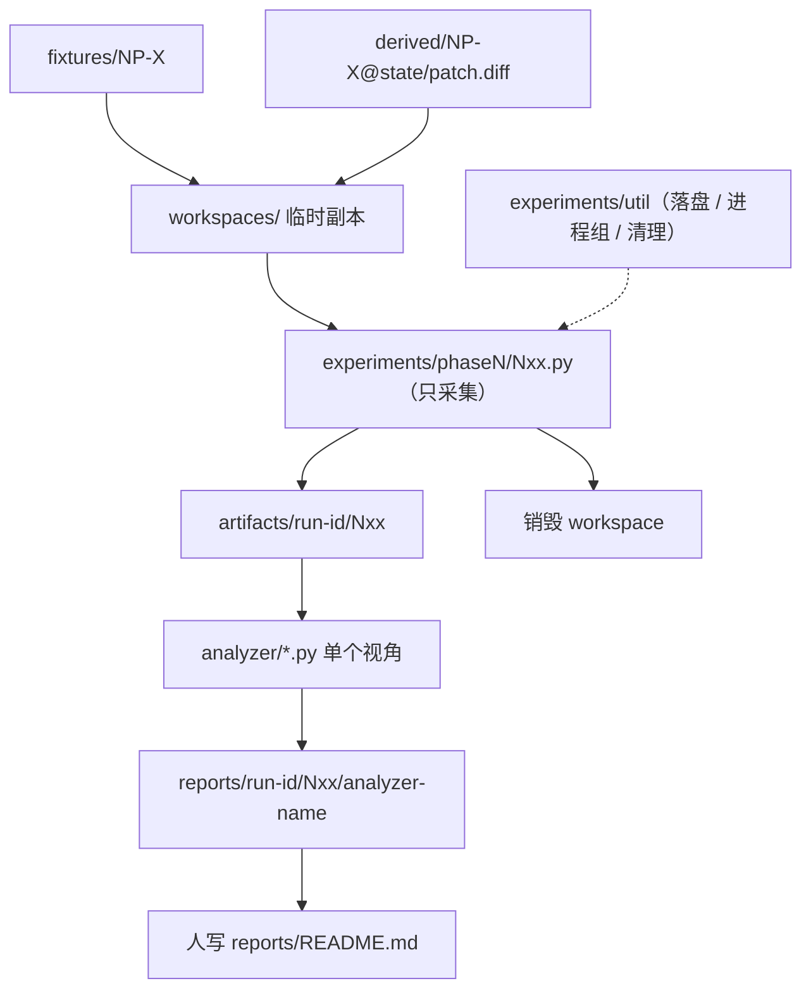

# probe_tests 执行架构

实验规划（哪些实验、判据、决策影响）在 [README.md](README.md)。V1–V8 指令编号表在 README §0.2，全部实验共同的记录与清理要求在 README §0.5。本文只规定**怎么跑、怎么判定、产物放哪**。

三条铁律：

1. **采集与判定是两次独立进程。** 日志落盘之后，判定只读磁盘。
2. **一个实验 = 一个 Python 脚本。** 实验之间不共享控制流，只共享落盘工具。
3. **脚本不下结论。** 脚本只采集；`CONFIRMED` 这类判断由 analyzer 规程化、由人写进报告。

---

## 1. 两段式

```text
采集：  python experiments/phase1/N09.py
        → artifacts/<run-id>/N09/...

判定：  python analyzer/stability.py artifacts/<run-id>/N09/
        → reports/<run-id>/N09/stability/...
```



### 为什么不用 YAML + kernel

11 条实验的步骤形态彼此**异构**：有序状态机（N03、N06）、GUI manual gate（N02、N06）、纯离线 diff（N09 横向、N04）、外部数据集迭代（N21）、一次性能力探测（N15）。把这些塞进统一 schema 需要三层间接——kernel 解释 schema、hook 注册表实现特例、`analysis.type` 分派判定——每加一个特例都要同时改 schema、改 hook、改分派。实测直接写脚本的代码量更低，管理成本也更低。

新的分工：**异构留在脚本里，同构留在 util 里**。同构的只有这几件事：起进程组、超时杀干净、按固定形状落盘、销毁工作区、算摘要。

---

## 2. 目录

```text
probe_tests/
├── README.md                 实验规划（11 条实验的卡片与步骤表）
├── ARCHITECTURE.md           本文件
├── fixtures/{phase1,phase2}/ 不可变实验材料，零实验元信息
├── annotations/{phase1,phase2}/  与 fixtures 一一对应的埋点表（YAML，纯数据）
├── derived/                  manual gate 产物（patch.diff + provenance.yaml）
├── experiments/
│   ├── util/                 共享落盘工具包（唯一被多个脚本 import 的东西）
│   ├── common/fragments/     实验参数片段（如 N05 的 warning 配置 .ini）
│   ├── phase1/               N09.py N08.py N03.py N01.py N02.py N04.py N05.py N06.py N07.py
│   └── phase2/               N15.py N21.py
├── analyzer/                 每个视角一个独立脚本
├── artifacts/                原始测量（唯一真相源）
├── reports/
│   ├── README.md             人写实验报告（结论）
│   └── <run-id>/<N>/         analyzer 输出
└── workspaces/               临时工作区，实验结束即空
```

**已删除，不要再建**：

| 已删 | 替代 |
| --- | --- |
| `runner/`（kernel / hooks / analyzers / report / testing） | 实验脚本 + `experiments/util/` + `analyzer/` |
| `datasets/official-demos/` | N21 按脚本内的 manifest（URL + commit）clone 到 `workspaces/`，仓库里不留数据集 |
| `experiments/**/N*.yaml` | 同名 `.py` |
| `report/`（单数）与顶层 `Analyzer.py` | `reports/<run-id>/<N>/` 与 `analyzer/<name>.py` |
| fake Godot 桩框架 | 干跑时用 `PROBE_GODOT` 环境变量指向任意可执行文件；假二进制产物不得被任何“已确认”结论引用 |

`fixtures/` 中不得放：实验说明、实验脚本、临时日志、GUI 记录、错误 UID 的永久版本、`.godot/`、运行结果。

---

## 3. 实验脚本契约

每个实验一个脚本，文件名就是实验编号：`experiments/phase1/N09.py`。脚本**只做四件事**：

1. 声明身份与依赖（编号、fixture、上游 exports）；
2. 从不可变 fixture 建临时工作区（需要时应用 derived patch）；
3. 按 README 卡片里步骤表的顺序采集，每一步落盘；
4. `finally` 清理：杀进程组、删工作区、校验原 fixture 仍 clean。

骨架（`util` 承担全部同构动作，脚本只表达顺序）：

```python
# experiments/phase1/N09.py
from experiments.util import probe

N = "N09"

def main():
    run = probe.start(N, repeat_default=5)      # 建 run-id、记录环境身份与 inputs_digest

    with probe.workspace("phase1/CleanControl") as ws:
        probe.cold(ws)                          # rm -rf .godot/
        run.measure(ws, group="clean-control", step="v1", cmd="V1", cache="COLD")
        probe.warm(ws)                          # 跑一次 V3，确认成功
        run.measure(ws, group="clean-control", step="v1", cmd="V1", cache="WARM")
        run.measure(ws, group="clean-control", step="v2-main", cmd="V2",
                    cache="WARM", target="res://main.gd")

    with probe.workspace("phase1/NP-CASCADE") as ws:
        ...

    run.finish()                                # 写 index.md 与 artifacts/latest/N09.json

if __name__ == "__main__":
    main()
```

`run.measure(...)` 内部完成：应用步骤级辅助（哨兵等）、按 `repeat` 循环、起独立进程组、超时 `killpg`、把该次测量按 §6 的形状落盘、撤销自己写入的文件。脚本里出现的每一个 `measure` 对应 README 步骤表里的一行。

**禁止**：

- 在脚本里做判定或打印“确认/未确认”；
- 跨实验 `import` 另一个实验脚本（要复用就下沉到 `util`）；
- 在原 fixture 上直接跑，或把工作区留到脚本结束之后；
- 把只有一个实验用得到的逻辑塞进 `util`（那属于该脚本的私事）。

---

## 4. Analyzer 契约

```text
python analyzer/<name>.py <artifact-dir> [--out reports/...]
```

`<artifact-dir>` 是一次已落盘的实验目录（含 `group/step/cache/repeat` 与 `index.md`）。analyzer 只凭磁盘工作，不要求 workspace 仍在、也不要求刚跑完采集。输出目录按 artifacts 的路径命名方式镜像生成：

```text
artifacts/<run-id>/<N>/   →   reports/<run-id>/<N>/<analyzer-name>/
```

同一份 artifacts 可以被多个 analyzer 从不同角度解析，各写各的子目录，互不覆盖。改判定逻辑不必重采，对同一目录再跑一次即可。

| analyzer | 解析角度 | 服务的实验 |
| --- | --- | --- |
| `stability.py` | 纵向重复差异 + 横向跨项目行差 | N09 |
| `delta.py` | Δ = `noise_signature` 减法，再用 `local_signature` 对埋点表归类 | N01、N02、N05、N06、N07 |
| `sequence.py` | 有序状态机，断言写在状态转移上 | N03、N06 |
| `exitcode.py` | rc / signal / timeout 交叉表，含存活性观测 | N08 |
| `cascade.py` | 根因候选与症状配对、放大倍数 | N04 |
| `capability.py` | 只提取能力与职责矩阵，无对错 | N15 |
| `corpus.py` | 数据集迭代 + 聚合统计 | N21 |

`analyzer/common.py` 放共享的行解析与两级 signature 计算（见 §9），其余脚本各自独立。

**禁止**：

- analyzer 里 `import` 实验脚本，或写死某个 fixture 名；
- analyzer 修改 `artifacts/`（它只读）；
- 往已有 analyzer 里加 `if N == "Nxx"` 分支——落不进现有角度就新写一个脚本。

语义结论（字段抹除规格、BG-DRIFT、`CONFIRMED`）不由 analyzer 判定，escalate 给人，由人贴进 [reports/README.md](reports/README.md)。

---

## 5. 共享工具 `experiments/util`

只收**多个实验都要做**的同构动作。

| 函数 | 职责 |
| --- | --- |
| `probe.start(N, ...)` / `run.finish()` | 建 run-id、采集环境身份（Godot 路径 / 版本 / build hash / 平台）、算 `inputs_digest`、收尾写 `index.md` 与 exports |
| `probe.workspace(fixture)` | 上下文管理器：复制 fixture 到 `workspaces/`，退出时销毁并校验原 fixture 仍 clean |
| `probe.cold(ws)` / `probe.warm(ws)` | 删除 `.godot/`；或跑一次 V3 并确认成功。见下「缓存态」 |
| `run.measure(...)` | 一次测量的全部同构动作（见 §3）；`cmd` 取 README §0.2 的 V1–V8 |
| `probe.sentinel(ws, include=...)` | 见下 |
| `probe.apply_derived(ws, name)` | 校验 `provenance.yaml` 的 build hash 后 `git apply`，见 §7 |
| `probe.snapshot(ws)` / `probe.diff(a, b)` | 文件树快照、`workspace.diff`、cache manifest |
| `probe.settings(ws, fragment)` | 追加 `experiments/common/fragments/` 的配置片段到 `project.godot` |
| `probe.annotations(fixture)` | 读埋点表并计入 `inputs_digest`（只读数据，不做匹配） |

一次性的特例（伪造 UID、改 `ext_resource`、生成 late class、生成大文件、`config_version` 降级）**写在用它的那个脚本里**，不进 `util`。

### 缓存态

README 步骤表的「缓存」列只有三个取值，`run.measure(cache_state=...)` 原样落进 artifact 路径：

| 取值 | 含义 | 实现 |
| --- | --- | --- |
| `COLD` | 本步骤前 `.godot/` 不存在 | `probe.cold(ws)` |
| `WARM` | 本步骤前已完成一次成功 import | `probe.warm(ws)` |
| `PRESERVE` | **不动缓存**，沿用上一步留下的状态 | 什么都不做 |

`PRESERVE` 是有序状态机（N03 的 T4/T5、N06 的观测步）的判定前提——这些步骤要观察的正是“缓存没被清”时引擎的行为，任何清缓存动作都会让该步失效。脚本必须在 `PRESERVE` 步骤前后落盘 cache manifest，用来事后证明缓存确实没变。

### `probe.sentinel`

V1（以及 V7/V8 作用于 V1 时）的哨兵**不常驻 fixture**：

```text
扫描 workspace 内 *.gd（N07 按需扩展到 .tscn / .tres / .gdshader）
排除自身与 __probe_ 前缀
写入 res://__probe_sentinel.gd
运行 V1
步骤结束删除
```

`__probe_` 前缀同时用于 signature 统计排除与 fixture 洁净性校验。**N04 分析根因时必须先扣掉哨兵 preload 坏文件产生的人造级联边**，否则放大倍数被高估。

---

## 6. Artifact 与 report 布局

与 README §0.1 的四元组对齐，路径必须包含 cache 与 repeat，否则重复运行会互相覆盖：

```text
artifacts/<run-id>/<N>/<group_id>/<step-id>/<cache_state>/<repeat_idx>/
├── metadata.json          含 inputs_digest、cwd、applied_helpers、env_overrides
├── argv.json
├── stdout.log
├── stderr.log
├── process-status.json    rc / signal / timed_out / wall_time
├── fs-before.json
├── fs-after.json
├── workspace.diff
└── cache-manifest.json

artifacts/<run-id>/<N>/<group_id>/cleanup.json
artifacts/<run-id>/<N>/index.md          证据索引，不是判定
artifacts/latest/<N>.json                该实验导出给下游的结论输入（见 §8）
```

路径必须含 `group_id`：同一实验下多个 group 可以有同名 `step_id`（N09 两组都有 `v1`），否则后写的会覆盖先写的日志。

**判定文件不进 artifacts**：`signatures.json`、`evaluation.json` 这类都属于 analyzer 产物，写在

```text
reports/<run-id>/<N>/<analyzer-name>/
```

`reports/README.md` 是人写的报告，与上面这些目录并列，互不覆盖。

---

## 7. Derived patch（manual gate 的可重放形式）

N02、N06 的 GUI 产物是纯文本，优先冻结为：

```text
derived/NP-ADDON@plugin-enabled/{patch.diff, provenance.yaml}
derived/NP-RESOURCE@uid-baseline/{patch.diff, provenance.yaml}
```

`provenance.yaml` 记 Godot 版本、build hash、生成时间、人工确认记录。应用前校验 build hash（对的是当前可执行文件，不是 git commit）；空或不一致则退回 manual gate，重做 GUI 并覆盖 derived。

N02 的核心判据本来就是“GUI 启用插件后 `git diff project.godot` 写了什么”——那份 diff 既是实验产物，也是可重放输入。

GUI 之后若出现下列情况，derived 方案作废，永久 manual gate：

1. 二进制资源：`.res` / `.scn`、import 产物（如 `.ctex`），diff 不可读且跨构建不稳；
2. `.godot/` 私货：`imported/`、`filesystem_cache*`、`editor_layout.cfg`、class cache——含时间戳、窗口坐标、本机路径；
3. 绝对路径或平台痕迹：`/Users/...`、`C:\...`、CRLF、`.DS_Store`；
4. 关键状态未写入可提交文本：例如启用插件后 `project.godot` 无变更，单例只活在运行时或 `.godot/`。

本地判定（不必推远程）：对 fixture 副本建 git 基线，GUI 后看 `git status` / `git diff`；只把实验目标文件的文本变更冻进 `patch.diff`（N02：`project.godot`；N06：`.tscn` / `.uid`）。`git diff --numstat` 出现 `-	-`（二进制）或有效变更全在 `.godot/` 则不可移植。用 `git apply --check` 在另一份干净副本上验证可重放。

---

## 8. 依赖、导出与陈旧检测

没有 YAML 的 `depends_on` 之后，依赖用两个约定表达：

1. **导出**：脚本结束时把下游要用的结论输入写到 `artifacts/latest/<N>.json`（例如 N09 的 normalization profile、N08 的 exit code 策略、N15 的 converter capabilities）。
2. **校验**：下游脚本启动时读上游 JSON，比对其中的 `inputs_digest`（fixture hash + 埋点表 hash + derived patch hash + Godot build hash + 上游导出 hash）。

| 情况 | 行为 |
| --- | --- |
| 上游 JSON 缺失 | 直接退出并报 `BLOCKED`，不可绕过 |
| 上游 digest 已变（STALE） | 默认拒绝执行；确认要用旧结论时须显式传 `--force-stale`，并把该标记写进 `metadata.json` |
| 上游重跑且导出变化 | 已跑过的下游实验一律标记为 STALE，其结论不得继续引用 |

README §0.5.4 的 BLOCKED 规则由这一节实现。

---

## 9. 两级 signature 与归类（实现备忘）

规格以 README §0.4 为准。实现时不可合并这两步：

1. 用 `noise_signature` 做 BG 减法（粗筛引擎噪声）；
2. 用 `local_signature` + `annotations/` 埋点表把 Δ 归入 REAL / CLEAN 桶。

CLEAN 桶 = 生产 verifier 的噪声过滤白名单；REAL 桶 = 禁止过滤的保护名单。桶内两条 signature 都要存。计算两级 signature 的代码只有一份，放 `analyzer/common.py`，实验脚本不参与计算。
