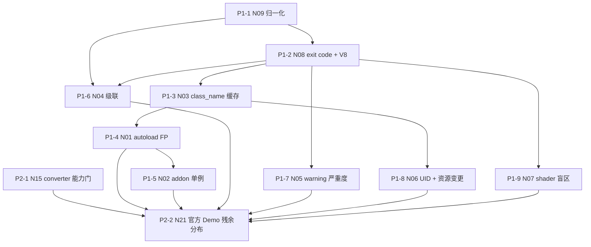

# Godot 4.7.1 Verifier 噪声与 3.x 自动迁移实验

> 本文档将实验重构为两个彼此隔离的阶段：
>
> 1. **第一阶段：Verifier 噪声排查**
>   使用 Godot 4.7.1 原生 clean 项目和专项 probe 项目，确认命令语义、缓存、autoload、warning、UID、shader、退出码和非确定性等问题。
> 2. **第二阶段：官方 3.5/3.6 Demo 自动迁移评测**
>   先验证 converter 能力边界，再对官方 Demo 执行自动迁移，统计迁移后残余问题的类型、数量和分布。

> **本版是裁剪版。** 原 N01—N21 精简为 **11 条实际执行的实验**（第一阶段 9 条 + 第二阶段 2 条）。被删除和被合并的实验、以及它们各自的先验结论，集中写在 §2.3，不再散落在卡片里。
>
> - **N 编号不变**，以对齐 `experiments/**/N*.py` 的文件名与已落盘的 artifacts；
> - 卡片按**实际执行顺序**排列，`P1-x` / `P2-x` 就是执行顺序；
> - 每张卡片只写自己特有的东西，全部实验共同的记录与清理要求上收到 **§0.5**。

---

# 第 0 层 · 测量定义

## 0.1 一次测量 = 四元组，不是“跑一条命令”

缓存状态必须进入实验设计：

```text
Measurement = (project, command, cache_state, repeat_idx)

cache_state ∈ {COLD, WARM}
  COLD = rm -rf .godot/
  WARM = 先跑一次 V3 import 成功后的状态

repeat_idx ∈ {1..R}
  R = 3（全部实验的默认值）
  R = 5（仅 N09 自身，校准低频抖动需要更多样本，见 N09 卡片）
```

每一次测量必须落盘哪些字段、每个实验结束必须通过哪些清理检查，见 **§0.5 通用记录契约**。

**任何一条结论，如果没有标注 cache state，就不进入“已确认”结论区。**

## 0.2 指令编号

共 8 条。旧编号 V9（哨兵）并入 **V1**；旧编号 V10（逐文件循环 V2）删除。后续实验凡写 V1，均指哨兵项目级校验。


| ID     | 命令                                                                                                                                                                                                                   | 语义定位                                                                                                                                                                               |
| ------ | -------------------------------------------------------------------------------------------------------------------------------------------------------------------------------------------------------------------- | ---------------------------------------------------------------------------------------------------------------------------------------------------------------------------------- |
| **V1** | `$GODOT --headless --path $P --check-only --script res://__probe_sentinel.gd --quit`，哨兵内 preload 全部脚本，哨兵脚本必须按照相对路径引入，必须要排序后引入，避免每次产生log的顺序不同。哨兵生效本身就是一个去噪的里程碑。哨兵本身只拉取gd代码，因为shader等资源应该在原本项目的脚本中去主动引用，哨兵不改变原本项目的逻辑。 | 项目级编译校验。godot-proposals #1758 的 workaround；已验证有效。哨兵**不常驻 fixture**，由 `probe.sentinel` 在步骤开始时生成、步骤结束时删除（契约见 ARCHITECTURE.md §5）。不带 `--script` 的裸 `--check-only` 已确认是 no-op，不再占用指令编号 |
| **V2** | `$GODOT --headless --path $P --script res://X.gd --check-only --quit`                                                                                                                                                | 单文件 check（官方文档唯一支持的用法）                                                                                                                                                             |
| **V3** | `$GODOT --headless --path $P --editor --import --quit`                                                                                                                                                               | 全项目导入 + class cache 重建                                                                                                                                                             |
| **V4** | `$GODOT --headless --path $P --import --quit`                                                                                                                                                                        | 不带 `--editor` 能否 import                                                                                                                                                            |
| **V5** | `$GODOT --headless --path $P --quit`                                                                                                                                                                                 | 真实运行时（autoload 会注册）→ **交叉验证信号源**                                                                                                                                                   |
| **V6** | `$GODOT --headless --path $P --quit-after 2`                                                                                                                                                                         | 更硬的防挂死                                                                                                                                                                             |
| **V7** | V1/V2/V3 + `--verbose`                                                                                                                                                                                               | 是否给出结构化/依赖顺序信息                                                                                                                                                                     |
| **V8** | V1/V2 + `--debug`                                                                                                                                                                                                    | **预期挂死或 signal 11 崩溃**                                                                                                                                                             |


## 0.3 `PROJECT_CHECK`

项目级扫描就是 **V1**（哨兵 preload）。实验脚本在 V1 步骤前写入 `__probe_sentinel.gd`，步骤结束后删除。旧文档里的 `PROJECT_CHECK` 与 V1 同义，不必再配映射。

注意：

- 后续实验需要项目级编译校验时写 **V1**（或 `PROJECT_CHECK`）。
- 哨兵 `__probe_sentinel.gd` 由 `probe.sentinel` 步骤级注入，不常驻 fixture。


## 0.4 噪声判定


### 0.4.1 两级 signature

归一化对每一条输出行产出**两条** signature，用途不同，不可互相替代：

```text
local_signature = sha1(kind | res_path | symbol | normalized_msg)
  保留 res:// 相对路径与符号名；抹掉行号、绝对路径、内存地址、耗时数值
  用途：项目内身份 —— 重复比较、级联去重、Agent 震荡检测

noise_signature = sha1(kind | msg_template)
  路径、符号名、数值全部占位符化，只留消息模板
  用途：唯一用途是 BG 减法
```

两级各自抹掉哪些字段，由 N09 的**纵向 + 横向**两个维度共同裁定（见 N09 卡片）。

因为 `noise_signature` 已经抹掉全部项目专属字段，**BG 不需要与探针同构**——CleanControl 可以一直保持极简。

### 0.4.2 BG 减法只作用于 noise_signature

对 CleanControl 建立背景集：

```text
BG(cmd, state) = {
  noise_signature(line)
  | line ∈ CleanControl 在 (cmd,state) 下的 stderr/stdout
  且 severity ∈ {ERROR, SCRIPT ERROR, WARNING}
}
```

对任意探针 P：

```text
Δ(P, cmd, state) = { line ∈ Out(P, cmd, state) | noise_signature(line) ∉ BG(cmd, state) }
```

**陷阱（必须写在实现里）**：模板化会把 `Identifier not found: Config`（N01）和 `Identifier not found: ProbeFoo`（N03）折叠成同一个 `noise_signature`。所以 **BG 减法只做粗筛，TP/FP 归类必须回到** `local_signature`。这两步不可合并——一旦合并，只要背景里出现过任意一条同模板消息，N01 的真假阳性就会被整体减掉。

### 0.4.3 real / clean 是归类桶，不是事先标注

埋点表 `annotations/<phase>/<NAME>.yaml` 只记录"我在哪个文件埋了什么 + 怎么匹配"，**不预言引擎会报什么文案**（那是实测结果，进 artifacts）。real/clean 是 Δ 算完之后的归类结果：

```text
埋点表（事先）：我在哪个文件埋了什么 + 匹配线索
归类（事后）：Δ 中每条命中埋点 → REAL 桶；未命中 → CLEAN 桶
```


| 判定               | 定义                           | 含义                           |
| ---------------- | ---------------------------- | ---------------------------- |
| **TP**           | 埋点被 Δ 中某条命中                  | verifier 正常工作；该 Δ 条目进 REAL 桶 |
| **FN**           | 埋点未被任何 Δ 条目命中                | verifier 盲区                  |
| **FP**           | Δ 中未命中任何埋点的条目 = CLEAN 桶的全部内容 | 噪声，必须过滤或规避                   |
| **SEV-MISMATCH** | 输出存在但严重度与预期不同                | 可能误触发终止条件                    |
| **BG-DRIFT**     | CleanControl 自身在重复实验间不稳定     | 输出需要归一化                      |


**两个桶累积起来就是第一阶段的最终交付物**：

- CLEAN 桶 = 生产 verifier 的**噪声过滤白名单**；
- REAL 桶 = **禁止过滤的保护名单**。

桶内每条必须同时存 `local_signature` 与 `noise_signature`：存前者才能回溯到具体埋点与具体文件，存后者才能把第一阶段的结论**泛化到第二阶段的官方 Demo**——那些项目的路径和符号名与探针完全不同，只有模板级 signature 能迁移。

### 0.4.4 对照优先级

同一个判定能用多种对照物时，按此优先级取：

```text
同项目内的 clean 埋点  >  最近邻探针  >  CleanControl (BG-base)
```

越靠前的对照物与被测项越同构，能排除的变量越多。这个设计原本已散落在各 N 卡片里当特例（NP-SYNTAX 的 `ok.gd`、NP-SHADER 的 `good.gdshader`、NP-AUTOLOAD 的 `main.gd` 走场景 vs `uses_autoload.gd` 孤立、N02 用 NP-AUTOLOAD 而不是 CleanControl 作对照），此处提为通则。

推论：**CleanControl 不需要为了"特征覆盖"变复杂**。它只承担 BG-base 与 N08 无错 rc 基线这两个职责，保持极简即可。

## 0.5 通用记录契约

下面这些要求对**每一条实验、每一个步骤、每一次重复**都成立。卡片不再重复抄录，只写自己额外需要的东西（见 §0.5.5）。

### 0.5.1 每一次测量都必须落盘


| 类别   | 必须记录                                                                    |
| ---- | ----------------------------------------------------------------------- |
| 输入身份 | 项目或数据集版本、fixture 名与文件树 hash、埋点表 hash、derived patch hash、`inputs_digest` |
| 环境身份 | Godot 二进制路径、版本、build hash、平台、`env_overrides`                            |
| 调用本身 | 完整 argv（列表形式，不经过 shell）、`cwd`、缓存状态、重复编号、本步骤应用的辅助操作列表                    |
| 输出   | stdout、stderr（分别落盘，不合流）                                                 |
| 进程   | exit code、终止 signal、是否 timeout、wall time                                |
| 副作用  | 步骤前后文件快照、`workspace.diff`、cache manifest                                |
| 收尾   | 工作区是否成功删除、原 fixture 是否仍然 clean                                          |


落盘路径形状与文件名以 [ARCHITECTURE.md](ARCHITECTURE.md) §6 为准：路径必须包含 `group_id / step_id / cache_state / repeat_idx`，否则重复运行会互相覆盖。判定文件不进 artifacts。

### 0.5.2 工作区隔离流程

所有实验一律走同一条流水线，任何 GUI 操作、UID 伪造、插件启用、文件改名、配置注入、converter 调用都**只能发生在临时工作区**：

```text
immutable fixture → copy 出临时 workspace →（可选）应用 derived patch → 有序步骤 → artifacts → 删除 workspace
```


### 0.5.3 每个实验结束必须通过的清理检查

- Godot 进程组已退出，无残留子进程；
- 临时工作区已删除；
- 原 fixture 的 git 状态干净、文件树 hash 未变；
- artifacts 不位于 fixture 内；
- 下一个实验不会继承上一个实验的 `.godot/`；
- manual gate 产生的文件只存在于临时工作区。

即使发生 timeout、signal 11、converter hang、Python 异常、人工取消或 assertion failure，也必须进入同一个 finally 清理流程（详见第 8 层）。

### 0.5.4 重复次数与依赖新鲜度

- 默认 `repeat: 3`；仅 N09 自身为 5；纯能力探测步骤与一次性前置步骤为 1。
- 卡片里的「依赖」是硬依赖：上游未完成或上游 `inputs_digest` 已过期（STALE）时，下游必须标记为 **BLOCKED**，不得静默跳过、不得沿用旧结论。
- 结论状态只能是 `CONFIRMED` / `NOT_REPRODUCED` / `INCONCLUSIVE` / `BLOCKED` / `NEEDS_MANUAL_REVIEW`（见第 9 层）。


### 0.5.5 卡片只写增量

每张实验卡片的结构固定为：

```text
定义块（目的 / Fixture / 对照 / 依赖 / 产出）
步骤表（严格有序，一行一步，缓存态与重复次数各占一列）
判据
决策影响
额外记录   ← 只写超出 §0.5.1 的部分
执行要点   ← 只写与通用流程不同的部分
```

---


# 第 1 层 · 项目总体规划


## 1.1 Fixture 清单与本轮取舍

Fixture 是不可变实验材料，一个 fixture 可以服务多个实验。**每个 fixture 具体跑哪些指令、在哪个缓存态下跑几次，全部写在对应实验卡片的步骤表里**，此处不再重复。

### A 组：Verifier 噪声 fixture（第一阶段）


| Fixture            | 承载的噪声/能力                                            | 服务的实验                 | 本轮             |
| ------------------ | --------------------------------------------------- | --------------------- | -------------- |
| **CleanControl**   | 背景集 BG-base、无错时的 rc 基线                              | N09、N08               | 执行             |
| **NP-SYNTAX**      | 真错误时的 rc、启动成功不等于脚本正确、错误文本格式、同构单根错误分母                | N08、N04               | 执行             |
| **NP-GLOBALCLASS** | `class_name` 全局类缓存冷假阳性、新增 `class_name` 后的 import 触发 | N03                   | 执行             |
| **NP-AUTOLOAD**    | autoload 符号假阳性，以及与之对照的真冲突                           | N01                   | 执行             |
| **NP-ADDON**       | 插件运行时注册的单例假阳性                                       | N02（并作 N08 的 V8 复现备选） | 执行             |
| **NP-CASCADE**     | 一个根因放大成多条 error；多错误输出顺序稳定性                          | N04、N09               | 执行             |
| **NP-WARN**        | warning 与 error 的严重度混淆、`exclude_addons`             | N05                   | 执行             |
| **NP-RESOURCE**    | 伪造 UID 的严重度、资源引用变更后的缓存陈旧                            | N06                   | 执行             |
| **NP-SHADER**      | shader 错误是盲区还是可抬升到解析期                               | N07                   | 执行             |
| **NP-ALIEN**       | C#/GDExtension 环境不匹配                                | 原 N13                 | **不执行**，见 §2.3 |


### B 组：Converter fixture（第二阶段）


| Fixture / 数据集           | 承载的能力                                   | 服务的实验 | 本轮             |
| ----------------------- | --------------------------------------- | ----- | -------------- |
| **CP-MINIMAL**          | converter 与 upgrade tool 的 CLI 能力门、职责矩阵 | N15   | 执行             |
| **官方 3.5/3.6 Demo 数据集** | 自动迁移残余问题分布、import 成本、TODO 与 shader 残余   | N21   | 执行             |
| **CP-BIGFILE**          | converter 跳过大文件 / hang                  | 原 N11 | **不执行**，见 §2.3 |
| **CP-TODO**             | `TODOConverter3To4` 与 `instance()` 覆盖率  | 原 N17 | **不执行**，见 §2.3 |
| **CP-SHADER**           | `.shader` → `.gdshader` 转换正确性           | 原 N18 | **不执行**，见 §2.3 |
| **CP-MUTATION**         | 哪些变异算子会被 converter 自动复原                 | 原 N20 | **不执行**，见 §2.3 |


标注为“不执行”的 fixture **保留在** `fixtures/` **里，不要删**，随时可以在时间允许时重新启用；本轮不为它们写实验脚本。

## 1.2 重要架构调整：项目是 Fixture，N 才是实验

原方案中的 NP/CP 项目继续保留，但其角色改为：

```text
NP/CP Project = 不可变实验材料 Fixture
N            = 独立、有序、可重复、可恢复的实验定义
```

因此：

- 不在每个 NP 项目里放任何实验元信息；
- 不以“进入某个项目后，把 V1—V8 全部跑一遍”的方式执行；
- 每个 N 独立拥有一个实验脚本；
- 一个 N 只执行与自己有关的命令；
- 脚本里的步骤严格有序，不可并行、不可重排；
- 每次实验从不可变 Fixture 创建独立工作区；
- 实验结束后删除工作区，而不是依赖在原目录中反向修改；
- 任何 GUI 操作、UID 生成、插件启用、文件改名或配置注入，都只能发生在该 N 的临时工作区。

---


# 第 2 层 · 本轮执行的实验与裁剪结果

裁剪原则只有一条：**这条实验的结论会不会改变 verifier 的判定准确性（假阳性、假阴性、成功判定）或改变代码量？** 会改的留下，不会改的删掉并写出先验结论。

## 2.1 第一阶段：Godot 4.7.1 Verifier 噪声排查（9 条）


| 执行序  | 编号  | 主题                                                | Fixture                            | 产出                             |
| ---- | --- | ------------------------------------------------- | ---------------------------------- | ------------------------------ |
| P1-1 | N09 | 非确定性与归一化                                          | CleanControl、NP-CASCADE            | 两级 signature 字段规格、`repeat` 默认值 |
| P1-2 | N08 | exit code 可信度、启动成功语义、`--debug` 存活性                | CleanControl、NP-SYNTAX、NP-AUTOLOAD | `exit_code_policy.json`、指令能力记录 |
| P1-3 | N03 | `class_name` 冷缓存假阳性 + 新增 `class_name` 的 import 触发 | NP-GLOBALCLASS                     | `import_trigger_policy`（脚本侧）   |
| P1-4 | N01 | autoload 假阳性                                      | NP-AUTOLOAD                        | autoload 过滤策略                  |
| P1-5 | N02 | addon 单例假阳性                                       | NP-ADDON                           | 符号白名单的实现成本裁决                   |
| P1-6 | N04 | 级联错误淹没根因                                          | NP-CASCADE、NP-SYNTAX               | 放大倍数、根因↔症状配对表                  |
| P1-7 | N05 | warning 与 error 严重度混淆                             | NP-WARN                            | 严重度采集策略                        |
| P1-8 | N06 | invalid UID 严重度 + 资源引用变更的 import 触发               | NP-RESOURCE                        | `import_trigger_policy`（资源侧）   |
| P1-9 | N07 | shader verifier 盲区                                | NP-SHADER                          | 验证边界声明                         |


## 2.2 第二阶段：Converter 和官方 Demo 自动迁移评测（2 条）


| 执行序  | 编号  | 主题                                                     | Fixture/数据集 | 产出                            |
| ---- | --- | ------------------------------------------------------ | ----------- | ----------------------------- |
| P2-1 | N15 | converter 与 ProjectUpgradeTool 的 CLI 能力门与职责矩阵          | CP-MINIMAL  | `converter-capabilities.json` |
| P2-2 | N21 | 官方 3.5/3.6 Demo 自动迁移残余问题分布（含 import 成本、TODO、shader 残余） | 官方 Demo 数据集 | 残余分布、支持边界                     |


## 2.3 被删除与被合并的实验

“合并”表示能力不丢、只是不再单独占一张卡片；“删除”表示本轮不做，并直接采用下表的先验结论。


| 原编号      | 原主题                                    | 处置  | 去向或先验结论                                                                                                                            |
| -------- | -------------------------------------- | --- | ---------------------------------------------------------------------------------------------------------------------------------- |
| N10      | `--debug` 挂死 / signal 11 崩溃            | 合并  | 降级为 **N08 的一步 V8 存活性观测**（外层 `timeout 30` + killpg）。它同时填上 N08 交叉表的 `被 timeout kill` 行，并给 N05 一个明确前提：warning 通道不能走 `--debug`         |
| N12-a    | 新增 `class_name` 后必须重跑 import           | 合并  | 本来就是 **N03 的 T4—T6**，不再单独跑                                                                                                         |
| N12-b    | `.tscn` 的 `ext_resource` 变更后缓存陈旧       | 合并  | 并入 **N06**：同一个 NP-RESOURCE 工作区、同一份正确基线，省掉一次 manual gate。`import_trigger_policy` 由 N03 + N06 共同产出                                   |
| N16      | ProjectUpgradeTool 的 CLI 与职责边界         | 合并  | 并入 **N15**：两者都是 `--help` 能力门 + 最小项目调用 + diff，共用一次采集                                                                                |
| N19      | 自动迁移后 `--import` 耗时                    | 合并  | 并入 **N21**：wall time 本来每次测量都记（§0.5.1），耗时只是对 N21 日志的一次聚合，不需要独立实验                                                                    |
| N17      | `TODOConverter3To4` 与 `instance()` 覆盖率 | 合并  | 并入 **N21**：TODO 与 `instance()` 残余已经是 N21 分类体系里的桶，真实 Demo 的统计比合成 fixture 更有代表性                                                      |
| N18      | shader 转换正确性与报告可信度                     | 合并  | 并入 **N21** 的 shader 桶；verifier 侧的可见性由 N07 负责。判定口径不变：**以文件 diff 为准，不信 converter 的 stdout**                                          |
| N11      | converter 跳过大文件 / hang                 | 删除  | 改为 **N21 的一次文件大小预扫描**（记录每个 Demo 的最大 `.gd` 字节数与最长行）。数据集里没有超阈值文件时该问题不成立；真出现时才启用 CP-BIGFILE。无论如何，**converter 调用一律包 timeout + killpg** |
| N13      | C#/GDExtension 环境污染                    | 删除  | 先验结论：入队阶段扫描 `*.csproj` / `*.gdextension` / `*.gdnlib`，命中即**硬拒收并给出理由**。既然不服务这类仓库，"是否污染纯 GDScript 解析结果"就不影响 verifier 准确性             |
| N14      | 并发 import 是否污染 `.godot/`               | 删除  | 先验结论：**workspace 级串行锁无条件实现**。实验只能给锁"找理由"，不改变要写的代码。对外表述改为"用于避免重复工作与控制进程资源"，不宣称修复已证实的数据损坏                                            |
| N20      | mutation 是否被 converter 自动复原            | 删除  | 移出探针实验，改为**基准集构造流水线的强制一步**：每个变体先过一次 converter，被复原的直接剔除或单列为 L0 组。这样评测泄漏在源头被堵住，不需要专门实验                                               |
| N01 的子实验 | #120225 `ResourceFormatLoader` 注册顺序    | 删除  | 埋点 `AL-RES-LOADER` 保留在 fixture 里但本轮不启用：注册顺序变种的缓解手段与主 FP 完全相同（`[autoload]` 符号白名单，或强制 warm-up），跑它不会改变任何一行代码                          |


原 3.1 条目中仍然重要的两条已就近写进卡片：**B9**（启动成功能否证明脚本全部正确）进 N08 判据，**E1/E2/A8**（converter 与 upgrade tool 的 CLI 是否存在及职责边界）进 N15 目的。**B3**（裸 `--check-only` 是 no-op，项目级扫描用哨兵 V1）已在 §0.2 的 V1 行说明。

---


# 第 3 层 · 实验配置与执行架构

目录结构、实验脚本契约、analyzer 契约、共享工具 `experiments/util`、artifact 布局与 derived patch，全部写在 [ARCHITECTURE.md](ARCHITECTURE.md)。**执行形式以该文档为准**：一个实验 = 一个 Python 脚本，不再有 YAML、kernel 与 hook 注册表。

本层只保留与实验规划直接相关的约束：

- 每个 N 一个 Python 脚本（`experiments/<phase>/<N>.py`），脚本里的步骤严格有序；
- 项目级扫描写 **V1**（哨兵 preload）；`PROJECT_CHECK` 与 V1 同义；
- V1 哨兵 `__probe_sentinel.gd` 由 `probe.sentinel` 步骤级注入，不常驻 fixture；
- 埋点表在 `annotations/`，与 `fixtures/` 路径一一对应；
- GUI 产物优先冻结为 `derived/<fixture>@<state>/patch.diff`；
- 重复次数与依赖新鲜度规则见 §0.5.4；上游结论通过 `artifacts/latest/<N>.json` 传递；
- §2.3 里判为“不执行”的实验不进本轮执行序，也不允许被任何“已确认”结论引用。

---


# 第 4 层 · 第一阶段实验

卡片按执行顺序排列。步骤表读法：**一行 = 一个步骤**，从上到下严格有序，不可并行、不可重排；`重复` 是该步骤的 `repeat` 次数；`—` 表示该步骤不启动 Godot（前置操作或纯离线分析）。

## P1-1 · N09 · 非确定性与归一化

- **目的**：找出输出里哪些字段是非确定的，据此定死两级 signature 的字段抹除规格。这是第一阶段所有判定的地基，必须最先跑。
- **Fixture**：CleanControl（背景稳定性）、NP-CASCADE（多错误时的顺序稳定性）
- **对照**：**纵向**＝同一项目重复运行互相 diff；**横向**＝同一条指令下两个项目互相 diff。两个维度缺一不可（见判据）。
- **依赖**：无
- **产出**：`signature-policy`（两级 signature 各自抹掉哪些字段）、全局 `repeat: 3` 默认值、BG 是否漂移的结论


### 步骤


| 步   | 命令  | 作用对象                   | 缓存态  | 重复  | 这一步要回答什么                                                    |
| --- | --- | ---------------------- | ---- | --- | ----------------------------------------------------------- |
| 1   | V1  | CleanControl 全项目哨兵     | COLD | 5   | 冷态背景行集合是否逐次一致                                               |
| 2   | V1  | CleanControl 全项目哨兵     | WARM | 5   | 暖态背景行集合是否逐次一致                                               |
| 3   | V2  | CleanControl `main.gd` | WARM | 5   | 单文件通道的背景噪声                                                  |
| 4   | V3  | CleanControl 整个项目      | COLD | 5   | import 通道的背景噪声与耗时字段                                         |
| 5   | V5  | CleanControl 整个项目      | WARM | 5   | 运行时通道的背景噪声                                                  |
| 6   | V2  | NP-CASCADE `dep_1.gd`  | WARM | 5   | 有错场景下单文件输出是否逐次一致                                            |
| 7   | V3  | NP-CASCADE 整个项目        | COLD | 5   | import 通道遇多错误时是否稳定                                          |
| 8   | V1  | NP-CASCADE 全项目哨兵       | WARM | 5   | 多条 error 的**内容与顺序**是否逐次一致                                   |
| 9   | —   | 步骤 1—8 已落盘的日志          | —    | —   | 横向 diff：同一条指令下 CleanControl 与 NP-CASCADE 的行级差异，找出“随项目而变”的字段 |


### 判据

1. 行集合不同 → 内容非确定；
2. 集合相同顺序不同 → 顺序非确定；
3. 出现随机 id / 内存地址 / 耗时数字 → 需归一化；
4. 横向 diff 中随项目而变的字段 → 必须在 `noise_signature` 里占位符化。

**为什么横向不可省**：绝对路径、`res://` 路径、符号名、行号在纵向重复中**完全稳定**，纵向永远发现不了它们；只有横向能暴露“这个字段随项目而变”。横向**不新增任何运行**，两个项目的日志本来都要采，它是纯离线分析。

### 决策影响

直接定死 §0.4.1 两级 signature 的**字段规格**：**纵向发现的字段两级都抹**（行号、绝对路径、内存地址、耗时数值）；**横向发现的字段** `local_signature` **保留、**`noise_signature` **抹掉**（`res://` 路径、符号名）。其中**行号必须排除**——patch 会移动行号，含行号的 signature 会让“同一个错误”看起来像新错误，Agent 的震荡检测直接失效。并且 `VerifyReport` 的 error 集合必须是**排序后的 set**，不是 list。

### 额外记录

- 本实验 `repeat` 为 **5** 而不是 3：它要“发现”低频抖动，3 次容易漏掉只在第 4、5 次才出现的字段。其余实验只需“确认”已知字段稳定，用 3 次。
- 逐次纵向 diff 与横向 diff 的**行级对齐结果**（哪一行对哪一行）。
- 被判为非确定的字段清单，以及每个字段的归属：两级都抹 / 只抹 `noise_signature`。


### 执行要点

`N09.py` 是第一阶段最先执行的 N，两个 fixture 各自一个 group（`group_id` 必须落进 artifact 路径，两组会出现同名 `step_id`）。步骤 9 不启动 Godot，交给 `analyzer/stability.py` 离线做。**N04 复用本实验 NP-CASCADE 的原始日志**，不需要为 N04 重跑；若本实验重跑且 normalization profile 变化，下游全部实验标记为 STALE。

---


## P1-2 · N08 · exit code 可信度、启动成功语义与 `--debug` 存活性

- **目的**：裁决 `exit_code == 0` 能不能直接当 `success`；顺带一次性把 V4/V6/V7 的能力和 V8（`--debug`）的存活性问清楚，后面不再重复试。
- **Fixture**：CleanControl（无错）、NP-SYNTAX（真错）、NP-AUTOLOAD（纯假阳性候选）
- **对照**：四类场景互为对照，最终填满下面的交叉表
- **依赖**：N09（signature 规格已定，才能判断输出是否等价）
- **产出**：`exit_code_policy.json`、指令能力记录（V4/V6/V7）、`--debug` 是否禁入正式 verifier 的结论


### 步骤


| 步   | 命令  | 作用对象                                            | 缓存态  | 重复  | 这一步要回答什么                                       |
| --- | --- | ----------------------------------------------- | ---- | --- | ---------------------------------------------- |
| 1   | V1  | CleanControl 全项目哨兵                              | WARM | 3   | 无错时 rc 是否为 0                                   |
| 2   | V2  | NP-SYNTAX `orphan_bad_parse.gd`                 | WARM | 3   | 单文件真错时 rc 是否 ≠ 0                               |
| 3   | V1  | NP-SYNTAX 全项目哨兵                                 | WARM | 3   | 项目级真错时 rc 是否 ≠ 0                               |
| 4   | V3  | NP-SYNTAX 整个项目                                  | COLD | 3   | import 通道遇真错时的 rc                              |
| 5   | V4  | NP-SYNTAX 整个项目                                  | COLD | 3   | 不带 `--editor` 能否 import，rc 语义是否相同              |
| 6   | V5  | NP-SYNTAX 整个项目                                  | WARM | 3   | **B9**：项目里有坏脚本时还能不能启动成功、rc 是否为 0               |
| 7   | V6  | NP-SYNTAX 整个项目                                  | WARM | 3   | `--quit-after 2` 是否改变 rc 与防挂死行为                |
| 8   | V7  | NP-SYNTAX，V1 + `--verbose`                      | WARM | 3   | verbose 是否给出依赖顺序等结构化信息，rc 是否变化                 |
| 9   | V2  | NP-AUTOLOAD `uses_autoload.gd`                  | COLD | 3   | 只有假阳性、没有真错误时 rc 会不会被污染成 ≠ 0                    |
| 10  | V8  | NP-SYNTAX `orphan_bad_parse.gd`，外层 `timeout 30` | WARM | 1   | `--debug` 是否掉进交互式 debugger 永久挂住，或 signal 11 崩溃 |


注意：关键结论：V1的哨兵脚本可以检查出所有有错误的脚本，但是无法报出每一个有错误的脚本的具体错误是什么，必须先用V1检查出出错的脚本，然后再用V2专门地去排查这一个具体脚本的错误。

### 判据

填下面这张交叉表，**只要出现“有错但 rc = 0”→ rc 不可信**：


| 场景             | 项目             | 有真错误 | 期望 rc   | 实测 rc |
| -------------- | -------------- | ---- | ------- | ----- |
| 干净             | CleanControl   | 否    | 0       | 0     |
| 单文件真错          | NP-SYNTAX V2   | 是    | ≠0      | 0     |
| 项目级真错          | NP-SYNTAX V1   | 是    | ≠0      | 0     |
| 纯假阳性           | NP-AUTOLOAD V2 | 否    | 0       | 0     |
| 被 timeout kill | V8 步骤          | —    | 124/137 | -6    |


另外两条判据：

- **B9**：若步骤 6 在有坏脚本的项目上仍能启动成功且 rc = 0 → “启动成功”**不能**证明脚本全部正确，V5 只能当交叉验证信号源，不能当验证器主通道。
- **V8 存活性**：wall time ≥ timeout（挂死），或 rc = 134/139，或 stderr 含 `handle_crash: Program crashed with signal 11` → 任一成立即判定 `--debug` 不可用。


### 决策影响

① 若 rc 与错误无关联，则 `VerifyReport.success` 不能直接等于 `exit_code == 0`，必须区分三态：

```text
CLEAN / HAS_ERRORS / INFRA_FAILURE
```

② V8 一旦证实挂死或崩溃 → `--debug` **永久禁入正式 verifier**，只作一次性探针；进程管理必须 `subprocess` + `start_new_session=True` + `os.killpg(SIGKILL)`（Godot 会 fork/spawn 子进程，单杀 pid 无效）。
③ 顺带意味着 **warning 通道不能靠** `--debug`，N05 的项目设置注入成为唯一出路。

### 额外记录

- 每一步的 rc、signal、是否 timeout 都要回填交叉表，缺一格不算完成。
- 步骤 10 额外记录：是否有残留 Godot 子进程、crash backtrace 全文（`Node3DEditor` / `FileDialog` 这类编辑器对象出现在 backtrace 里，就是 headless 下 debugger 引用未初始化编辑器对象的证据）。
- 步骤 9 只采集 rc；该行“有真错误＝否”的标签由 **N01** 确认后回填，本实验不预判。


### 执行要点

`N08.py` 按 fixture 分 group，步骤不能按项目矩阵批量展开。步骤 10 用独立工作区，`repeat: 1`，必须独立进程组 + 30 秒 timeout，无论进程状态如何都在 finally 里杀进程组。若 V8 在 NP-SYNTAX 上未复现，允许在 NP-ADDON（#111515 的原环境）上补跑一次；两次都未复现则记 `NOT_REPRODUCED`，不再追加尝试。原 N10 已并入本卡片，不再单独执行。

---


## P1-3 · N03 · `class_name` 冷缓存假阳性与新增 `class_name` 的 import 触发

- **目的**：确认冷缓存会不会凭空报“找不到全局类”，以及新增 / 修改 `class_name` 后是不是必须重跑 import。后者直接决定 Agent 每轮 patch 的时间成本。
- **Fixture**：NP-GLOBALCLASS
- **对照**：自身的三态序列（这是**唯一不需要 CleanControl 的探针**，因为它比的是自己）
- **依赖**：N09、N08
- **产出**：`import_trigger_policy` 的脚本侧两项（`class_name_added`、`gd_file_added`）


### 步骤


| 步   | 命令  | 作用对象                                                               | 缓存态           | 重复  | 这一步要回答什么                                 |
| --- | --- | ------------------------------------------------------------------ | ------------- | --- | ---------------------------------------- |
| T1  | V2  | `uses_class.gd`                                                    | COLD          | 3   | 冷缓存下是否报 `Identifier not found: ProbeFoo` |
| T2  | V3  | 整个项目                                                               | COLD→WARM     | 1   | 重建 class cache、建立 WARM 基线，不参与判定          |
| T3  | V2  | `uses_class.gd`                                                    | WARM          | 3   | import 之后是否干净                            |
| T4  | V2  | `uses_late.gd`（脚本新建 `late_class.gd` + `uses_late.gd`，**不 import**） | PRESERVE      | 3   | 新增带新 `class_name` 的文件后，不 import 会不会报错    |
| T5  | V3  | 整个项目                                                               | PRESERVE→WARM | 1   | 补 import                                 |
| T6  | V2  | `uses_late.gd`                                                     | WARM          | 3   | 补 import 之后是否干净                          |


### 判据

- T1 报 `Identifier not found: ProbeFoo` 而 T3 干净 → **冷缓存假阳性确认**；
- T4 报错而 T6 干净 → **patch 后缓存陈旧确认**（原 N12-a 的全部内容）。


### 决策影响

这是第一阶段最贵的一条结论，直接回答“每轮 patch 后必须重跑 import 吗”：

- T4 报错 → 只要 patch 触及 `class_name` 或新增文件，**必须 import**，代价是每轮 +N 秒 → 必须做**条件性 import 触发器**（在 diff 里 grep `class_name`、检测文件新增、检测资源变更）；
- T4 干净 → import 只需一次，迭代成本被 check 主导 → 迭代速度提升一个量级，Agent 可以放心多轮试错。


### 额外记录

每一步都快照 `.godot/global_script_class_cache.cfg` 的内容与 hash，这是判断“缓存是否真的被重建”的唯一硬证据。

### 执行要点

`N03.py` 把 T1—T6 写成不可并行、不可重排的有序步骤。`late_class.gd` 与 `uses_late.gd` 由脚本自己在 T3 之后创建（一次性操作，不进 `util`），T4/T5 用 `PRESERVE` 保住 T2 建立的缓存（这两步的判定前提就是“缓存没被清”）。T6 完成后删除工作区，不在 fixture 里留下 late 文件。原 N12-a 不再单独执行，其结论就是 T4—T6。

---


## P1-4 · N01 · autoload 假阳性（#78587）

- **目的**：确认 `--check-only` 会不会对真实存在的 autoload 符号误报“找不到”，以及能否用最便宜的方式（强制 warm-up）绕开。
- **Fixture**：NP-AUTOLOAD（`Config` 注册为 autoload；`uses_autoload.gd` 是孤立脚本，调 `Config.ping()`）
- **对照**：同项目内的 clean 埋点 `AL-MAIN`（`main.gd` 走场景）> CleanControl 的 BG
- **依赖**：N09、N08、N03（COLD/WARM 是否有效已由 N03 裁定）
- **产出**：autoload 过滤策略（是否需要解析 `project.godot` 的 `[autoload]` 段建白名单）


### 步骤


| 步   | 命令  | 作用对象                                                         | 缓存态       | 重复  | 这一步要回答什么                                          |
| --- | --- | ------------------------------------------------------------ | --------- | --- | ------------------------------------------------- |
| 1   | V2  | `uses_autoload.gd`                                           | COLD      | 3   | 冷缓存下是否报 `Identifier not found: Config`            |
| 2   | V3  | 整个项目                                                         | COLD→WARM | 1   | 建立 WARM 基线，不参与判定                                  |
| 3   | V5  | 整个项目                                                         | WARM      | 3   | 运行时是否正常打印 `Config.ping() called`（证明符号真实存在）        |
| 4   | V2  | `uses_autoload.gd`                                           | WARM      | 3   | WARM 下是否仍然报错 → 能否用强制 warm-up 规避                   |
| 5   | V1  | 全项目哨兵                                                        | WARM      | 3   | 项目级扫描会不会把这个 FP 放大                                 |
| 6   | —   | `rename_file` 启用 `shadow_config.gd.disabled`（埋点 `AL-SHADOW`） | —         | —   | 造出与 FP 文案相似的**真错误**                               |
| 7   | V2  | `shadow_config.gd`                                           | WARM      | 3   | `Class "Config" hides an autoload singleton` 是否出现 |
| 8   | V5  | 整个项目                                                         | WARM      | 3   | 真错误是否同样在运行时暴露（与步骤 3 对比）                           |


### 判据

**FP 成立** ⟺ 步骤 1 或 4 的输出含 `Identifier not found: Config`，**且**步骤 3 正常打印 `Config.ping() called`（证明符号真实存在）。

步骤 6—8 不是可选装饰：#78587 里**两种文案都出现过**，`Compile Error: Identifier not found: singleton` 是**假阳性本体**，`Parse Error: Class "singleton" hides an autoload singleton` 是报告者故意加 `class_name` 造出来的**真错误**。必须分别确认哪条是噪声（`AL-USES`，`filterable: true`）、哪条不能过滤（`AL-SHADOW`，`filterable: false`），否则过滤器会把真错误一起吃掉。

### 决策影响

① FP 存在且 WARM 下也在 → 必须实现 autoload 符号白名单过滤（解析 `project.godot` 的 `[autoload]` 段）+ V5 交叉验证；
② FP 只在 COLD → verifier 强制 warm-up 即可，省掉整个过滤器，**这是最便宜的解法**；
③ FP 不复现（4.7.1 可能已合入修复 PR #110295）→ 记 `NOT_REPRODUCED`，省下的时间给 N02。

三种结果对应三套不同代码量，所以这条必须早于 N02 定下来。

### 额外记录

- 两个埋点各自命中的**精确文案**（原文照抄，不要概括），这是过滤器白名单的输入。
- 步骤 3 与 8 是否打印 `Config.ping() called`。
- COLD 与 WARM 的差异结论要单独成条：报告者暗示与 `.godot` 缓存有关，若 WARM 下 FP 消失，N01 就退化成“verify 前必须 warm-up”一句话。


### 执行要点

`N01.py` 使用 NP-AUTOLOAD 的独立副本。埋点 `AL-RES-LOADER`（`res_loader.gd.disabled`，#120225 注册顺序变种）**本轮不启用**，理由见 §2.3；两个 `.disabled` 文件在任何情况下都不得同时启用。所有改名与配置注入只发生在临时工作区。

---


## P1-5 · N02 · addon 单例假阳性（#111515）

- **目的**：插件在 `_enable_plugin()` 里注册的单例，到底会不会写进 `project.godot`。这一个事实决定符号白名单是 20 行、200 行，还是干脆不做。
- **Fixture**：NP-ADDON（`addons/dummy/plugin.gd` 在 `_enable_plugin()` 里调 `add_autoload_singleton("DummySingleton", ...)`）
- **对照**：**NP-AUTOLOAD**（不是 CleanControl——最近邻探针优先，见 §0.4.4）
- **依赖**：N01（先知道静态 `[autoload]` 的 FP 行为，才能判断 addon 是不是同根同源）
- **产出**：符号白名单的实现成本裁决


### 步骤


| 步   | 命令  | 作用对象                                                                                                                      | 缓存态  | 重复  | 这一步要回答什么                                   |
| --- | --- | ------------------------------------------------------------------------------------------------------------------------- | ---- | --- | ------------------------------------------ |
| 0   | —   | 应用 `derived/NP-ADDON@plugin-enabled/patch.diff`（先校验 build hash），不可用则退回 manual gate：GUI 打开项目、启用一次插件、把新 diff 冻结回 `derived/` | —    | —   | **本实验的核心事实**：启用插件后 `project.godot` 到底被写了什么 |
| 1   | V5  | 整个项目                                                                                                                      | WARM | 3   | 运行时单例是否注册成功（证明符号真实存在）                      |
| 2   | V2  | `uses_addon.gd`                                                                                                           | WARM | 3   | check-only 是否报 `DummySingleton` 找不到        |
| 3   | V2  | `uses_addon.gd`                                                                                                           | COLD | 3   | 冷态是否加剧（与 N01 的 COLD/WARM 结论对照）             |
| 4   | V1  | 全项目哨兵                                                                                                                     | WARM | 3   | 项目级扫描是否放大该 FP                              |


### 判据（这是决策分叉点）

- 若启用后 `DummySingleton` **出现在** `project.godot` **的** `[autoload]` **段里** → N02 与 N01 **同根同源**，一条过滤规则通吃，少写一个模块；
- 若**没出现**（纯运行时注册）→ 过滤器必须去**扫描 addon 源码里的** `add_autoload_singleton` **调用**才能建白名单，这是显著更贵、更不可靠的实现 → 建议直接判定为**不过滤、走 escalate**，并在报告里写明理由。


### 决策影响

决定“符号白名单”这个模块是 20 行、200 行还是不做。这是本阶段唯一一条**直接换算成代码量**的结论。

### 额外记录

- 步骤 0 的 `project.godot` 完整 diff 与 `[autoload]` 段全文（这份 diff 既是实验产物，也是可重放输入）。
- 插件启用状态从哪来：derived patch 还是 manual gate；derived patch 的 `provenance.yaml` build hash 是否与当前二进制一致。


### 执行要点

`N02.py` 先把 NP-ADDON 复制到临时工作区，优先消费 `derived/NP-ADDON@plugin-enabled/`。若 GUI 写入了二进制或不可移植内容（判定细则见 ARCHITECTURE.md §7），derived patch 方案作废，永久退回 manual gate。**N02 不跑 V8**——`--debug` 已由 N08 一次性裁决。实验结束后删除整个工作区，原始 NP-ADDON 必须保持“插件未启用”的干净状态。

---


## P1-6 · N04 · 级联错误淹没根因

- **目的**：量化“一个根因产生几条 error”，并给出区分根因与症状的可执行规则。
- **Fixture**：NP-CASCADE（1 个坏根 + 5 个直接依赖 + 1 个二级依赖）
- **对照**：**NP-SYNTAX 的** `scene_bad.gd`。它与 NP-CASCADE 的 `root_bad.gd` 内容完全一致（都是 `func f() -> void` 缺冒号），属于**同构错误**，只有它能当分母；`orphan_bad_parse.gd` 是另一种形态（`func broken(:`），不能拿来做分母。
- **依赖**：N09（归一化规则必须先定，否则去重数不可信）、N08
- **产出**：放大倍数、根因↔症状文案配对表、`VerifyReport.root_cause_errors` 的必要性


### 步骤


| 步   | 命令  | 作用对象                                  | 缓存态  | 重复  | 这一步要回答什么                   |
| --- | --- | ------------------------------------- | ---- | --- | -------------------------- |
| 1   | —   | 复用 N09 步骤 7、8 的 NP-CASCADE V3 / V1 日志 | —    | —   | 分子：一个根因在项目级扫描下产生多少条 error  |
| 2   | V2  | NP-SYNTAX `scene_bad.gd`              | WARM | 3   | 分母：同构单根错误在单文件通道下产生多少条      |
| 3   | V2  | NP-CASCADE `dep_1.gd`                 | WARM | 3   | 直接依赖被单独 check 时报的是根因还是症状   |
| 4   | V2  | NP-CASCADE `leaf.gd`                  | WARM | 3   | 二级依赖被单独 check 时报什么（传递性有多远） |


**放大倍数 = NP-CASCADE 项目级 error 行数 /** `scene_bad.gd` **单文件 error 行数**。`dep_2`—`dep_5` 不再逐个跑：`dep_1` 与 `leaf` 已经覆盖“直接依赖 / 二级依赖”两种形态，放大倍数由项目级输出算，不靠逐文件累加。

### 判据

1 个根因产生 ≥ 2 条 error → 级联存在。同时提取级联专属文案：`Failed to load script "..." with error "Compilation failed"`、`Failed to compile depended scripts`、`ERROR: modules/gdscript/gdscript.cpp:3041`。

判定规则草案：`at:` 位置指向**引擎内部路径**（`modules/gdscript/*.cpp`）的行 = 症状；指向 `res://` 的行 = 根因候选。

### 决策影响

① 放大倍数决定 error triage 的必要性和收益（若是 1:7，说明不做 triage，Agent 有 86% 的注意力浪费在症状上）；
② **症状 error 不得计入 error-signature 重试计数器**，否则一个根因就会把熔断阈值打满，把好仓库误标 `needs-human`；
③ 决定 `VerifyReport` 需要一个 `root_cause_errors` 字段，而不是一个扁平列表。

### 额外记录

- 原始错误行数、去重后 signature 数、根因候选数、症状数、放大倍数，五个数缺一不可。
- 一张“根因 error ↔ 症状 error”的**文案配对表**。
- 必须先扣掉**哨兵 preload 坏文件产生的人造级联边**（`__probe_` 前缀），否则放大倍数被高估。


### 执行要点

`N04.py` 只有步骤 2—4 需要启动 Godot；步骤 1 是对 N09 artifacts 的离线分析，因此 N04 必须排在 N09 之后，脚本启动时校验 `artifacts/latest/N09.json` 存在且未过期（规则见 §0.5.4）。脚本里显式记录 `scene_bad.gd` 的单根错误结果为外部对照（同构错误分母，不得用 `orphan_bad_parse.gd` 替代）。

---


## P1-7 · N05 · warning 与 error 严重度混淆

- **目的**：确认 CLI 下 warning 到底出不出现、以什么前缀出现，从而决定它是不是一条可用的“第二档信号”。
- **Fixture**：NP-WARN（`warn.gd` 埋 warning；`addons/noisy/noisy.gd` 用于验证 `exclude_addons`）
- **对照**：CleanControl 的 BG（背景里本来就有多少 WARNING）
- **依赖**：N08（V8 已判定不可用，本实验不再重试 `--debug`）、N09
- **产出**：严重度采集策略


### 步骤


| 步   | 命令  | 作用对象                                                                                                                                   | 缓存态  | 重复  | 这一步要回答什么                                                   |
| --- | --- | -------------------------------------------------------------------------------------------------------------------------------------- | ---- | --- | ---------------------------------------------------------- |
| 1   | V2  | `warn.gd`（默认设置）                                                                                                                        | WARM | 3   | 默认设置下单文件通道有没有 warning                                      |
| 2   | V1  | 全项目哨兵（默认设置）                                                                                                                            | WARM | 3   | 默认设置下项目级扫描有没有 warning                                      |
| 3   | V3  | 整个项目（默认设置）                                                                                                                             | COLD | 3   | import 通道有没有 warning                                       |
| 4   | —   | `append_project_settings` 注入 `experiments/common/fragments/np-warn-debug.ini`（`gdscript/warnings/enable=true` + `exclude_addons=true`） | —    | —   | 打开 warning 开关                                              |
| 5   | V2  | `warn.gd`（启用 warning）                                                                                                                  | WARM | 3   | 是否以 `WARNING:` 前缀出现在 **stderr** 里                          |
| 6   | V1  | 全项目哨兵（启用 warning）                                                                                                                      | WARM | 3   | 项目级扫描下的 warning 数量与前缀                                      |
| 7   | V3  | 整个项目（启用 warning）                                                                                                                       | COLD | 3   | `exclude_addons` 是否真的屏蔽了 `addons/noisy/noisy.gd` 的 warning |


### 判据

1. 默认设置下 warning 是否根本不出现（若不出现，N05 在 CLI 下不成立，只是文档里的坑）；
2. 注入设置后是否以 `WARNING:` 前缀出现在 **stderr** 里（能不能靠前缀区分严重度）；
3. `exclude_addons` 是否真的屏蔽了 addon 内的 warning。


### 决策影响

① 若项目设置注入成功 → 在**不触发挂死**的前提下拿到第二档信号，可以喂给 Agent-as-Judge 做“改坏了吗”的辅助证据（例如 patch 后新增 `UNUSED_PARAMETER` 说明可能删错了逻辑）——这是一个**免费的语义保真信号**；
② 无论如何，`severity != ERROR` **的行绝不进 reward 和终止条件**，否则 Agent 永远修不完（N06 同理）。

### 额外记录

每一组实际注入的设置片段内容，以及每条 warning 行的严重度前缀原文。

### 执行要点

`N05.py` 分两个 group：默认配置组（步骤 1—3）与启用 warning 组（步骤 5—7），配置注入只发生在后者的工作区。原方案里的 V8 对照**删除**：N08 已经裁定 `--debug` 不可用，warning 只能走项目设置这一条路。

---


## P1-8 · N06 · `invalid UID` 严重度与资源引用变更后的 import 触发

- **目的**：两件事一次做完——伪造 UID 报出来是 WARNING 还是 ERROR；以及改了 `.tscn` 的 `ext_resource` 之后不 import 会不会留下陈旧缓存。两者共用同一份正确基线，所以合成一张卡片。
- **Fixture**：NP-RESOURCE（`main.tscn` 通过 `ext_resource` 引用 `sub.tscn`）
- **对照**：同一工作区的正确 UID 基线（步骤 3）> CleanControl
- **依赖**：N08、N09、N03（脚本侧的 import 触发结论先落地）
- **产出**：严重度策略、`import_trigger_policy` 的资源侧两项（`scene_ext_resource_changed`、`uid_changed`）


### 步骤


| 步   | 命令  | 作用对象                                                                                                             | 缓存态       | 重复  | 这一步要回答什么                   |
| --- | --- | ---------------------------------------------------------------------------------------------------------------- | --------- | --- | -------------------------- |
| 1   | —   | 应用 `derived/NP-RESOURCE@uid-baseline/patch.diff`（校验 build hash），不可用则 manual gate：GUI 打开并保存，把 diff 冻结回 `derived/` | —         | —   | 先有**正确**的 UID 基线，才有资格伪造    |
| 2   | V3  | 整个项目                                                                                                             | COLD→WARM | 1   | 正确基线下 import 是否干净，并建立 WARM |
| 3   | V1  | 全项目哨兵                                                                                                            | WARM      | 3   | 正确基线的输出（本实验的第一优先对照物）       |
| 4   | —   | `corrupt_uid` 把 `.uid` / `.tscn` 里的 `uid://` 改成伪造值                                                               | —         | —   | —                          |
| 5   | V2  | `sub.gd`                                                                                                         | WARM      | 3   | 单文件通道能不能看见 UID 问题          |
| 6   | V1  | 全项目哨兵                                                                                                            | WARM      | 3   | `invalid UID` 以什么严重度前缀出现   |
| 7   | V3  | 整个项目                                                                                                             | WARM      | 3   | import 能否自愈伪造的 UID         |
| 8   | V1  | 全项目哨兵                                                                                                            | WARM      | 3   | 补 import 之后噪声是否消失          |
| 9   | —   | 把 `main.tscn` 的 `ext_resource` 指向另一个路径（原 N12-b 的触发物）                                                             | —         | —   | —                          |
| 10  | V1  | 全项目哨兵（**不 import**）                                                                                              | COLD      | 3   | 资源引用变更后不 import 会不会报错      |
| 11  | V3  | 整个项目                                                                                                             | WARM      | 1   | 补 import                   |
| 12  | V1  | 全项目哨兵                                                                                                            | WARM      | 3   | 补 import 之后是否干净            |


### 判据

- 步骤 6 出现 `invalid UID` 且严重度为 WARNING → SEV-MISMATCH 风险确认；若它以 `ERROR:` 前缀出现 → **更糟**，说明无法靠前缀区分严重度，必须靠消息文案白名单；
- 步骤 7、8 若能让噪声消失 → 入队前的 UID 规范化（`--import` 重建）是有效解；
- 步骤 10 报错而步骤 12 干净 → **资源引用变更后必须重跑 import**（原 N12-b 确认）。


### 决策影响

① 若是 WARNING → 前缀过滤即可，成本 0；
② 若是 ERROR → 必须维护“非阻塞性 error 文案白名单”，这是熔断误触发的头号来源；
③ 无论如何，**入队前对 workspace 跑一次 UID 规范化**（`--import` 重建），把这类噪声在源头消掉。

与 N03 合并输出完整触发表：

```text
import_trigger_policy:
  class_name_added: true/false            ← N03 T4—T6
  gd_file_added: true/false               ← N03 T4—T6
  scene_ext_resource_changed: true/false  ← 本实验步骤 10—12
  uid_changed: true/false                 ← 本实验步骤 5—8
  ordinary_gd_body_changed: true/false    ← N03 T3 与本实验步骤 3 的对照
```


### 额外记录

- 步骤 1 建立的正确 UID 基线 diff；
- 伪造前后的 `.uid` 与 `.tscn` 内容（原文，不是概括）；
- `ext_resource` 变更前后的 `main.tscn` 内容。


### 执行要点

`N06.py` 全程一个工作区、严格按序：正确基线 → 伪造 UID → 观察 → 补 import → 改资源引用 → 观察 → 补 import。**禁止在 fixture 里保存错误 UID**，实验结束直接删除工作区。原 N12-b 不再单独执行。

---


## P1-9 · N07 · shader 盲区（漏报，不是假阳性）

- **目的**：确认 `.gdshader` 的错误在哪个阶段可见、有没有可见。这是唯一一条测**假阴性**的实验，直接决定验证边界怎么声明。
- **Fixture**：NP-SHADER（坏 `bad.gdshader` → `mat.tres` → 挂在 `main.tscn` 的 Sprite2D 上；`shader_user.gd` 用 `preload` 引用它；同项目另有 `good.gdshader` → `good_mat.tres` 作为正确 shader 对照）
- **对照**：同项目 `good.gdshader`（第一优先，用来区分“这个 shader 坏”与“任何 shader 都不报”）> CleanControl
- **依赖**：N08（命令能力）、N09（归一化）
- **产出**：验证边界声明；是否把哨兵扩展到 shader


### 步骤


| 步   | 命令  | 作用对象             | 缓存态  | 重复  | 这一步要回答什么                                 |
| --- | --- | ---------------- | ---- | --- | ---------------------------------------- |
| 1   | V2  | `shader_user.gd` | COLD | 3   | `preload` 能否把 shader 错误“抬”到 GDScript 解析期 |
| 2   | V3  | 整个项目             | COLD | 3   | import 阶段是否报 shader 错误                   |
| 3   | V2  | `shader_user.gd` | WARM | 3   | 暖态下是否仍然可见                                |
| 4   | V5  | 整个项目             | WARM | 3   | 场景启动阶段是否报（`main.tscn` 上挂着坏材质）            |
| 5   | V1  | 全项目哨兵            | WARM | 3   | 默认哨兵（只 preload `*.gd`）的覆盖范围到哪            |


### 判据（三种结果，价值递减）

1. **全部静默** → 盲区确认，`.gdshader` 走 escalate 通道；
2. **V3 import 阶段报错** → 多了一条免费信号，shader 可以进 reward，项目范围可以扩大；
3. **V2 报** `Failed to load resource` → `preload` 会把 shader 错误抬到 GDScript 解析期 → **这是个可利用的技巧**：让 `generate_sentinel` 额外 preload 全部 `.gdshader`，就把 shader 纳入了 check-only 的覆盖范围。

每一步都必须与 `good.gdshader` 侧的输出对比，否则无法区分“坏 shader 不报”和“所有 shader 都不报”。

### 决策影响

直接决定**验证边界声明**。“我知道我的客观信号覆盖不到哪类错误，所以那类直接升级人工”比“我全都能修”可信得多。若命中结果 3，则是一个可以写进 README 的巧思。

### 额外记录

每一步标注信号来源：脚本解析 / 资源 import / 场景启动。同一条错误在不同阶段的文案往往不同，这三类必须分开存。

### 执行要点

`N07.py` 若确认 V2 的 preload 方案成立，本实验只输出 capability，**不直接改写其他 fixture**；是否把哨兵 preload 扩展到 `.gdshader` 由 `probe.sentinel` 的参数统一控制，不在各实验脚本里各写一份（契约见 ARCHITECTURE.md §5）。

---


# 第 5 层 · 第二阶段实验


## P2-1 · N15 · converter 与 ProjectUpgradeTool 的 CLI 能力门

- **目的**：一次问清三件事——Godot 4.7.1 官方二进制里到底有没有 `--validate-conversion-3to4` / `--convert-3to4`；有没有可自动化的 ProjectUpgradeTool 入口（原 E1/E2/A8）；这些工具各自改哪类文件。第二阶段的流水线形状由它决定。
- **Fixture**：CP-MINIMAL（最小 3.x 项目，`config_version=4`）
- **对照**：三组工具在**彼此隔离**的副本上跑，互为对照
- **依赖**：无
- **产出**：`converter-capabilities.json` + “工具 → 文件类型 / 变更类型”职责矩阵


### 步骤


| 步   | 命令                           | 作用对象            | 缓存态  | 重复  | 这一步要回答什么                                                       |
| --- | ---------------------------- | --------------- | ---- | --- | -------------------------------------------------------------- |
| 1   | `--help`                     | 不涉及项目           | —    | 1   | `convert` / `3to4` / `upgrade` 相关入口是否存在；记完整 help、版本、build hash |
| 2   | `--validate-conversion-3to4` | CP-MINIMAL 副本 A | —    | 1   | 能否对最小 `config_version=4` 项目调用成功                                |
| 3   | `--convert-3to4`             | CP-MINIMAL 副本 B | —    | 1   | 是否真的改了文件（以 diff 为准，不看 stdout）                                  |
| 4   | upgrade tool（若步骤 1 发现入口）     | CP-MINIMAL 副本 C | —    | 1   | 它改哪些文件类型：GDScript、UID、`.tscn`、`.tres`、资源路径、import cache        |
| 5   | V3                           | CP-MINIMAL 副本 D | COLD | 1   | 用 `--import` 近似替代 upgrade tool 时的边界在哪                          |


### 判据

help 中存在**并且**能对最小项目成功调用，才算能力门通过；**不能只根据源码里存在对应代码就判定 CLI 可用**。步骤 2—5 必须各用一个独立副本，同一工作区连续执行会让文件变更无法归因。

### 决策影响

- 转换器存在 → 使用单二进制；不存在 → 使用明确固定版本的第二个 Godot 二进制；仍不可用 → 从 `renames_map_3_to_4.cpp` 自建 L0。
- upgrade tool 有 CLI → 第二阶段流水线是 `converter → upgrade tool → verifier`；无 CLI → 以 `--import` 近似替代，并在报告里声明 UID / 资源重保存的边界。


### 额外记录

完整 `--help` 原文、版本字符串、build hash；每一组的完整文件 diff（职责矩阵的唯一依据）。

### 执行要点

`N15.py` 不修改任何原始项目，每步 `repeat=1`，判定交给 `analyzer/capability.py`。它把结论导出到 `artifacts/latest/N15.json`（含 `converter-capabilities`），**N21 启动时必须读它**；能力门失败时 N21 标记为 `BLOCKED`，不得静默跳过。原 N16 已并入本卡片。

---


## P2-2 · N21 · 官方 3.5/3.6 Demo 自动迁移残余问题分布

- **目的**：对选定的官方 Godot 3.5/3.6 Demo 执行自动迁移，统计 converter 之后仍然存在的问题。这是第二阶段唯一的交付物级实验，也吸收了原 N19（import 耗时）、N17（TODO 与 `instance()` 残余）、N18（shader 残余）、N11（大文件预扫描）。
- **输入**：固定 tag/commit/hash 的官方 Demo；每个 Demo 保留来源 URL、版本、文件树 hash、文件数与资源规模
- **对照**：官方对应 4.x Demo 只能作为**弱参考**，不能默认它与 3.5/3.6 版本逐文件一致
- **依赖**：N15（流水线形状）+ 第一阶段全部策略（signature 规格、exit code 策略、import 触发表、严重度策略、shader 边界）
- **产出**：残余问题分布、支持边界、import 成本


### 步骤


| 步   | 阶段                | 作用对象              | 缓存态  | 重复  | 这一步要回答什么                                                                                         |
| --- | ----------------- | ----------------- | ---- | --- | ------------------------------------------------------------------------------------------------ |
| A0  | 预扫描               | Demo manifest     | —    | 1   | 文件树 hash、文件数、资源规模，**以及最大** `.gd` **字节数与最长单行**（原 N11 的大文件问题在这里判定成立与否）                             |
| A1  | converter         | 每个 Demo 一个独立转换工作区 | —    | 1   | converter 改了什么：完整 diff、stdout、TODO 数、明确跳过与静默跳过的文件                                                |
| A2  | upgrade tool 或 V3 | 同一转换工作区           | COLD | 1   | 按 N15 的结论选路，把项目带到可 import 状态                                                                     |
| A3  | 冻结快照              | 转换结果              | —    | —   | 冻结为**只读** converted snapshot，后续实验只消费副本                                                           |
| B1  | V1                | snapshot 副本       | COLD | 3   | 残余问题全集 + cold import 成本                                                                          |
| B2  | V1                | snapshot 副本       | WARM | 3   | 残余问题是否与 COLD 一致 + warm 成本（原 N19）                                                                 |
| B3  | V5                | snapshot 副本       | WARM | 3   | 启动阶段才暴露的残余                                                                                       |
| B4  | 离线分类              | A1—B3 的全部日志与 diff | —    | —   | 按下面的分类体系逐条归类；统计 `TODOConverter3To4` 与 `instance()` 残余（原 N17）、shader 残余（原 N18）、import 耗时聚合（原 N19） |


### 判据

所有残余问题必须归类；无法自动判断的进入 `UNCLASSIFIED_NEEDS_REVIEW`，**不能静默丢弃**。converter 的 stdout 不作为 checkpoint：**报告成功但文件未变化**本身就是一条要记录的结论，一切以文件 diff 与后续 verifier 结果为准。

### 决策影响

得到真实的残余错误分布、RAG 语料权重、Agent 修复优先级、预估成本与支持边界。若 import 成本（B1/B2 的 wall time）成为迭代主导项，则需要条件性 import、预热 cache 快照或 workspace 级 cache 复用。

### 额外记录

- Demo manifest 的 hash 与每个 Demo 的来源信息；
- 每条残余记录必须落齐下面 D 节的全部字段；
- A1 的 converter 调用必须记录是否 timeout、是否被 killpg。


### 执行要点

`N21.py` 以 Demo manifest 为输入，每个 Demo 创建独立转换工作区。**A3 冻结之后不得再在同一目录上运行任何会修改文件的步骤**；B1—B3 各自消费只读快照的副本。converter 调用一律包 timeout 与进程组清理。

### 分类体系


#### A. Converter 行为

- 正确转换；
- 部分转换；
- 插入 `TODOConverter3To4`；
- 明确跳过；
- 静默跳过；
- 错误转换；
- 报告成功但文件未变化；
- timeout；
- crash；
- 产生破坏性文件修改。


#### B. Verifier 阶段

- parse error；
- compile error；
- import/resource error；
- invalid UID warning；
- shader error；
- startup/runtime error；
- warning；
- verifier false positive；
- verifier false negative；
- infrastructure failure。


#### C. 根因类别

- API rename；
- 方法签名变化；
- 参数顺序变化；
- `instance()` / scene 实例化；
- `yield` / `await` 时序；
- Tween 重构；
- 生命周期变化；
- 节点或属性改名；
- signal/connect API；
- scene/resource 序列化；
- UID；
- shader；
- autoload/addon；
- C#/GDExtension；
- 二进制资源；
- converter 缺陷；
- 4.0→4.7 版本漂移；
- 其他待人工确认。


#### D. 每条残余记录字段

```text
demo_id
source_version
source_commit
godot_build_hash
path
file_type
raw_message
normalized_signature
severity
phase
root_cause_category
version_drift_bucket
converter_touched_file
converter_todo_present
verifier_command
cache_state
repeat_count
is_root_cause
is_cascade
auto_fixable
needs_judge
needs_human
```

---


# 第 6 层 · 依赖总览

第 4、5 层的卡片已经按执行顺序排列，本层只回答“谁挡着谁”。P1-0 / P2-0 是环境与 fixture 校验，不是 N。依赖未完成或上游 `inputs_digest` 过期时，下游标记为 **BLOCKED**，不得静默跳过（§0.5.4）。


| 执行序  | N   | 硬依赖            | 该实验产出的决策                                        | 影响哪些下游                                 |
| ---- | --- | -------------- | ----------------------------------------------- | -------------------------------------- |
| P1-1 | N09 | —              | 两级 signature 字段规格；`repeat: 3` 默认值；BG 是否漂移       | 第一阶段全部；N04 直接复用其日志                     |
| P1-2 | N08 | N09            | exit code 可否当 success；V5 仅作交叉验证；`--debug` 禁入    | 所有实验的成功判定；N05 的采集路径                    |
| P1-3 | N03 | N09, N08       | COLD/WARM 是否有效；新增 `class_name` 是否必须 import      | N01；N06 的资源侧对照；条件性 import              |
| P1-4 | N01 | N09, N08, N03  | autoload FP 是否存在；WARM 能否规避；是否要 `[autoload]` 白名单 | N02 的过滤策略；N08 交叉表“纯假阳性”行回填             |
| P1-5 | N02 | N01            | addon 单例是否写入 `[autoload]`；是否与 N01 同根            | 符号白名单的实现成本                             |
| P1-6 | N04 | N09, N08       | 级联放大倍数；症状是否计入重试计数                               | `VerifyReport.root_cause_errors`       |
| P1-7 | N05 | N08, N09       | warning 如何采集；是否进 reward / 终止条件                  | 正式 verifier 的严重度策略                     |
| P1-8 | N06 | N09, N08, N03  | invalid UID 严重度；资源变更是否必须 import                 | 入队前 UID 规范化；`import_trigger_policy` 收尾 |
| P1-9 | N07 | N09, N08       | shader 是盲区还是可抬升                                 | 验证边界声明；哨兵是否扩展                          |
| P2-1 | N15 | —              | converter / upgrade tool 的 CLI 是否存在             | N21；失败则 N21 BLOCKED                    |
| P2-2 | N21 | N15 + 第一阶段全部策略 | 残余问题分布、支持边界、import 成本                           | RAG 语料 / Agent 优先级 / 人工升级边界            |





---


# 第 7 层 · Fixture 与埋点表

Fixture 实物是唯一真相源，位于 `fixtures/phase1/` 与 `fixtures/phase2/`。本文不再抄录源码。

埋点表与 fixture 路径一一对应，位于 `annotations/phase1/` 与 `annotations/phase2/`：只描述“埋了什么 + 怎么匹配”，不预言引擎文案。

实验参数片段（如 N05 的 warning 配置）在 `experiments/common/fragments/`，不进 fixture。

GUI 产物在 `derived/`，见 [ARCHITECTURE.md](ARCHITECTURE.md) §7。

---


# 第 8 层 · 清理、恢复与隔离规则


## 8.1 不在原 Fixture 上直接实验

所有实验都使用 §0.5.2 的工作区隔离流程。这比在同一项目中反复 `git checkout` 更可靠，因为：

- `.godot/` 可能不受 git 管理；
- GUI 可能写入隐藏文件；
- C# 可能产生 `.mono/`；
- import 可能产生 `.godot/imported/`；
- 插件可能修改 `project.godot`；
- converter 可能重命名文件；
- crash 后可能留下锁文件或临时文件。


## 8.2 失败时也必须清理

清理检查清单见 §0.5.3。即使出现：

- timeout；
- signal 11；
- converter hang；
- Python 异常；
- 人工取消；
- assertion failure；

也必须进入统一 finally 清理流程。

---


# 第 9 层 · 最终报告结构

人写结论与规程化中间结果都在 `reports/`，不再使用单数 `report/`：

```text
reports/
├── README.md                         人写实验报告（结论）
└── <run-id>/<N>/<analyzer-name>/     analyzer 中间结果
```

例如 N09 的稳定性分析写在 `reports/<run-id>/N09/stability/`。同一份 artifacts 可以被多个 analyzer 各写各的子目录，互不覆盖。

人写报告里，import 成本（原 N19）、`TODOConverter3To4` 与 `instance()` 残余（原 N17）、shader 残余（原 N18）三节仍归在 N21 的结论下，不再单开文件。填写规则见 [reports/README.md](reports/README.md)。

每个结论只能处于以下状态之一：

- `CONFIRMED`
- `NOT_REPRODUCED`
- `INCONCLUSIVE`
- `BLOCKED`
- `NEEDS_MANUAL_REVIEW`

“已确认”区必须引用：

- run ID；
- N 编号；
- step ID；
- log 文件；
- Godot build hash；
- cache state；
- repeat 数；
- 判定依据。

被裁剪掉的实验（§2.3）在报告里只以“先验结论 + 裁剪理由”的形式出现，**不得标注为** `CONFIRMED`。

---


# 最终设计结论

1. **NP/CP 项目不再是实验执行单元，而是不可变 Fixture。**
2. **N 才是独立实验单元，每个 N 有自己的一个 Python 脚本，步骤严格有序。**
3. **本轮只执行 11 条实验**（第一阶段 9 条 + 第二阶段 2 条）。裁剪标准是“结论会不会改变 verifier 的判定准确性或代码量”；被删除的实验一律写出先验结论，见 §2.3。
4. **N09 最先执行**，用于建立输出稳定性和归一化规则。
5. **N08 紧随其后**，用于裁决 exit code；`--debug` 的存活性作为它的一步一次性观测，不再单独占一条实验。
6. **指令集仍为 V1—V8**：V1 即哨兵项目级校验；旧 V9/V10 编号删除。V8 只在 N08 里被观测一次，之后永久禁入。
7. **全部实验共同的记录与清理要求集中在 §0.5**，卡片只写增量；每张卡片的指令写成有序步骤表，缓存态与重复次数各占一列，不留需要二次解读的写法。
8. `import_trigger_policy` **由 N03（脚本侧）与 N06（资源侧）合并产出**，原 N12 不再单独存在。
9. **所有 GUI、UID、插件和文件修改只发生在临时工作区**；可重复的 GUI 产物冻结为 derived patch。
10. **官方 3.5/3.6 Demo 的转换结果先冻结为只读快照**，再分别用于残余统计与耗时聚合；converter 的 stdout 永远不作为 checkpoint，一切以文件 diff 为准。
11. **最终指标必须同时覆盖解析/编译正确性、converter 残余和语义级待办**；“解析清零”不能等同于“迁移完成”。
12. **采集与判定彻底分开**：实验脚本只跑命令、只落盘；判定由 `analyzer/` 下的独立脚本事后做，两者互不调用。
13. **V1 哨兵由** `probe.sentinel` **步骤级注入** `__probe_sentinel.gd`**，不常驻 fixture。**
14. **Signature 分两级**：`local_signature` 做项目内身份，`noise_signature` 只用于 BG 减法；real/clean 是归类桶不是事先标注。

