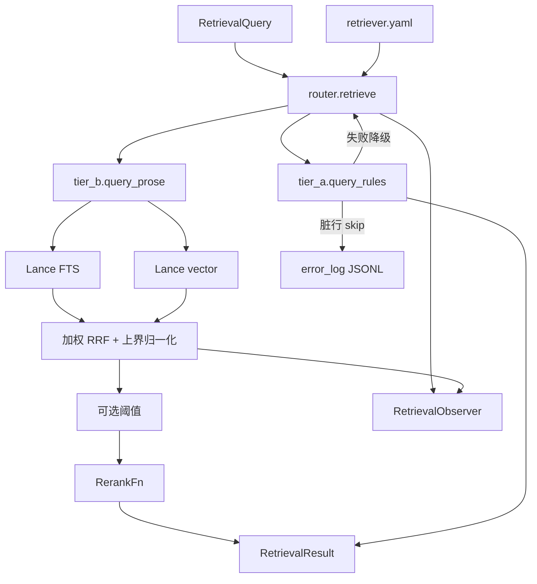

# Retriever 架构

本文是检索运行时的架构说明。Agent 怎么调用、YAML 怎么改，见 [README.md](README.md)。字段级协议在 [docs/](docs/README.md)。A 层表结构权威在 [rag/build/README.md](../build/README.md)；B 层切块与 Lance 列权威在 [CHUNKING.md](../vault/tier_b_prose/CHUNKING.md)。

**冻结面：** SQLite DDL、Lance 表列、`MigrationRule` / `ProseChunk`、SQL WHERE 骨架、`detection_method` 死门、A+B 同时召回且 `merged` 先 A 后 B、`query_embed` 与 `passage_embed` 配对。本目录只读成品库，不写库、不切块、不 embedding。

**可调面：** [`retriever.yaml`](retriever.yaml) 中的 k、权重、通道、阈值、重排名；`RerankFn`；`RetrievalObserver`。这些不进 `RetrievalQuery`。

---

## 1. 在系统里的位置

```text
verify 报错
  → Agent 工具 retrieve_migration_rule
      → rag.retriever.retrieve_cached
          → SQLite artifacts/rules.db          （A，精确规则）
          → LanceDB artifacts/corpora/...      （B，散文段落）
      → RetrievalResult
  → Agent 决定是否 apply_patch / escalate
```

C 层（`workspace_index/`）不在本包。`rag/build/` 不在运行时依赖里。retriever **禁止** `import rag.build`。

做成库而不是 HTTP 服务：SQLite 与 LanceDB 都是嵌入式文件。Day 5 每个 worker `import rag.retriever` 只读同一份 `artifacts/`。

---

## 2. 模块地图

与 [docs/README.md](docs/README.md) 脚本边界表、各模块 docstring 对齐。

| 文件 | 负责 | 禁止 |
| --- | --- | --- |
| `__init__.py` | re-export `retrieve` / `retrieve_cached` | SQL、开库、读 YAML 逻辑 |
| `schemas.py` | 枚举、`MigrationRule`、`ProseChunk` | IO、SQL、检索；本轮不新增模型类 |
| `config.py` | `load_config` / `RetrieverConfig` / `config_hash` | 查库、算 RRF |
| `tier_a.py` | **唯一 SQL**：`query_rules` | Lance、B 层、重排 |
| `tier_b.py` | 两路召回 + 加权 RRF + 归一化 + 阈值 + 调 `RerankFn` | SQL、`coverage` / escalate |
| `rerank.py` | `RerankFn` + `identity` / `minilm_l6` | Lance / SQLite；超参闭包在 callable 内 |
| `router.py` | 编排、订结果、调 observer；A 整次失败则 `[]` 并继续 B | 自己写 SQL、自己算 RRF |
| `cache.py` | `cache_key(query, manifest_hash, config_hash)` + `retrieve_cached` | 改命中结果除 `cache_hit` |
| `observe.py` | Observer 协议、NoOp、Composite、事件签名 | 检索、默认写远端 |
| `error_log.py` | A 层失败 JSONL | 被 B / 重排调用 |
| `retriever.yaml` | 唯一调参文件 | — |

```text
Agent 工具
  → __init__.retrieve_cached
    → cache.retrieve_cached
      → router.retrieve
        → config（只读）
        → tier_a.query_rules → error_log
        → tier_b.query_prose → rerank callable
        → observe.*（即使 NoOp）
```

禁止反向 import。eval 脚本（`gen_eval_set.py` / `run_ablation.py`）在包外，只许 import retriever、改 Config 副本。

---

## 3. 一次检索



安全边界：SQL 模板写死，值走 `?`。B 层两路 `limit` 来自 YAML，不是调用方拼出来的查询语言。

分数：A 层命中方式置信度；B 层 RRF 上界归一化 `[0,1]`。不跨层排序。

---

## 4. 扩展点

| 点 | 怎么扩 | 不要怎么扩 |
| --- | --- | --- |
| 调 k / 权重 | 改 YAML 或 `RetrieverConfig` 拷贝 | 给 `RetrievalQuery` 加字段 |
| 换重排 | 注册 `RerankFn`，超参闭包在函数内 | 在 `tier_b.py` 写死模型 |
| 线上观测 | `set_observer` / 调用参数传入 | 在 `tier_b` 里 open 文件 |
| 新过滤维度 | 先改契约文档和 `RetrievalQuery`，再改 SQL 白名单 | `filters: dict` |
| 新 Lance 列 | 先改 CHUNKING 并重建向量库 | 检索侧假装有这一列 |

---

## 5. 实现时注意（本轮不做）

- 把 `pyyaml` 挪到 `[project.dependencies]`，wheel 打包 `retriever.yaml`。
- `cache_key` 必须含 `config_hash`；B 层 corpora manifest 是否折进 `manifest_hash` 见 [hash_and_manifest.md](../../docs/hash_and_manifest.md) 第 8 节。
- 进程内 `load()` 一次打开 SQLite + Lance + YAML。
- Observer 抛错不得打断 `retrieve()`。
- stub 函数体在实现轮替换 `NotImplementedError`，不要先返回假数据。

---

## 6. 实现检查清单

写函数体时对照。每一条都是已定行为：

- [ ] SQL 只出现在 `query_rules()` 内部
- [ ] `detection_method` 过滤写死为那两个常量
- [ ] 版本比较只走 `since_version_code <= target_version_code`
- [ ] 符号匹配四列 OR，值全部 `?` 绑定
- [ ] `kinds` 非空才追加 `symbol_kind IN (...)`
- [ ] `ORDER BY since_version_code DESC` + 写死的 `source_priority`
- [ ] 默认 hybrid：两层都查；`merged` 先 A 后 B
- [ ] B 层两路独立查询 + Python 加权 RRF；`query_embed`，不用 `embed()`
- [ ] B 层版本过滤是 Lance `where` 前置
- [ ] `ProseHit.score` 为上界归一化 `[0,1]`；阈值默认关闭
- [ ] 重排只改顺序；callable 对 retriever 透明
- [ ] k / 权重只来自 YAML；`top_k_a` / `top_k_b` 仅覆盖最终条数
- [ ] A 层整次失败降级；单行 skip；启动 schema 不匹配先落盘再 raise
- [ ] 每阶段调用 observer，默认 NoOp
- [ ] 缓存 key = `manifest_hash + config_hash + query`（无 `request_id`）
- [ ] 工具函数只做 Query → `retrieve_cached` → JSON
