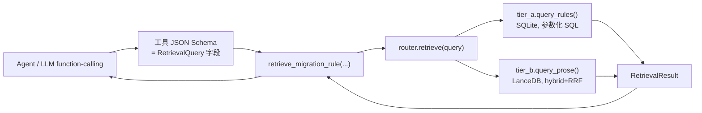

# A/B 层统一检索服务：接口协议

这份文档定协议，不是实现说明。数据库那一行长什么样，看 [rag/build/README.md](../build/README.md)；这里回答的是「一行数据怎么被查出来、查出来之后怎么交给 Agent」。

读完应该能回答用户在设计阶段最容易卡住的四个问题：

1. Agent 工具的入参，到底是不是一个「拼好的 SQL」包成 Pydantic 对象传进去？—— 不是，见第 2、3 节。
2. 一次调用要不要同时召回结构化规则和语义段落？—— 要，而且是结构性设计，不是概率性地「碰巧都查到」，见第 5 节。
3. SQL 语句和检索工具的契约怎么解耦？—— SQL 永远待在 `tier_a.py` 内部，`RetrievalQuery` 里没有任何字段能直接影响 WHERE 子句的结构，只能影响参数取值，见第 3 节。
4. `retrieve_migration_rule` 这个工具最终长什么样？—— 见第 10 节，一段可以直接抄的伪代码。

---

## 0. 两个边界，一份契约

系统里有两条完全不同的「接口」，容易被混为一谈：



- **外层边界（LLM 看到的）**：一个 function-calling 工具，参数是扁平、可 JSON 序列化的字段。LLM 只填字段值，不写 SQL，不知道背后是 SQLite 还是 LanceDB。
- **内层边界（Python 库看到的）**：`RetrievalQuery`（入）和 `RetrievalResult`（出）两个 Pydantic 模型。这是 [docs/rag.md](../../docs/rag.md) 里说的「唯一契约」——今天是被函数直接调用的参数/返回值，以后想包成 MCP 或 REST，只需要在外面加一层适配器把 HTTP body / MCP 参数转换成同一个 `RetrievalQuery`，内部一行不用改。

**这两条边界用的是同一个 Pydantic 模型**，不是两套东西做映射。`RetrievalQuery` 被设计得足够「扁平」（没有嵌套的子对象、没有需要 LLM 理解 SQL 语义的字段），所以它可以直接拿来当 LangChain 之类框架的 `args_schema`：框架自动把它翻译成 JSON Schema 喂给 LLM，LLM 填完值之后框架直接实例化出一个 `RetrievalQuery`（此时 Pydantic 校验已经跑过一次），工具函数体拿到的就是一个类型安全、字段合法的对象，直接传给 `router.retrieve()`。

这就是第 3 个问题的答案：**不是把 SQL 语句包成 Pydantic 对象传进 tool，而是把「业务级检索条件」包成 Pydantic 对象传进 tool；SQL 字符串本身永远不出现在这个对象里，也永远不会从这个对象的字段拼接生成**——`tier_a.py` 内部的 SQL 模板是写死的，`RetrievalQuery` 的字段只能替换参数占位符的值（symbol 字符串、版本号、limit 数字），不能改变 WHERE 子句用了哪些列、用了什么逻辑运算符。这是故意的：即使有人把一整段用户输入（比如报错信息里混进的恶意文本）塞进 `error_text`，最坏情况也只是查不到东西，不可能改变查询结构。

---

## 1. 运行时契约总览

```python
# rag/retriever/schemas.py（下一轮落地，这里先定形状）

class SymbolKind(str, Enum):
    class_ = "class"; method = "method"; property = "property"; signal = "signal"
    enum = "enum"; constant = "constant"; builtin = "builtin"; shader = "shader"
    theme = "theme"; color = "color"; project_setting = "project_setting"
    singleton = "singleton"; utility = "utility"; rewrite = "rewrite"; trap = "trap"

class ChangeKind(str, Enum):
    rename = "rename"; remove = "remove"; add = "add"; signature = "signature"
    type = "type"; move = "move"; split = "split"; replace = "replace"
    default = "default"; behavior = "behavior"; rewrite = "rewrite"
    trap = "trap"; false_positive = "false_positive"

class DetectionMethod(str, Enum):
    agent_retrieval = "agent_retrieval"
    agent_retrieval_or_escalate = "agent_retrieval_or_escalate"
    static_scan_post_l0 = "static_scan_post_l0"        # 永远不会被 query_rules() 选中
    verify_error_filter = "verify_error_filter"          # 永远不会被 query_rules() 选中

class AgentAction(str, Enum):
    apply_rename = "apply_rename"; apply_and_warn = "apply_and_warn"
    do_not_fix = "do_not_fix"; escalate_human = "escalate_human"; note_only = "note_only"

AGENT_VISIBLE_DETECTION_METHODS = (
    DetectionMethod.agent_retrieval,
    DetectionMethod.agent_retrieval_or_escalate,
)
```

`MigrationRule` 的字段与 [build/README.md 第 5 节](../build/README.md) 的 DDL 逐列对应，这里不重复贴一遍；唯一区别是 SQLite 里的 `INTEGER 0/1` 在这里是 `bool`，JSON TEXT 列在这里是 `list[str]` / `dict[str, Any]`。

---

## 2. `RetrievalQuery`：唯一入参契约

```python
class RetrievalMode(str, Enum):
    hybrid = "hybrid"              # 默认：A、B 两层都查，两层都召回
    exact_only = "exact_only"      # 消融实验用：只查 A 层
    semantic_only = "semantic_only"  # 消融实验用：只查 B 层

class RetrievalQuery(BaseModel):
    # 输入至少给一个
    error_text: str | None = None      # verify/import 抛出的原始报错文本
    symbols: list[str] = Field(default_factory=list)   # Agent 已经知道的旧符号名
    query_text: str | None = None      # 自由文本问题（不针对某条报错，例如"Tween 怎么迁移"）

    # 版本
    target_version: str                # "4.7.1"，必填

    # 缩小范围（可选，不改变 WHERE 的结构，只是追加白名单内的过滤值）
    file_hint: str | None = None       # 触发的文件路径/后缀，例如 "res://fx/beam.gdshader"
    kinds: list[SymbolKind] | None = None

    # 检索策略
    retrieval_mode: RetrievalMode = RetrievalMode.hybrid
    top_k: int = 8                      # top_k_a / top_k_b 的默认值
    top_k_a: int | None = None
    top_k_b: int | None = None

    # 可观测性
    request_id: str | None = None

    @field_validator("target_version")
    @classmethod
    def _check_version(cls, v: str) -> str:
        if not re.fullmatch(r"\d+\.\d+(\.\d+)?", v):
            raise ValueError(f"target_version must look like '4.7' or '4.7.1', got {v!r}")
        return v

    @field_validator("top_k", "top_k_a", "top_k_b")
    @classmethod
    def _check_top_k(cls, v: int | None) -> int | None:
        if v is not None and not (1 <= v <= 50):
            raise ValueError("top_k must be between 1 and 50")
        return v

    @model_validator(mode="after")
    def _require_some_input(self) -> "RetrievalQuery":
        if not (self.error_text or self.symbols or self.query_text):
            raise ValueError("provide at least one of error_text, symbols, query_text")
        return self

    @computed_field
    @property
    def target_version_code(self) -> int:
        return version_to_code(self.target_version)
```

字段设计上刻意做的取舍：

- **没有 `sql` / `where` / `filters: dict` 这类「透传」字段。** 一旦允许调用方直接传一段过滤表达式，`RetrievalQuery` 就从「业务契约」退化成了「SQL 的另一种序列化格式」，第 3 节说的解耦就没有意义了。任何新的过滤维度，都必须先在这个模型里显式声明一个字段、写好校验，再在 `tier_a.py` 里加一段白名单逻辑去消费它——多一步,但换来的是"LLM 不可能构造出一个能拖垫整张表、或者查到不该看见的 `detection_method` 的请求"。
- **`detection_method` 不是这个模型的字段。** 调用方无法请求"把 `static_scan_post_l0` 的行也给我"——这个过滤条件是 `tier_a.query_rules()` 内部硬编码的常量（`AGENT_VISIBLE_DETECTION_METHODS`），不接受外部覆盖。这是第 1 版方案里"陷阱不能让 Agent 检索到"这条设计决策在接口层的落地：不是靠 Agent 自律不去查,而是这条路径在类型层面就不存在。
- **`retrieval_mode` 默认 `hybrid`，不是"先查 A、A 没有再查 B"。** 这是本轮改的重点：上一版设计是"精确查表命中就直接返回,不命中才查语义层",这次改成默认两层总是一起查、一起返回,原因见第 5 节。`exact_only`/`semantic_only` 两个选项保留下来,不是给 Agent 用的,是给 [docs/rag.md](../../docs/rag.md) 里要求的"纯关键词 vs 纯向量 vs 混合"消融实验用的——同一个 `RetrievalQuery`,只改一个字段,三种模式的评测代码几乎不用分叉。
- **`top_k_a` 和 `top_k_b` 是独立预算,不是共享总量。** 如果两层共享一个 `top_k`,A 层命中很多时会把 B 层的名额挤没,又变成了"实质上只召回了 A"。两层各自截断到自己的 `top_k`(默认都等于 `top_k`),`merged` 列表的长度上限是两者之和,不是 `top_k` 本身。

---

## 3. `tier_a.py`：结构化检索，SQL 永远待在这一层

```python
def query_rules(
    conn: sqlite3.Connection,
    *,
    symbols: Sequence[str],
    target_version_code: int,
    kinds: Sequence[SymbolKind] | None = None,
    limit: int = 8,
) -> list[MigrationRule]:
    """唯一允许拼 SQL 的地方。WHERE 结构写死，可变部分只有参数值。"""
```

固定不变的部分（任何调用者都改不了）：

```sql
SELECT * FROM migration_rules
WHERE detection_method IN ('agent_retrieval', 'agent_retrieval_or_escalate')
  AND since_version_code <= ?
  AND (
        old_symbol IN (...)
     OR new_symbol IN (...)
     OR owner       IN (...)
     OR EXISTS (SELECT 1 FROM json_each(match_tokens) WHERE value IN (...))
  )
  {AND symbol_kind IN (...)}   -- 只有 kinds 非空时才加这一段，且值必须是 SymbolKind 枚举成员
ORDER BY since_version_code DESC, source_priority ASC
LIMIT ?;
```

`symbols` 列表通过 `?` 占位符逐个绑定，绝不用 f-string 拼进 SQL 文本。`kinds` 在拼接前先校验每一项都是 `SymbolKind` 枚举的合法值（Pydantic 在 `RetrievalQuery` 层已经校验过一次，这里是第二道防线，防止有人绕过 `RetrievalQuery` 直接调用 `query_rules`）。`source_priority` 是一张写死的映射（`official_renames=0, official_renames_skipped=1, api_diff=2, official_prose=3, official_prose_3to4_shader=3, manual_trap=4, manual_rewrite=4`），用来让"同一版本、多个来源都命中"时的排序是确定性的，不依赖 SQLite 对相同 `ORDER BY` 键的隐式顺序。

每一行从 SQLite 读出来之后，**立刻**用 `MigrationRule.model_validate(row_dict)` 校验。校验失败：记日志、跳过这一行、计数器 `+1`（曝露成 Prometheus 风格的 `rules_schema_drift_total`），继续处理剩下的行——单行脏数据不该让整次检索报错，但必须留下痕迹供人事后发现。

---

## 4. `tier_b.py`：语义检索，同一个版本过滤前置到向量库

```python
def query_prose(
    table: "lancedb.table.Table",
    *,
    text: str,
    target_version_code: int,
    limit: int = 8,
) -> list[ProseHit]:
    """LanceDB 混合检索（BM25 + 向量 + RRF 融合），since_version_code 作为前置过滤。"""
```

`ProseChunk` 的形状：

```python
class ProseChunk(BaseModel):
    id: str
    text: str
    heading_path: list[str]     # ["Breaking changes", "Rendering"]
    since_version: str | None
    since_version_code: int
    related_symbols: list[str]  # build 时从原文反引号符号里顺手抽的，用于展示，不用于过滤
    source: str                 # official_prose_prose / official_prose_3to4_shader / manual_trap_note ...
    source_file: str
    source_url: str | None
```

版本过滤是 LanceDB 查询的 `where` 前置条件（`since_version_code <= :target`），不是查完之后在 Python 里再筛一遍——数据量大起来之后差别很大，而且前置过滤和 `tier_a` 用的是同一枚 `target_version_code`，两层的"版本语义"必须完全一致，这也是第 3 节坚持只有一份 `version_to_code` 实现的原因之一。

`ProseHit = ProseChunk + score: float + match_reason: Literal["bm25", "vector", "hybrid"]`。

---

## 5. `router.retrieve()`：为什么两层必须一起召回，怎么融合

**改变的地方**：上一版设计是"先精确查 A，命中就直接返回（置信度 1.0），查不到才查 B"。这次改成**默认一次调用同时查两层，两层都放进返回结果**，原因有三个，都是从真实场景倒推出来的：

1. A 层命中一条改名规则,不代表 Agent 不需要看 B 层的上下文。比如 `Changed defaults` 类的规则——`change=default` 那一类,查到"默认值变了"这个事实本身没问题,但 B 层里可能还挂着一段解释"为什么变、什么场景会受影响"的散文,只返回 A 层会让 Agent 拿着一条干巴巴的事实却不知道该怎么判断这次改动对当前项目有没有影响。
2. TRAP-003(shader)这类 `agent_retrieval_or_escalate` 的策略,本质上要求"A、B 都查过了、都没有命中"才能作为 escalate 的依据。如果 A 命中就不查 B,那么"B 里其实有相关说明,只是没被查"和"B 里确实没有"这两种情况会被混为一谈,`escalate_suggested` 这个字段就失去了意义。
3. 评测的时候需要能对比"只有 A"、"只有 B"、"A+B"三种模式的效果(`docs/rag.md` 第 4 章的消融实验要求)。如果生产路径本身就是"A 命中就短路",那生产环境永远不会经历"A+B 都返回"这条路径,评测数字和线上实际检索到的东西是两套东西,复现不了。

融合算法（伪代码，非最终实现）：

```python
def retrieve(query: RetrievalQuery) -> RetrievalResult:
    t0 = time.monotonic()
    symbols = query.symbols or extract_symbols(query.error_text or "")  # 确定性正则，不调 LLM

    structured: list[StructuredHit] = []
    if query.retrieval_mode != RetrievalMode.semantic_only:
        rows = tier_a.query_rules(
            conn, symbols=symbols, target_version_code=query.target_version_code,
            kinds=query.kinds, limit=query.top_k_a or query.top_k,
        )
        structured = [StructuredHit(rule=r, score=score_of(r, symbols),
                                     match_reason=reason_of(r, symbols)) for r in rows]

    prose: list[ProseHit] = []
    if query.retrieval_mode != RetrievalMode.exact_only:
        prose = tier_b.query_prose(
            table, text=query.error_text or query.query_text or " ".join(symbols),
            target_version_code=query.target_version_code, limit=query.top_k_b or query.top_k,
        )

    merged = (
        [UnifiedHit(layer="A", score=h.score, structured=h.rule) for h in structured]
        + [UnifiedHit(layer="B", score=h.score, prose=h.chunk) for h in prose]
    )

    coverage = (
        "rule_hit" if structured else "prose_only" if prose else "no_hit"
    )
    top_rule = structured[0].rule if structured else None
    recommended_action = top_rule.agent_action if top_rule else None
    escalate_suggested = coverage == "no_hit" or recommended_action == AgentAction.escalate_human

    return RetrievalResult(
        resolved_symbols=symbols,
        target_version_code=query.target_version_code,
        structured_hits=structured,
        prose_hits=prose,
        merged=merged,
        coverage=coverage,
        recommended_action=recommended_action,
        escalate_suggested=escalate_suggested,
        cache_hit=False,
        took_ms=(time.monotonic() - t0) * 1000,
    )
```

`structured` 内部排序已经在 SQL 的 `ORDER BY` 里做完（`since_version_code DESC, source_priority ASC`），`prose` 内部排序由 LanceDB 的 RRF 融合分数决定；`merged` 不重新排序、不做二次插值，就是"A 在前、B 在后"的拼接。这是故意的简化：A 层是确定性事实，永远比 B 层的相关性分数更值得信任，不应该让一个高分的 B 层段落排到 A 层规则前面去。

`extract_symbols()` 是一个**确定性**的正则/规则函数（不是 LLM 调用），用来从 `error_text` 里抠出候选符号——例如匹配 GDScript 报错里常见的 `Invalid get index 'xxx'`、`Identifier "xxx" not found`、反引号包裹的类型名等已知模式。这一步失败或抠不出任何符号时，`symbols` 允许为空，`tier_a.query_rules()` 此时会因为 `old_symbol IN ()` 之类的空列表条件自然查不到任何行——不需要额外的分支处理空输入。

---

## 6. `RetrievalResult`：唯一出参契约

```python
class UnifiedHit(BaseModel):
    layer: Literal["A", "B"]
    score: float
    structured: MigrationRule | None = None
    prose: ProseChunk | None = None

class RetrievalResult(BaseModel):
    resolved_symbols: list[str]
    target_version_code: int

    structured_hits: list[StructuredHit]
    prose_hits: list[ProseHit]
    merged: list[UnifiedHit]

    coverage: Literal["rule_hit", "prose_only", "no_hit"]
    recommended_action: AgentAction | None
    escalate_suggested: bool

    cache_hit: bool
    took_ms: float
```

三个"控制流"字段是本轮新增的重点，直接对应用户提到的"可能还要设计一些控制流的复杂信息"：

- **`coverage`**：一句话回答"这次查询命中了什么类型的东西"，Agent 的 prompt 模板可以直接按这个值切换措辞（"按以下规则修改" vs "没有精确规则，仅供参考的相关说明如下" vs "知识库未覆盖"）。
- **`recommended_action`**：把"该怎么处理"这件事从"Agent 自己读一堆规则再拍脑袋"变成"直接读一个字段"。取的是排序后第一条结构化命中的 `agent_action`；没有结构化命中时是 `None`。
- **`escalate_suggested`**：一个布尔值，直接操作化了 TRAP-003 的策略——`coverage == "no_hit"`，或者最靠前的规则本身就写了 `agent_action = "escalate_human"`，这个字段就是 `True`。这个判断不需要 Agent 用一次额外的推理去得出，它是检索这一步的确定性副产品。**但工具本身不据此做任何决策**——是否真的转人工、是否重试、是否换个查询词再试一次，这些分支逻辑属于上层的 LangGraph 节点，不属于这个检索接口。检索服务只负责把事实报告清楚,不擅自替 Agent 做决定,这条边界必须守住,否则以后想换编排框架时,策略逻辑会被锁死在 SQL 查询函数里,拆不出来。

---

## 7. 版本编解码：一份实现，两侧共用

```python
# rag/version_codec.py —— 包根目录，build/ 和 retriever/ 都直接 import，互不依赖对方

def version_to_code(v: str | None) -> int:
    if not v:
        return 0
    major, minor, *rest = (int(x) for x in v.split("."))
    patch = rest[0] if rest else 0
    return major * 10000 + minor * 100 + patch
```

放在包根目录而不是 `build/schemas.py` 或 `retriever/schemas.py` 里面的原因：`build_tier_a.py` 写 `since_version_code` 用它，`RetrievalQuery.target_version_code` 也用它，`tier_a.query_rules()` 的 `since_version_code <= ?` 比较两边都靠它——这三处如果各自实现一份，只要有一处漏改（比如某天要支持 `4.7.1-rc1` 这种版本号），比较就会在写库和查库两端悄悄产生不一致，且不会报错，只会安静地漏检或多检。`retriever` 不 import `build` 下的任何东西（worker 镜像不带 `build/`），所以这份函数必须放在两者都能到达、又不属于任何一方的位置。

---

## 8. 校验的三道防线

| 阶段 | 校验什么 | 失败怎么处理 |
| --- | --- | --- |
| adapter 写 `intermediate/*.jsonl` | 每条产出先 `MigrationRule.model_validate()` 再落盘 | 直接抛错，build 失败，不允许带着脏数据进入下一步 |
| `build_tier_a.py` 合并写库 | 再校验一次（YAML 手写内容没走 adapter，必须在这一步兜底），并写入 `meta.schema_version` | 抛错，build 失败 |
| `retriever` 打开数据库连接 | **启动时**读 `meta.schema_version`，与代码里写死的期望值比较 | 不一致直接 `raise RuntimeError`，拒绝提供服务——这是故意做成"响亮地失败"，不做成"尽量兼容旧协议" |
| `tier_a.query_rules()` 逐行读取 | 每行 `MigrationRule.model_validate(row_dict)` | 单行失败：记日志、计数、跳过，不影响其余行返回 |
| `RetrievalQuery` 构造时 | `field_validator` / `model_validator`（版本号格式、`top_k` 范围、至少一个输入字段） | Pydantic `ValidationError`，工具调用层直接把错误信息还给框架，不吞掉 |

第三道防线（启动时的 schema_version 检查）是本轮补的：之前的设计只想到了"每行读出来要校验"，但如果整份 `rules.db` 是用旧协议构建的（比如列名还是 `kind` 不是 `symbol_kind`），逐行校验会在几乎每一行都失败，日志刷屏却掩盖了真正的原因。启动时先校验一次协议版本号，能把这类问题挡在第一次查询之前。

---

## 9. 缓存

```python
def cache_key(query: RetrievalQuery, manifest_hash: str) -> str:
    payload = query.model_dump_json(exclude={"request_id"})
    return hashlib.sha256(f"{manifest_hash}:{payload}".encode()).hexdigest()
```

`manifest_hash` 来自 `artifacts/manifest.lock.json`——数据库或向量库重新 build 过，缓存自动失效，不需要手动清缓存。`request_id` 从哈希输入里排除，避免同一条查询因为调用方每次生成不同的 trace id 而永远缓存不命中。命中时把 `RetrievalResult.cache_hit` 改成 `True` 再返回，不修改其余字段。

---

## 10. 包成 Agent 工具：外层 schema 直接复用 `RetrievalQuery`

```python
# rag_tool.py —— Agent 唯一看到的东西

from rag.retriever import retrieve_cached, RetrievalQuery

@tool(args_schema=RetrievalQuery)
def retrieve_migration_rule(**kwargs) -> dict:
    """Look up Godot 3-to-4 migration rules and official notes for an error
    message or a known old API symbol, filtered to the target engine version.
    Always returns both exact rule matches and relevant prose context in one
    call. Check `escalate_suggested` before attempting a fix without a rule."""
    query = RetrievalQuery(**kwargs)     # 框架多半已经校验过一遍，这里是防御性的第二次
    return retrieve_cached(query).model_dump(mode="json")
```

工具函数体只做两件事：把 LLM 填的字段实例化成 `RetrievalQuery`，调用 `retrieve_cached`。**没有第三件事**——不在这里拼 SQL、不在这里决定要不要查 B 层、不在这里判断要不要 escalate。这一层薄到几乎没有逻辑,是故意的:所有真正的决策(查哪层、怎么融合、命中后该怎么办的建议)都已经在 `router.retrieve()` 里做完了,工具函数只是一个类型转换 + 序列化的外壳。以后如果要把这个工具从"直接 import 调用"换成"MCP server"或者"REST 接口",改的也只是这一层外壳,`RetrievalQuery` / `RetrievalResult` 和它们背后的逻辑一行不用动。

---

## 11. 消融实验怎么复用同一套契约

[docs/rag.md](../../docs/rag.md) 要求对比"纯关键词 / 纯向量 / 混合"三种模式的 Recall@5。做法是同一份评测用例，构造三个只有 `retrieval_mode` 不同的 `RetrievalQuery`：

```python
for mode in (RetrievalMode.exact_only, RetrievalMode.semantic_only, RetrievalMode.hybrid):
    result = retrieve(query.model_copy(update={"retrieval_mode": mode}))
    record_recall_at_5(mode, result)
```

不需要维护三套不同的检索代码路径，`router.retrieve()` 内部的 `if query.retrieval_mode != ...` 分支已经是唯一的分叉点。

---

## 12. FAQ（直接回应设计过程中的追问）

**为什么不让调用方直接传一个 filter 字典，更灵活？**
灵活性和"LLM 不可能构造出危险查询"这条安全边界是矛盾的。`RetrievalQuery` 每加一个字段都是一次显式的设计决策（要不要开这个过滤维度、允许的取值范围是什么），比"反正开一个 `dict[str, Any]` 以后什么都能传"更啰嗦，但换来的是这份契约本身就是文档,也是唯一能出现在数据库查询里的输入来源。

**A 层和 B 层的分数是同一个量级吗，能直接比大小排序吗？**
不能，也没有必要。A 层的"分数"本质是"命中方式"的置信度（精确符号命中 = 1.0，token 命中 = 0.7 左右，具体数值留给实现时按经验调），B 层的分数是 RRF 融合后的相对排名分数。`merged` 不做跨层排序，就是"A 全部在前、B 全部在后"地拼接，这比"伪装成同一量级、再排出一个看似精确其实没有意义的顺序"更诚实。

**`escalate_suggested = True` 时，Agent/编排层具体应该做什么？**
这份接口不规定。它只负责把"这次检索没有覆盖"这个事实,清楚地暴露成一个字段。要不要真的转人工、要不要先换个查询词再试一次、要不要退化成只读 B 层的散文说明——这些是 Day 3 LangGraph 编排层的策略,不属于检索服务的职责。把这条边界画清楚,是为了让检索服务保持"纯粹回答事实"的单一职责,不然以后策略一变,又要回来改 SQL 查询函数。
