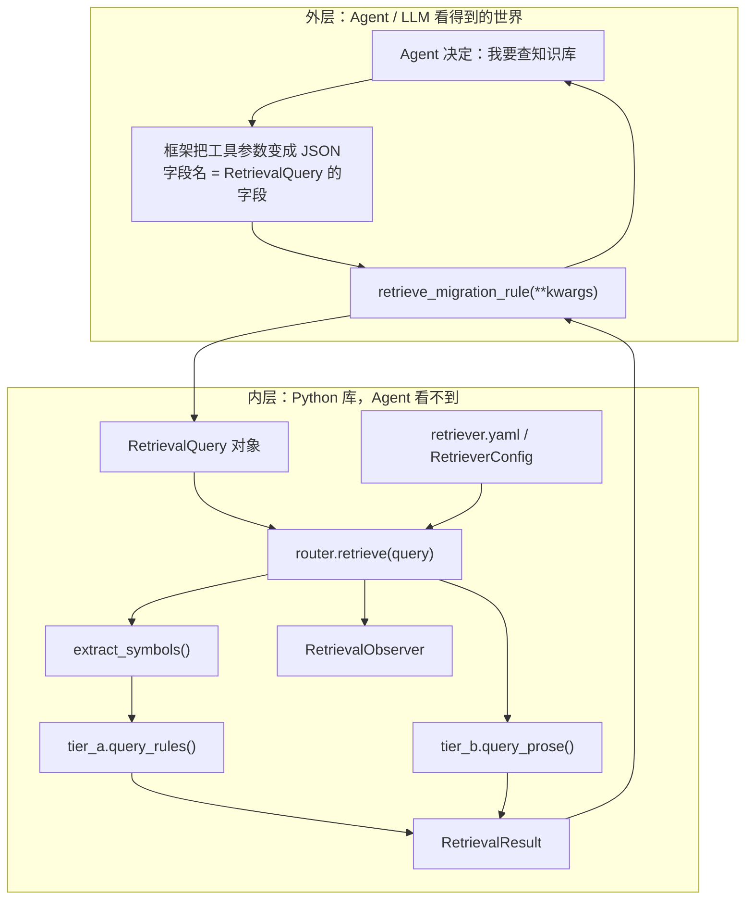

# 入门：从 Agent 问一句话，到数据库查出几行

数据库里一行长什么样，权威在 [rag/build/README.md](../../build/README.md)（库已经按那份 DDL 建好了）。B 层一段散文怎么切、怎么写成向量，权威在 [CHUNKING.md](../../vault/tier_b_prose/CHUNKING.md)（向量库也已经按那份 schema 写好了）。**这里只建立图像，并用一条真实报错把整条路走一遍。**

实现代码可以还是 docstring stub。写实现时必须按本目录协议落地，不能改查询结构、不能改已落库字段、不能改「两层一起查」。

读完你应该能自己讲清楚这四件事：

1. Agent 传进来的**不是**一段 SQL，而是一张叫 `RetrievalQuery` 的表格。
2. 真正的 SQL **写死**在 `tier_a.py` 里；`RetrievalQuery` 的字段只能填空（符号名、版本号），不能改 WHERE 用了哪些列。条数默认来自 [`retriever.yaml`](../retriever.yaml)，见 [config.md](config.md)。
3. 默认一次调用会**同时**查 A 层（SQLite 字典）和 B 层（LanceDB 说明书），两层结果都返回。
4. 还给 Agent 的是 `RetrievalResult`：里面既有规则行，也有散文段落，还有三个控制流字段（`coverage` / `recommended_action` / `escalate_suggested`）。

---

## 0. 先建立整体图像

### 0.1 这个检索工具在整个项目里干什么

回顾一下本项目在干什么：输入一个 Godot 3.x 仓库，官方转换器先吃掉机械改名，然后 Agent 循环处理**转换器搞不定的残余报错**。Agent 手里有一组工具，其中之一叫 `retrieve_migration_rule`。

它要解决的问题很具体：

> 刚刚 `godot --headless --check-only` 报了一句  
> `Invalid call. Nonexistent function 'instance' in base 'PackedScene'.`  
> 目标引擎是 Godot 4.7.1。  
> 知识库里有没有「旧写法 → 新写法」的规则？有没有一段官方/社区说明，告诉我该怎么改？

知识其实分三种形态（详见 [docs/rag.md](../../../docs/rag.md)），本目录只服务前两种：

| 层 | 存的是什么 | 打个比方 | 存在哪 | 怎么查 |
| --- | --- | --- | --- | --- |
| **A 层** | 能写成一行的确定性规则：`instance → instantiate` | 英汉词典 | `artifacts/rules.db`（SQLite 一张表） | 按符号名精确查表 |
| **B 层** | 写不成一行的经验段落：yield 改 await 时可能要重排语句 | 说明书里的注意事项 | `artifacts/corpora/default/corpus.lance`（LanceDB） | 按报错原文做混合检索 |
| **C 层** | 当前这个仓库自己的场景树、符号表 | 这套房子的户型图 | `workspace_index/`，每个仓库现建 | **不在本目录**，本检索器不碰它 |

Agent **不需要知道**背后有 A/B 两层、更不需要知道 SQLite 和 LanceDB。它只看到一个工具：填几个字段，拿回一份结构化结果。

### 0.2 一个生活类比：图书馆前台，不是把钥匙交给读者

把 Agent 想成一个要查资料的读者，把 `retrieve_migration_rule` 想成图书馆前台。

- 读者不会被允许走进书库自己翻柜子，更不会被允许自己写「去三楼东侧第 17 架把所有红皮书搬出来」这种内部指令。
- 读者只准填一张借书单：书名（符号）、主题（报错原文）、只要哪一年以后的版本。最多借几本，由馆里的规章（YAML）决定，不写在借书单的小字里给读者乱填。
- 前台拿着这张单子，**按馆里写死的流程**去查两本目录：一本是卡片目录（A 层 SQLite），一本是主题检索机（B 层 LanceDB）。
- 查完把书和一张回执一起交给读者。回执上写着：这次命中了没有、建议怎么用、要不要去问馆员。

这张借书单就是 `RetrievalQuery`。馆里写死的查卡片流程就是 `tier_a.py` 里那条 SQL。主题检索机的流程就是 `tier_b.py`。前台把两本目录的结果订在一起交出去，就是 `router.retrieve()`。

**关键点：读者填的是「我想查什么」，不是「你用哪条 SQL」。** 即使有人在报错文本里塞进一段奇怪的文字，也只会影响「查得到查不到」，不可能改掉前台用哪几张卡片、按什么顺序排。

### 0.3 整条调用链



两条边界用的是**同一个**入参模型 `RetrievalQuery`：

- **外层**（LLM 看到的）：一个 function-calling 工具。参数是扁平、可 JSON 序列化的字段。LLM 只填字段值。
- **内层**（Python 库看到的）：`RetrievalQuery`（入）和 `RetrievalResult`（出）。今天是函数参数/返回值；以后若要包成 MCP 或 REST，只在外面加一层适配器。

YAML 和 observer **不是**工具参数。

### 0.4 最容易搞错的一句话

> **不是**把 SQL 语句包成 Pydantic 对象传进 tool。  
> **而是**把「业务级检索条件」包成 Pydantic 对象传进 tool。  
> SQL 字符串本身永远不出现在这个对象里，也永远不会从这个对象的字段**拼接生成 WHERE 结构**。

`tier_a.py` 内部的 SQL **模板是写死的**。`RetrievalQuery` 的字段只能替换参数占位符的值（符号字符串、版本号整数）。LIMIT 默认来自 YAML。它不能决定 WHERE 用了哪些列，也不能决定用 AND 还是 OR。

这是故意的安全边界：即使有人把一整段用户输入塞进 `error_text`，最坏情况也只是查不到东西，不可能变成「把整张表拖出来」。

---

## 1. 第一次做检索需要先知道的 6 个常识

### 1.1 表、行、列：就是一张 Excel

A 层的成品是一个 SQLite 文件：`rag/artifacts/rules.db`。里面主要有一张表，叫 `migration_rules`。

- **表（table）** = 一张工作表
- **行（row）** = 一条迁移规则，例如「`instance` 要改成 `instantiate`」
- **列（column）** = 这条规则的各个属性

SQLite 是**嵌入式**数据库：它就是一个文件，Python 用标准库 `sqlite3` 打开就能查。B 层的 LanceDB 也是嵌入式的，每个格子里除了文字，还多存了一串 384 个小数（向量）。

### 1.2 SQL 是给数据库的说明书，不是给 Agent 的

本项目里 Agent 永远不会写 SQL。只有 `tier_a.query_rules()` 这一处会拿着一条预先写好的 SQL，把几个空填上，交给 SQLite 执行。

| SQL 词 | 人话 |
| --- | --- |
| `SELECT *` | 把符合条件的行的**所有列**都给我 |
| `FROM migration_rules` | 去哪张表找 |
| `WHERE ...` | 只留满足这些条件的行 |
| `AND` / `OR` | 「并且」/「或者」 |
| `IN ('a', 'b')` | 这一列的值是括号里的某一个 |
| `EXISTS (子查询)` | 那个小查询只要能找出至少 1 行，这里就算成立 |
| `ORDER BY 列 DESC` | 从大到小排 |
| `LIMIT 8` | 最多返回 8 行 |

完整 SQL 的逐句翻译在 [tier-a.md](tier-a.md)。

### 1.3 参数化查询：空格用 `?` 占着，值另外递进去

禁止：

```python
sql = f"SELECT * FROM migration_rules WHERE old_symbol = '{symbol}'"
```

正确：

```python
sql = "SELECT * FROM migration_rules WHERE old_symbol = ?"
conn.execute(sql, ("instance",))
```

`RetrievalQuery` 能影响的，就是这些 `?` 最终被填成什么。

### 1.4 Schema / Pydantic

本项目用 Pydantic 规定「这张表允许出现哪些字段」。和检索直接相关的：

| 名字 | 角色 |
| --- | --- |
| `RetrievalQuery` | 入参，Agent 填的借书单 |
| `MigrationRule` | A 层数据库一行 |
| `RetrievalResult` | 出参，回执 |

`MigrationRule` 的字段和 [build/README.md 第 5 节](../../build/README.md) 的 DDL **逐列对应**。字段细节见 [contracts.md](contracts.md)。`RetrievalQuery` / `RetrievalResult` 本轮仍以文档为权威，尚未写入 `schemas.py`。

### 1.5 枚举

`SymbolKind.method`、`DetectionMethod.agent_retrieval` 的合法值只有名单上的词。Agent 不能发明一个 `symbol_kind="随便写"`。这和 SQL 注入防护是同一类思路。

### 1.6 为什么 A 层用 SQL，B 层不用 SQL

- A 层规则是「旧符号 = 这个、新符号 = 那个」。SQL 最擅长。
- B 层段落是「这段话讲的是不是同一类问题」。用向量 + BM25，不用 SQL。

两层查完，由 `router.py` 订成一份 `RetrievalResult`。

---

## 2. 用一条真实报错，把整条路走完

### 2.1 现场

L0 官方转换器跑完了。`godot --headless --check-only` 仍报：

```text
SCRIPT ERROR: Invalid call. Nonexistent function 'instance' in base 'PackedScene'.
   at: res://scenes/enemy.tscn 对应的脚本 enemy.gd:17
```

Agent 已经知道目标版本是 `4.7.1`。它**不会**写出 SQL。生产路径下它也不传 `top_k`（条数交给 YAML）。它只会填：

```json
{
  "error_text": "Invalid call. Nonexistent function 'instance' in base 'PackedScene'.",
  "symbols": ["instance"],
  "target_version": "4.7.1"
}
```

框架用这些值构造 `RetrievalQuery`（版本号格式、至少一个输入字段），再交给工具函数。

### 2.2 工具函数几乎什么都不做

```python
from rag.retriever import retrieve_cached, RetrievalQuery

@tool(args_schema=RetrievalQuery)
def retrieve_migration_rule(**kwargs) -> dict:
    """Look up Godot 3-to-4 migration rules and official notes for an error
    message or a known old API symbol, filtered to the target engine version.
    Always returns both exact rule matches and relevant prose context in one
    call. Check `escalate_suggested` before attempting a fix without a rule."""
    query = RetrievalQuery(**kwargs)
    result = retrieve_cached(query)
    return result.model_dump(mode="json")
```

工具函数**没有第三件事**：不拼 SQL，不决定要不要查 B 层，不判断要不要转人工，不读 YAML，不挂 Prometheus。

### 2.3 router 把「借书单」拆成两路查询

完整控制流见 [router-runtime.md](router-runtime.md)。跟这个例子：

1. **抠符号**。本次已有 `symbols=["instance"]`。若只有 `error_text`，则 `extract_symbols()` 用写死的正则抠。不是 LLM。
2. **换算版本**。`"4.7.1"` → `40701`，SQL 和 Lance 都用这个整数做 `<=`。
3. **读 YAML**。A 层 LIMIT 默认 8；B 层 BM25 k=3、向量 k=10、融合后 10、重排后 3。
4. **默认两层都查**（`retrieval_mode=hybrid`）。
5. **订在一起返回**。A 全部在前，B 全部在后。不按分数混排。各阶段调用 observer（默认 NoOp）。

### 2.4 A 层

SQL 模板始终是 [tier-a.md](tier-a.md) 那一条。代入后等效于：Agent 可见、`since_version_code <= 40701`、符号 `instance` 对得上，最近版本优先，最多 8 条。值全部走 `?`，不要 f-string。

命中后立刻 `MigrationRule.model_validate(row)`。单行失败：JSONL 落盘、skip、继续。整次查询失败：router 接住，A 当空列表，B 照常。

### 2.5 B 层

`query_prose()` 不跑 SQL。同一句报错原文：

1. `query_embed(报错原文)`，不要给 query 拼 `heading_path`。模型与建库相同：`BAAI/bge-small-en-v1.5`。
2. `where: since_version_code <= 40701` 前置过滤。
3. BM25 取 3 条、向量取 10 条，加权 RRF，取前 `recall_k=10`。
4. 上界归一化到 `[0, 1]`，写入 `ProseHit.score`。默认不按阈值截断。
5. 默认 `identity` 重排（保持融合顺序），取前 `rerank_k=3`。YAML 改成 `minilm_l6` 才走 MiniLM cross-encoder。

`instance → instantiate` 这种一对一改名，B 层命中可以为 0。两层独立预算。细节见 [tier-b.md](tier-b.md)。

### 2.6 交回 Agent 的回执（压缩示例）

```jsonc
{
  "resolved_symbols": ["instance"],
  "target_version_code": 40701,
  "structured_hits": [
    {
      "score": 1.0,
      "match_reason": "old_symbol",
      "rule": {
        "id": "official_renames:4.0:_:method:instance",
        "old_symbol": "instance",
        "new_symbol": "instantiate",
        "agent_action": "apply_and_warn",
        "source": "official_renames_skipped"
      }
    }
  ],
  "prose_hits": [],
  "merged": [
    { "layer": "A", "score": 1.0, "structured": { "...": "上面那条 rule" } }
  ],
  "coverage": "rule_hit",
  "recommended_action": "apply_and_warn",
  "escalate_suggested": false,
  "cache_hit": false,
  "took_ms": 12.4
}
```

检索服务到这里停：只报告事实和建议字段，**不擅自替 Agent 做决定**。B 层若有命中，`score` 是 0～1 的归一化 RRF，不能和 A 层的 `1.0` 比大小。
