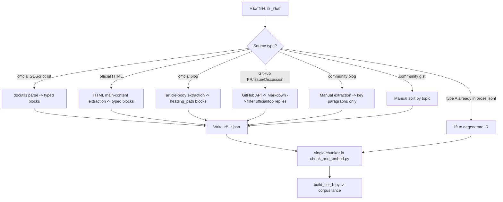

# B 层（经验语料）检索结果清单

> 对应 Day2 RAG 方案里的 B 层：无法压缩成一行字典、需要语义理解的迁移知识。 本清单是我按你规划里列出的 B 层内容清单（官方逐版本升级指南 + 10 条语义级重构知识点）逐条检索后，人工核实过 URL 有效性的结果，可以直接作为 `tier_b_prose/` 目录下的抓取清单使用。
>
> 预处理出口、漏斗路由（parser / 规则 / 人 / LLM）、逐步工作流与切块算法不在本文：见 [CHUNKING.md](CHUNKING.md)。

---

## 一、检索原则

在开始检索前，我遵循的几条原则（和你 Day2 方案里"为什么不用网络搜索当检索工具"的结论是一致的，这里只是**建库阶段**用搜索去定位一次性、可复现的原始语料，和 Agent **运行时**查询完全是两回事）：

1. **只要一手来源，不要二手转述**。优先级：`godotengine/godot-docs` 官方仓库原文 > `docs.godotengine.org` 官方渲染页 > 官方博客(`godotengine.org/article/...`) > 官方 GitHub 仓库里的 PR/Issue 讨论（含关键设计决策的第一手记录）> 高质量社区教程/博客。凡是能找到官方文档原文的条目，一律不采用转述性质的第三方博客做主源，只在官方文档语焦太简略、需要"人话讲清楚坑在哪"时，才把社区文章列为补充源。
2. **每条知识点必须验证 URL 真实可访问**（通过实际搜索结果里的 `url` 字段获取，不凭记忆拼接路径），版本号明确的页面优先用带版本号的固定链接（如 `/en/4.4/...`）而不是 `/en/stable/...`，因为 `stable` 会随官方发新版而指向不同内容，破坏你要求的"语料两次运行完全一致"这个复现性要求。
3. **官方原始讨论 > 教程复述**。像 rpc 语法重构、Tween 从节点变对象这类"设计变更"，我优先找官方博客或者合并进主仓库的 PR 讨论，因为这些地方会说明"为什么这么改"，这恰好是没法压缩进 A 层字典、真正需要语义检索的那部分内容；纯教程只讲"怎么改"，价值上等价于 A 层规则，不是 B 层该收的东西。
4. **同一知识点如果官方文档已经讲清楚，就不再引入社区源**，避免 B 层语料重复堆砌、稀释向量检索的信噪比。只有官方文档明显"点到为止"（比如 setget 迁移只给了语法对照，没讲清楚"内部访问不触发 setter"这种行为差异）时，才补一条高质量社区解读。
5. **版本号强制标注**。每条来源我都标了它对应"从哪个版本改到哪个版本"，方便你按 `since_version` 字段拍平进同一张表（跟你 A 层"7 篇 rst 合并"的处理方式一致）。

---

## 二、检索到的语料清单

### 2.1 官方逐版本升级指南（godot-docs `upgrading_to_godot_4.x.rst` 系列，共 8 篇）

这是 B 层最主力的一批语料，官方仓库路径确认为 `tutorials/migrating/upgrading_to_godot_4.x.rst`，按 `since_version` 逐篇独立抓取、拍平合并。


| 版本跨度    | 说明                                                                                                                      | 抓取用 URL（GitHub 原始 rst，推荐用于建库）                                                                        | 阅读用 URL（渲染版 HTML）                                                                      |
| ------- | ----------------------------------------------------------------------------------------------------------------------- | ---------------------------------------------------------------------------------------------------- | -------------------------------------------------------------------------------------- |
| 3→4     | 全量重命名 + 渲染管线/shader NDC 深度范围变化等大版本迁移说明                                                                                  | https://github.com/godotengine/godot-docs/blob/master/tutorials/migrating/upgrading_to_godot_4.rst   | https://docs.godotengine.org/en/stable/tutorials/migrating/upgrading_to_godot_4.html   |
| 4.0→4.1 | GDExtension 破坏性变更为主                                                                                                     | https://github.com/godotengine/godot-docs/blob/master/tutorials/migrating/upgrading_to_godot_4.1.rst | https://docs.godotengine.org/en/stable/tutorials/migrating/upgrading_to_godot_4.1.html |
| 4.1→4.2 | Mesh 资源格式变更（含是否可降级两种升级模式）、字体/动画 API 调整                                                                                  | https://github.com/godotengine/godot-docs/blob/master/tutorials/migrating/upgrading_to_godot_4.2.rst | https://docs.godotengine.org/en/4.4/tutorials/migrating/upgrading_to_godot_4.2.html    |
| 4.2→4.3 | —                                                                                                                       | https://docs.godotengine.org/en/4.3/tutorials/migrating/upgrading_to_godot_4.3.html                  | 同左（未找到必要性单独存 rst 链接，HTML 版已核实可访问）                                                      |
| 4.3→4.4 | `@export_file` **行为变更：Inspector 赋值从存** `res://` **路径改存** `uid://` **引用**（对应你陷阱表里的 issue#104379/GH-97912），Curve 资源范围强制校验 | https://github.com/godotengine/godot-docs/blob/master/tutorials/migrating/upgrading_to_godot_4.4.rst | https://docs.godotengine.org/en/stable/tutorials/migrating/upgrading_to_godot_4.4.html |
| 4.4→4.5 | —                                                                                                                       | https://docs.godotengine.org/en/4.5/tutorials/migrating/upgrading_to_godot_4.5.html                  | 同左                                                                                     |
| 4.5→4.6 | 场景格式前后兼容说明、Glow 默认参数变化、SpringBoneSimulator 返回类型变更                                                                       | https://github.com/godotengine/godot-docs/blob/master/tutorials/migrating/upgrading_to_godot_4.6.rst | https://docs.godotengine.org/en/stable/tutorials/migrating/upgrading_to_godot_4.6.html |
| 4.6→4.7 | —                                                                                                                       | 未单独确认 rst 直链，用渲染版                                                                                    | https://docs.godotengine.org/en/4.7/tutorials/migrating/upgrading_to_godot_4.7.html    |


> 备注：目录索引页 `tutorials/migrating/index.rst`（https://github.com/godotengine/godot-docs/blob/master/tutorials/migrating/index.rst）可以作为程序化抓取的入口，里面 `toctree` 列出了所有子页面文件名，写抓取脚本时不需要手动维护这张表。

---

### 2.2 十条语义级重构知识点


| #   | 知识点                                                                                | 主源（官方，优先采信）                                                                                                                                                                              | 补充源（社区，讲清楚"为什么/坑在哪"）                                                                                                                                               | 备注                                                                                          |
| --- | ---------------------------------------------------------------------------------- | ---------------------------------------------------------------------------------------------------------------------------------------------------------------------------------------- | ------------------------------------------------------------------------------------------------------------------------------------------------------------------ | ------------------------------------------------------------------------------------------- |
| 1   | `yield` → `await`，协程改写，代码顺序调整                                                      | 官方 `upgrading_to_godot_4.rst` 已含基础对照；GDScript 参考手册 await 关键字条目                                                                                                                           | https://uhiyama-lab.com/en/notes/godot/await-coroutine-basics/ （专门一节"Migrating from Godot 3's yield"，讲清楚 `_process` 里误用 await 导致协程堆积这类真实坑，官方文档没提）                  | 社区源里含一个**危险模式**：在 `_process()` 里每帧 `await` 会导致等待堆积，属于典型"改错但不报错"陷阱，值得连同你静态扫描思路一起收进 B 层打标     |
| 2   | Tween 系统整体重构：Tween 从场景树节点变为 `create_tween()` 生成的轻量对象                               | 官方设计讨论 PR：https://github.com/godotengine/godot/pull/41794 （官方原始设计说明："Tweens are no longer nodes... fire and forget"）；类参考：https://docs.godotengine.org/en/stable/classes/class_tween.html | https://bugnet.io/blog/fix-godot-tween-not-working-godot-4 （专门讲"`$Tween` 节点引用失效、`interpolate_property` 报 Nonexistent function"这类迁移后典型报错和杀死重建模式）                    | PR #41794 是最权威的"为什么这么改"一手材料                                                                 |
| 3   | `KinematicBody.move_and_slide()`→ `CharacterBody` 的 `velocity`属性驱动                 | 官方教程：https://docs.godotengine.org/en/stable/tutorials/physics/using_character_body_2d.html                                                                                               | https://bugnet.io/blog/fix-godot-characterbody2d-move-and-slide-not-moving （讲清楚"不再接受参数、必须先赋值 velocity 属性"这个最容易漏改的点，命中率应该很高，因为报错通常是"静默不动"而非报错）                      | 这条属于"改错但不报错"类型坑，参考你陷阱表处理原则，建议同时给 A 层打一条特征标记                                                 |
| 4   | 字符串式信号连接 `connect("sig", self, "method")` → `Callable` 对象 `sig.connect(method)`    | 官方 Issue 讨论（含官方给出的正确写法对照）：https://github.com/godotengine/godot-docs/issues/5577                                                                                                          | https://bugnet.io/blog/fix-nonexistent-function-connecting-signals-godot （讲自动迁移工具转换失败的场景，尤其是方法名来自变量而非字面量时）                                                         | issue #5577 里官方直接给出了错误信息原文和正确代码对照，适合当 E2 测试集的 query-answer 对                                |
| 5   | `setget` → 内联 `set(value)/get:`属性语法                                                | 官方 issue（确认 4.0 起完全移除 setget 语法）：https://github.com/godotengine/godot-docs/issues/6265                                                                                                   | https://shaggydev.com/2022/09/27/godot-4-setter-getter/ （详细对比新旧两种写法，并指出关键行为差异："Godot 3 里类内部访问不会触发 setter/getter，Godot 4 里永远会触发" —— 这条行为差异官方文档没有明说，纯语义知识，正是 B 层该收的） | 行为差异这条是最值钱的部分，A 层字典只能给出语法映射，触发时机变化必须靠 B 层                                                   |
| 6   | `File`/`Directory` → `FileAccess`/`DirAccess`（含 `open()` 变静态方法、无 `close()`）        | 官方合并 PR（含设计说明）：https://github.com/godotengine/godot/pull/65271；类参考：https://docs.godotengine.org/en/stable/classes/class_fileaccess.html                                                  | — （官方 PR 描述已经足够清楚，无需补充源）                                                                                                                                           | PR 里提到"没有 close() 方法"这个反直觉设计，容易被忽略                                                          |
| 7   | `OS` 拆分为 `OS`/`Time`/`DisplayServer`/`Engine`四个类                                   | 官方核心重构报告：https://godotengine.org/article/core-refactoring-progress-report-2/（讲清楚为什么要拆——" OS 类过于臃肿、无法做 headless 多窗口"这类架构动机）；官方升级指南同一节已覆盖：见 2.1 表 3→4 那一行                                  | —                                                                                                                                                                  | 这是唯一一条我优先选"官方博客"而非"官方 issue"做主源的知识点，因为博客里讲了架构动机，这类"为什么"恰好是纯规则表格覆盖不到的                        |
| 8   | 注解语法变化：`export`/`onready`/`tool` 关键字 → `@export`/`@onready`/`@tool` 注解             | 官方设计讨论（含"为什么用 @ 前缀"的官方解释）：https://github.com/godotengine/godot-proposals/discussions/6192                                                                                                | https://godot-mcp.abyo.net/guides/godot4-export-annotations （汇总了 `@export_range`/`@export_enum`/`@export_group` 等全部变体，附 Godot 3→4 速查表）                             | discussions/6192 里官方明确回应了"@onready 是否该是关键字而非注解"的社区质疑，对理解设计边界有帮助                             |
| 9   | `EditorPlugin` 虚函数改名 + `_ready`/`_process` 等生命周期函数不再自动调用父类实现（需手动 `super._ready()`） | 官方类参考：https://docs.godotengine.org/en/4.4/classes/class_editorplugin.html                                                                                                                | 社区维护的详细迁移笔记（含大量实测踩坑记录，非官方但内容扎实）：https://gist.github.com/WolfgangSenff/168cb0cbd486c8c9cd507f232165b976                                                             | 这条社区 gist 价值很高——"父类虚函数不再自动调用，必须手动 super"这个坑官方文档几乎没有专门强调，但极容易导致 addon 迁移后行为异常且不报错，属于典型静默失效场景 |
| 10  | rpc 语法：`master`/`puppet`/`remote`/`sync` 等关键字 → 统一 `@rpc(...)` 注解                  | 官方博客（设计动机 + 语法演进过程，最权威一手资料）：https://godotengine.org/article/multiplayer-changes-godot-4-0-report-2/                                                                                      | https://bugnet.io/blog/fix-godot-rpc-call-not-working-enet-multiplayer （讲清楚"函数没加 @rpc 注解时 .rpc() 会静默什么都不做，不报任何错误"这一典型陷阱）                                           | 官方博客明确解释了"为什么废弃 master/puppet"（命名容易混淆、master 用得少），这段设计论述适合直接作为向量检索命中后返回给 Agent 的解释性文本       |


---

### 2.3 GDScript 语法官方文档（`tutorials/scripting/gdscript/`，🟡选做-高价值）

**这一块是我第一轮完全漏掉的**，第一次交付时只搜了"migrating/升级指南"和"社区教程"，没有专门搜官方 GDScript 语言参考手册本身。这份手册里的语义细节比迁移指南更细，因为迁移指南只列"改了什么"，语言参考手册会讲"新语法的确切行为边界"，属于比迁移指南更下游、颗粒度更细的B层语料。补充如下：


| 文件                                         | 内容                                                                                                                     | URL                                                                                                                                        | 对B层的价值                                                                                                                      |
| ------------------------------------------ | ---------------------------------------------------------------------------------------------------------------------- | ------------------------------------------------------------------------------------------------------------------------------------------ | --------------------------------------------------------------------------------------------------------------------------- |
| `gdscript_basics.rst`                      | GDScript语言参考主文档，含注解(annotation)机制的官方定义、`yield`关键字"仅为过渡保留"的官方措辞、`await`对函数返回类型的隐式影响（"返回一个signal的函数会让调用者自动await该signal"） | https://github.com/godotengine/godot-docs/blob/master/tutorials/scripting/gdscript/gdscript_basics.rst                                     | 是annotation语法（@export/@onready/@tool）唯一的官方权威定义来源，比我第一轮找的社区文章更适合当主源                                                          |
| `gdscript_styleguide.rst`                  | 官方风格指南，含`@export`/`@onready`混用的真实代码示例（`@onready var _state = initial_state: set = set_state`这类链式写法）                    | https://github.com/godotengine/godot-docs/blob/master/tutorials/scripting/gdscript/gdscript_styleguide.rst                                 | 补充annotation实战写法，可作为E4难例测试集的原始素材来源                                                                                          |
| `getting_started/step_by_step/signals.rst` | 信号系统官方教程，含`.connect()`回调命名约定（`_on_node_name_signal_name`）、编辑器可视化连接与代码连接两种方式的对照                                         | https://github.com/godotengine/godot-docs/blob/master/getting_started/step_by_step/signals.rst                                             | 信号迁移那条（表2.2第4条）的补充源，讲清楚命名约定这个隐性规则                                                                                           |
| ⭐**关键语义坑**：`@onready`与`@export`同时作用于同一变量   | 会触发`ONREADY_WITH_EXPORT`警告（**默认按error级别处理**），原因是`@onready`在场景实例化后会覆盖`@export`设置的值，导致Inspector里配置的值被静默覆盖                | 来源标注在`gdscript_basics.rst`第449-543行区间（第三方索引站点DeepWiki摘录，原文需去官方rst对应行号核实）：https://deepwiki.com/godotengine/godot-docs/4.1-gdscript-language | **这条是我第一轮完全没发现的坑**，报错信息(ONREADY_WITH_EXPORT)本身不直观、容易被当成无关警告忽略，属于典型"改错但不报错/报错但不显眼"类型，建议连同你陷阱表(known_traps)一起补一条，而不只是放进B层语义语料 |


> 说明：DeepWiki不是官方源，我用它只是为了快速定位`ONREADY_WITH_EXPORT`这条坑在rst里的大致行号区间，**建库时请直接去官方**`gdscript_basics.rst`**原文核实这段文字**，不要把DeepWiki本身当抓取源收进vault。

---

## 三、我用过的检索词（按顺序）

以下是我为完成这份清单实际发起的检索（自然语言查询，非 SQL/精确匹配）：

1. `Godot docs upgrading_to_godot_4.x.rst migrating breaking changes`
2. `godot-docs upgrading_to_godot_4.7.rst OR upgrading_to_godot_4.5.rst github`
3. `Godot docs "Upgrading from Godot 4.2 to Godot 4.3" OR "Upgrading from Godot 4.4 to Godot 4.5"`
4. `Godot yield to await GDScript 4.0 migration coroutine tutorial`
5. `Godot 4 move_and_slide KinematicBody CharacterBody2D velocity migration changes`
6. `Godot 4 signals Callable connect migration string method name deprecated`
7. `Godot 4 File Directory replaced FileAccess DirAccess migration setget OS Time DisplayServer split`
8. `GDScript setget replaced set get inline syntax Godot 4 proposal`
9. `Godot 4 OS class split Time DisplayServer Engine singleton migration`
10. `Godot 4 create_tween() vs Tween node migration tween_property tutorial`
11. `Godot 4 EditorPlugin virtual function renames addon migration _ready _process`
12. `Godot 4 rpc syntax @rpc annotation migration multiplayer master puppet remote sync deprecated`
13. `Godot 4 GDScript annotations @export @onready @tool replace keyword export tool onready`
14. `godot-docs tutorials/scripting directory GDScript coroutines signals overview index`
15. `godot-docs gdscript_basics.rst annotations export onready tool signal step_by_step signals.rst`

每条查询都是 3–8 个词的自然语言短语，先搜"变化本身"（是什么改了），再针对官方文档讲得不够细的点单独补一条搜"迁移坑/报错现象"，这和你 Day2 方案里"路由逻辑不需要模型参与决策"的思路一致——我这边是人工分两轮做的：**第一轮找权威源，第二轮专门补"没法写进表格的行为差异"**，这正好复刻了 A 层/B 层的分工边界，也是我认为这份清单能直接进 `tier_b_prose/` 的原因。

---

## 四、原始语料下载清单

所有表 2.1/2.2/2.3 列出的 URL 已经一次性下载到本目录下的 `_raw/` 子目录，按来源分类存放，方便后续按不同策略处理。下载摘要见 `_raw/download_summary.json`。

```text
rag/vault/tier_b_prose/_raw/
├── official_upgrading_guide/        # 8 篇 godot-docs migrating rst（表 2.1）
├── official_gdscript_doc/           # 3 份官方 GDScript rst（表 2.3）
├── official_html_doc/               # 官方 HTML 渲染页：教程 + 类参考（表 2.2 主源）
├── official_blog/                   # 2 篇 godotengine.org 官方博客（表 2.2 主源）
├── github_pr/                       # 2 个 GitHub PR（表 2.2 主源）
├── github_issue/                    # 2 个 GitHub Issue（表 2.2 主源）
├── github_discussion/               # 1 个 GitHub Discussion（表 2.2 主源）
├── community_blog/                  # 7 篇社区博客（表 2.2 补充源）
└── community_gist/                  # 1 个 GitHub Gist（表 2.2 补充源）
```

## 五、语料分类与处理方式

这批 raw 文档不能全部直接交给 LLM 或统一 chunking，必须按来源类型和语义密度分类处理。**逐步工作流（每类先做什么、谁执行、LLM 何时允许碰）以 [CHUNKING.md](CHUNKING.md) 为准。** 预处理的唯一出口是 Document IR（`ir/<stem>.ir.json`）；社区博客/gist 的真相源是 `curation/*.yaml`，不是把 HTML 送给模型。切块由单一 chunker 在 IR 之后做。下面只给抓取侧的去噪口径；不要在这一步按 token 切块，也不要把类型 B–G 再写成「整节拼成一段」的 `*.prose.jsonl`——那是类型 A 的历史产物，chunker 会 lift，其余来源不要效仿。

### 类型 A：官方 rst 升级指南（8 篇 `upgrading_to_godot_4.x.rst`）

- **位置**：`_raw/official_upgrading_guide/`（已删除，见下方说明）
- **状态**：**已在 A 层编译阶段处理完毕，无需在 B 层重复处理**。
- **说明**：这 8 篇官方升级指南在 `parse_upgrading_docs.py` 编译 A 层时已经处理过——表格行进入 `build/intermediate/rst_4x.jsonl` 并最终写入 `artifacts/rules.db`，非表格段落按 `heading_path` 落入 `vault/tier_b_prose/*.prose.jsonl`。后续又经过 `clean_prose_jsonl.py` 清洗，去除了 docutils `:ref:` role 解析失败的告警文本。因此 `_raw/official_upgrading_guide/` 下的原始 rst 快照没有继续保留在 B 层工作目录中的必要，已删除以避免后续规划混淆。
- **产出示例**：`upgrading_to_godot_4.1.rst.prose.jsonl`（按节拍平的退化 IR；chunker 按 [CHUNKING.md](CHUNKING.md) 第 4 节 lift，本轮不改写成 `.ir.json`）。
- **后续操作**：新增版本时再按同样流程处理，当前这 8 篇不要再动。

### 类型 B：官方 GDScript 语言参考 rst（3 篇）

- **位置**：`_raw/official_gdscript_doc/`
- **处理方式**：**docutils parse → 按块写入 IR**（`paragraph` / `code` / `admonition` 分开保留），重点章节人工复核。切块见 [CHUNKING.md](CHUNKING.md)，不要在 parse 阶段按 token 切，也不要把整节拼成一段 `text`。
- **说明**：
  - `gdscript_basics.rst` 体量最大（约 115 KB），用自身章节标题维护 `heading_path`；但需要人工复核以下关键段落是否作为完整块进入 IR：
    - `await` 关键字语义；
    - 注解（Annotations）机制；
    - `ONREADY_WITH_EXPORT` 警告（DeepWiki 标注的区间仅为参考，需以官方 rst 实际位置为准）。
  - `gdscript_styleguide.rst` 和 `signals_step_by_step.rst` 同样按章节写入 IR，代码示例块保持独立 `code` 块。
- **不建议**：直接整篇硬切，会把一个注解定义切成两半。

### 类型 C：官方 HTML 渲染页（教程 + 类参考）

- **位置**：`_raw/official_html_doc/`
- **处理方式**：**HTML 正文提取 → 按标题/段落写入 IR**（描述段 + 示例代码；签名表丢弃）。
- **说明**：
  - `using_character_body_2d.html`、`class_fileaccess.html`、`class_editorplugin.html` 都是 Sphinx 渲染的 HTML，包含大量导航栏、侧边栏、签名表等噪音。
  - 需要先做一次 HTML-to-text，只保留 `<article class="[bd-]article">` 或 `<div role="main">` 内的正文；用标题层级维护 `heading_path`，块写入 `ir/*.ir.json`。
  - 类参考页面（`class_*.html`）大量是 API 签名列表，这些已能被 A 层 `extension_api.json` / `official_prose` 覆盖，B 层只需要保留“描述性文字”和“使用注意”段落。
- **不建议**：直接对原始 HTML 做向量 embedding，噪音会淹没语义。

### 类型 D：官方博客（godotengine.org/article）

- **位置**：`_raw/official_blog/`
- **处理方式**：**HTML 正文提取 → 按文章内 `<h3>`/`<h4>` 写入 IR → 整段保留设计动机部分**。不要在这一步按 token 切。
- **说明**：
  - 这两篇博客的核心价值是“为什么这么改”（OS 拆分、RPC 语法演进），不是操作步骤。
  - 提取 `<div class="article-body">` 内的正文，按标题维护 `heading_path`，过滤图片 caption、footer、广告卡片。
- **不建议**：按固定 token 长度切，否则会把一段因果论述切成两半。切块是 [CHUNKING.md](CHUNKING.md) 里单一 chunker 的事。

### 类型 E：GitHub PR / Issue / Discussion

- **位置**：`_raw/github_pr/`、`_raw/github_issue/`、`_raw/github_discussion/`（`*.md`，由 `download_github_api.py` 写入）
- **处理方式**：**scan 解析 Markdown → process_github 按维护者/opening post/代码筛选 → IR**。细则见 [CHUNKING.md](CHUNKING.md) §6.6。
- **说明**：
  - 不要对 github.com HTML 做 embedding。刷新时重跑下载脚本，不要另存页面。
  - PR：保留描述（opening post）+ 维护者评论 + 代码块。
  - Issue：保留问题描述和官方维护者回复。
  - Discussion：保留原始帖和官方账号回复。
- **不建议**：把整串围观 +1 灌进 IR。

### 类型 F：社区博客 / 教程

- **位置**：`_raw/community_blog/`
- **处理方式**：**人工筛选关键段落 → 只把“行为差异 / 静默失败 / 报错现象”写入 IR**。不要整篇进 IR，更不要整篇 chunking。
- **说明**：
  - 这些文章是博客体，掺杂 SEO 引言、作者简介、无关广告、通用教程步骤。
  - 按 README.md 第 4 点原则，只摘录 README.md 表格“补充源”列里明确标注的那几句关键信息。例如：
    - `await-coroutine-basics.html`：只保留 “Migrating from Godot 3's yield” 和 `_process()` 里每帧 await 导致堆积的段落；
    - `fix-godot-tween-not-working-godot-4.html`：只保留 `$Tween` 失效、`interpolate_property` 报错、kill/re-create 模式；
    - `fix-godot-rpc-call-not-working-enet-multiplayer.html`：只保留“函数没加 @rpc 时 .rpc() 静默什么都不做”。
- **不建议**：整篇灌入。README.md 反复强调这些社区源的价值在于“那几句话”，其余部分是噪音。

### 类型 G：社区 Gist

- **位置**：`_raw/community_gist/`
- **处理方式**：**人工筛选 → 按主题拆成多份 IR**（推荐一份源拆成多个 `ir/*.ir.json`）。
- **说明**：
  - WolfgangSenff 的 gist 是一份综合迁移笔记，涵盖多个知识点（`RectangleShape2D.extents→size`、`EditorPlugin` super、Tween、信号等）。
  - 需要按 gist 内部的小标题或代码块主题拆开，每份标注对应的 `match_tokens`（如 `RectangleShape2D`、`EditorPlugin`、`super._ready`）。
  - 其中 `RectangleShape2D.extents→size` 这类数值语义陷阱，应同时给 A 层 `known_traps.yaml` 补一条 `static_scan_post_l0` 规则，而不是只放 B 层。
- **不建议**：作为单一长文本直接 embedding，会稀释不同主题的检索信号。

## 六、处理流程图

类型 A 的 `*.prose.jsonl` 已存在，chunker 按 [CHUNKING.md](CHUNKING.md) 第 4 节 lift。其余类型写入 `ir/*.ir.json`，再进入同一个 chunker。写完 IR **不等于**切好了。



## 七、下一步建议

IR schema、漏斗工作流、切块算法、与 `ProseChunk` 的映射以 [CHUNKING.md](CHUNKING.md) 为准。下面只排工作顺序。

1. **类型 A 已完成**：8 篇官方升级指南的 `*.prose.jsonl` 不要再动；chunker 会 lift。下一步把类型 B 的 3 篇官方 GDScript rst 解析进 `ir/*.ir.json`（块级 IR，不是再写一份 `*.prose.jsonl`）。
2. **类型 F/G 需要人工介入**：先把 README 标明的句子写入 `curation/*.yaml`，再由编译脚本生成 IR。不要把社区 HTML 整篇送给 LLM，也不要指望自动 parser 直接 `keep=true`。
3. **类型 E 已改为 API Markdown**：`_raw/github_*/*.md` 是真相源；`process_github.py` 不再联网。
4. **统一出口是 IR，不是 prose.jsonl**：类型 B–G 的字段按 [CHUNKING.md](CHUNKING.md) 第 3 节；类型 A 继续用现有 `heading_path` / `text` / `since_version` / `source_file` / `source`。`chunk_and_embed.py` 读这两类输入，切块后才映射到 `ProseChunk`。
5. **如果你要给这批语料也标注 `since_version`**，表 2.2 里第 1/2/3/4/5/8/9/10 条都属于"3→4"这个大版本变更，第 6/7 条同属 3→4（`File`/`Directory` 拆分和 `OS` 拆分都是 4.0 就完成的），可以统一标 `since_version=4.0`，不需要拆更细。

